# 크롤러 생성에 필수! XPATH 문법 정리

출처: https://qiita.com/rllllho/items/cb1187cec0fb17fc650a

최근 크롤러를 만들 수있는 기회가 많아 그 때  XPath가 편리하다고 생각했기 때문에 XPath에 대한 정리해 보았습니다. XPath를 배우는 분들에게 도움이되면 좋겠습니다.


## 초급편

### XPath 란?

XPath는 XML 문장 중의 요소, 속성 값 등을 지정하기위한 언어입니다.  XPath는 XML 문장을 트리로 보는 것으로, 요소와 속성의 위치를 지정할 수 있습니다.  HTML이 XML의 일종으로 간주 될 수 있기 때문에 XPath를 사용하여 HTML 문장 중의 요소를 지정할 수 있습니다.

예를 들어,

```html
<html>
...
  <body>
    <h1>원피스</h1>
    <div class="item">
      <span class="brand">iQON</span>
      <span class="regular_price">1,200원</span>
      <span class="sale_price">1,000원</span>
    </div>
  </body>
</html>
```

이러한 HTML의 경우라면 아래와 같은 트리 구조로 표시 할 수 있습니다.

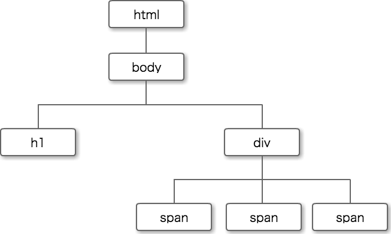

XPath는 이러한 트리 구조에서 요소를 가져옵니다.


### XPath의 기초

#### 위치 경로

XPath는 위치 경로로 표시됩니다.  위치 경로는 트리 구조에서 특정 요소를 지정하는 식입니다.  위치 경로는 URL과 같이 '/'요소를 연결해 쓰고 있습니다.


```html
<html>
...
  <body>
    <h1>원피스</h1>
    <div class="item">
      <span class="brand">iQON</span>
      <span class="regular_price">1,200원</span>
      <span class="sale_price">1,000원</span>
    </div>
  </body>
</html>
```

이 HTML에서 'h1 요소'를 취득하는 XPath는 트리 구조의 위로부터 순서에 'html 요소 → body 요소 → h1 요소'로 지정합니다.
위치 경로로 나타내면,

```bash
/html/body/h1
```

이러한 XPath됩니다.

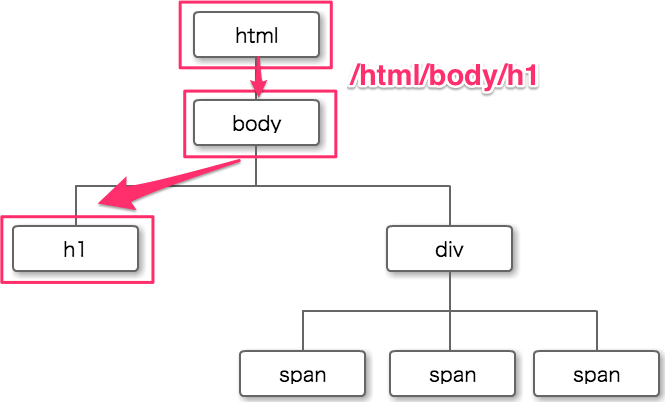


## 중급편

### 속성에 대해

Class 같은 요소에  특성을 XPath는 '@'로 표시합니다.

「1,200 엔」이라는 요소를 원한다면이 속성을 사용 아래와 같이 쓸 수 있습니다.

```python
/html/body/div/span[@class='regular_price']
```


### // 사용 도중까지의 경로를 선택

```python
/html/body/div/span[@class='regular_price']
```

이 Xpath를 '//'를 이용하여 노드 패스 를 생략 할 수 있습니다.  '//'는 descendant-or-self 약어입니다.  즉 기점이되는 노드의 모든 후손의 집합을 나타냅니다. 

예를 들어,

```python
/html/body/div/span[@class='regular_price']
```

이 XPath를 '//'를 이용하여 선택하면 아래와 같이 쓸 수 있습니다.

```python
//span[@class='regular_price']
```


### 지정하는 문자열이 포함되어있는 요소를 가져 오기 : contains

Contains는 지정한 문자열이 포함되어있는 요소를 가져옵니다.

```python


```

위의 HTML에서 class에 image가 붙는 모든 것을 얻고 싶다면, 'contains'를 사용할 수 있습니다.

contains 함수는 첫 번째 인수 문자열에 두 번째 인수 문자열이 포함되어 있는지 여부를 확인하는 함수입니다.

class에 image를 만들어내는 요소 모두 취득한다는 조건을 contains를 이용하여 표현하면 다음과 같은 작성됩니다.

```python
//img[contains(@class, 'image')]
```

이 XPath는 class에 image를 포함 img 요소를 취득한다는 의미입니다.

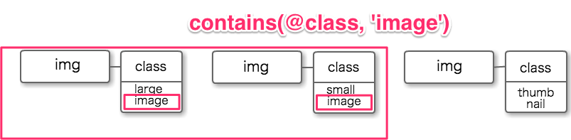

또한 텍스트에 포함 된 문자를 지정하려면 다음과 같이 text ()와 contains를 결합합니다.

```html
<div class="item">
  <h1>원피스</h1>
  <div class="price">1,200円</div>
    <div class="description">
       겨울에 최적의 니트 원피스입니다.
       번호:100000000
    </div>
  </div>
</div>
```

이 HTML에서 '번호'라는 문자를 포함하는 요소를 지정하려면

```python
//div[contains(text(), '번호')]
```

라고 쓸 수 있습니다.

또한 '지정 문자가 포함 된 JavaScript'를 취득하는 경우는 다음과 같이 쓸 수 있습니다.

```python
//script[contains(text(), 'stock')]
```


### 요소의 위치를 지정 : position

요소의 위치를 지정하려면 position을 사용합니다.  Position은 지정된 노드에서 몇 번째 노드인지를 지정 할 수 있습니다.

```html
<ul>
  <li>색상을 선택</li>
  <li>화이트</li>
  <li>레드</li>
  <li>블루</li>
</ul>
```

이 HTML로 position ()를 사용해보십시오.

#### position() =

위의 HTML로 '레드'는 li 요소의 3 번째이므로 position을 이용하여 다음 처럼 표시할 수 있습니다. 

```python
//li[position()=3]
```

그리고 position()=3을 생략 하여 아래와 같이  쓸 수 있습니다.

```python
//li[3]
```

#### position() >

'색상을 선택'이외의 li 요소를 취득하는 경우에는 position을 이용하여 다음과 같이 나타낼 수 있습니다.

```python
//li[position()>1]
```

'색상을 선택'는 li 요소의 첫 번째이기 때문에 position() >1은 '색상을 선택'이외의 li 요소를 지정합니다.

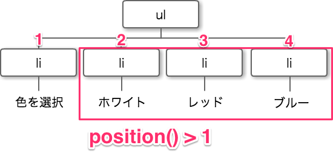


### 텍스트 노드의 취득

요소의 텍스트를 검색하려면 'text()'라는 텍스트 노드를 사용합니다.

```html
<p>S 사이즈 <span>레드</span></p>
```

이 HTML에서 'S 사이즈'라는 단어 만 검색하려면, text ()를 사용하여

```python
//p/text()
```

라고 쓸 수 있습니다.


### not

Not은 술어에서 부정을 나타냅니다.

```html


```

이 HTML에서 http://sample.ne.jp/sample_main_image.jpg 비@src를 원한다면는 not을 사용하여

```python
//img[not(contains(@src, 'main'))]/@src
```

라고 쓸 수 있습니다.


### or

Or 조건을 XPath에서 사용할 수 있습니다.

```html


```

이 HTML에서 100 또는 300를 포함 src를 취득하려면 or를 사용하여 아래와 같이 쓸 수 있습니다.

```python
//td[contains(@src,'100') or contains(@src, '300')]
```

또한 100 또는 300 이외의 src를 원한다면는 not와 or를 결합합니다.

```python
//td[not(contains(@src,'100') or contains(@src, '300'))]
```


###  and

And 조건도 XPath에서 사용할 수 있습니다.

```html


```

이 HTML에서 'main'과 '300'을 포함 src를 원한다면은 and를 사용하여 아래와 같이 쓸 수 있습니다.

```python
//img[contains(@src, 'main') and contains(@src, '300')]
```


## 고급편

### 노드 테스트

위치 경로에서 요소를 표현 할 때 '축 노드 테스트 술어 '라는 것을 사용하여 표현합니다.

| 이름        | 설명                                                      |
| :---------- | :-------------------------------------------------------- |
| 축          | 트리에서 상대 위치를 지정                                 |
| 노드 테스트 | 선택한 노드의 형태와 이름을 지정                          |
| 술어        | 선택한 노드의 집합을 어떤 식을 사용하여보다 세밀하게 지정 |

```python
/html/body/h1
```

라는 XPath 노드 테스트만으로 요소를 표시했습니다.  노드 테스트만으로는 원하는 요소를 얻을 수없는 경우는 축과 술어를 사용하여 잘게 요소를 지정할 수 있습니다.

### 술어에 대해

트리 그림은 class 등의 속성 정보를 추가 한 것이 아래 그림입니다.

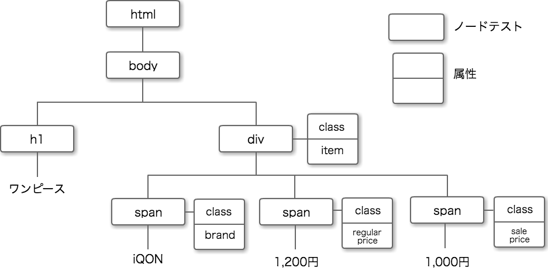

### 축

축 트리에서 상대 위치를 지정합니다.  축 대표적인 것으로 다음과 같은 종류가 있습니다.

| 이름              | 설명                                                   |
| :---------------- | :----------------------------------------------------- |
| self              | 노드 자신을 나타냄                                     |
| child             | 노드의 자식 노드의 집합                                |
| parent            | 노드의 부모 노드의 집합                                |
| ancestor          | 노드에서 조상 노드의 집합 (부모 포함)                  |
| descendant        | 노드에서 하위 노드 집합                                |
| following         | 노드 뒤에 나오는 노드의 집합                           |
| preceding         | 노드 앞에 나오는 노드의 집합                           |
| following-sibling | 노드와 같은 계층에 있고 이후에 나오는 형제 노드의 집합 |
| preceding-sibling | 노드와 같은 계층에 있고 앞에 나오는 형제 노드의 집합   |

축을 방금 전까지의 그림 이외에보십시오.  어디를 기점으로 생각 하느냐에 따라 위치 관계는 바뀌지 만, 이번은 'div'를 중심으로 축을 생각합니다.

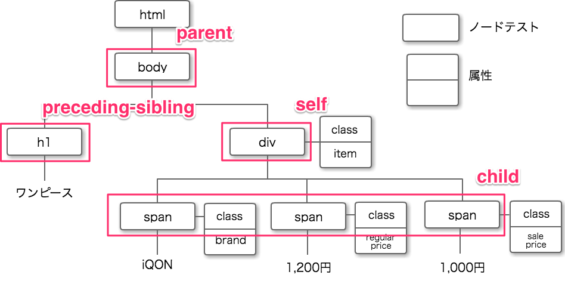

이번에는 div를 중심으로 생각 div를 자신이 기점이되는 노드 즉 'self'입니다.Body는 div에서보고 하나의 계층 즉 부모가되기 때문에 'parent'이고 span은 하나 아래의 계층 즉 자식이되기 때문에 'child'입니다.또한 h1 요소는 div와 일치하는 계층이며 div 이전에 출현하므로 축은 'preceding-sibling'입니다.


### Child의 생략에 대해

명시 적으로 축을 지정하지 않으면 축이 child 간주됩니다. 따라서 기본적으로 child는 생략 할 수 있습니다.


### // 사용 도중까지의 경로를 선택

'//'는 descendant-or-self 약어입니다.즉 기점이되는 노드의 모든 후손의 집합을 나타냅니다.이 '//'를 사용하여 경로를 생략 할 수 있습니다.

예를 들어,

```python
/html/body/div/span[@class='regular_price']
```

이 XPath를 '//'를 이용하여 선택하면 아래와 같이 쓸 수 있습니다.

```python
//span[@class='regular_price']
```


### 축 : 노드 테스트 [조건]

축 노드 테스트 술어를 사용하여 XPath를 쓰는 경우 '축 : 노드 테스트 [술어]'라고 쓰기에서 요소를 지정합니다.

```html
<html>
...
  <body>
    <h1>원피스</h1>
    <div class="item">
      <span class="brand">iQON</span>
      <span class="regular_price">1,200원</span>
      <span class="sale_price">1,000원</span>
    </div>
  </body>
</html>
```

이 HTML에서 '1,200 원'의 요소를 추출 XPath는 아래와 같이 쓸 수 있습니다.

`/html/body/div/span[@class='regular_price']/self::text()`

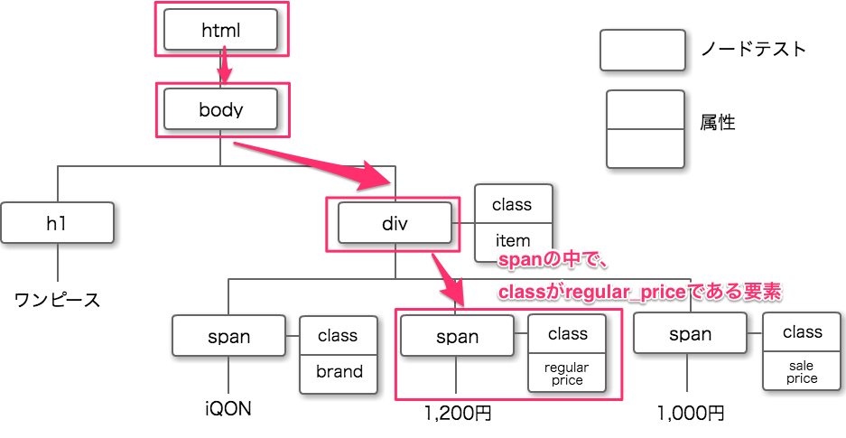

또한 생략 한 형태로 작성하면 이렇게됩니다.

```python
//span[@class='regular_price']
```

여기까지 단축 과 축 노드 테스트 술어를 설명했습니다.축 노드 테스트 술어에 대해 더 자세히 알고 싶은 분은 아래 페이지가 몹시 알기 쉽기 때문에 꼭 참고하여보십시오.

http://www.techscore.com/tech/XML/XPath/XPath3/xpath03.html/


### 지정된 요소 이후의 형제 요소를 가져 오는 : following-sibling ::

축 에서 소개했지만 'following-sibling ::'는 기점이되는 노드와 같은 계층에 있고 기점이되는 노드보다 '후'에 나오는 형제 노드의 집합을 나타내는 축입니다.이 'following-sibling ::'테이블 요소를 지정할 때 맹활약합니다.

```html
<table>
  <tr>
    <td>생산국</td>
    <td>일본</td>
  </tr>
  <tr>
    <td>소재</td>
    <td>면</td>
  </tr>
</table> 
```

이 같은 테이블이 포함되어있는 경우, '면'을 어떻게 취득하면 좋을까요.

```python
//td[4]
```

라고 쓸 수 있지만 td 요소가 늘어나거나 줄어들거나 변화가있을 경우 // td [4] 지정하는 요소가 변화 대응 할 수 없습니다.

그래서 'following-sibling ::'를 사용합니다.면을 취득하려면

```python
//td[contains(*, '소재')]/following-sibling::td[1]
```

라고 쓸 수 있습니다.

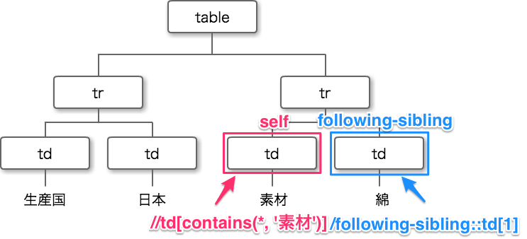


### 지정된 요소 이전의 형제 요소를 가져 오는 : preceding-sibling ::

'preceding-sibling ::'는 following-sibling :: 대되는 축에 기점이되는 노드와 같은 계층에 있고 기점이되는 노드보다 '전에'에 나오는 형제 노드의 집합을 나타내는 축 입니다.이쪽도 테이블 요소를 지정할 때 맹활약합니다.

```html
<table>
  <tr>
    <td class="title">22cm</td>
    <td class="title">23cm</td>
    <td class="title">24cm</td>
  </tr>
  <tr>
    <td class="title">레드</td>
    <td class="inventory">재고 있음</td>
    <td class="inventory">재고 있음</td>
  </tr>
  <tr>
    <td class="title">블루</td>
    <td class="inventory">재고 있음</td>
    <td class="inventory">재고 있음</td>
  </tr>
  <tr>
    <td class='title'>그린</td>
    <td class='inventory'>재고 있음</td>
    <td class='inventory'>재고 있음</td>
  </tr>
</table>
```

위와 같은 HTML에서 색상 (레드, 블루, 그린)를 모두 취득하려면 어떤 XPath에서 얻을 수 있을까요?

단순히

```python
//td[@class='title']
```

는 색상뿐만 아니라 크기도 취득하게됩니다.이런 때 preceding-siblings ::를 사용합니다.

```python
//td[@class="inventory"][1]/preceding-sibling::td
```

이렇게 쓰는 것으로, class 속성이 inventory의 td 요소의 첫 번째 (td[@class='inventory'][1])의 하나 앞의 요소 (preceding-sibling :: td) 즉 색상을 얻을 수 있습니다.

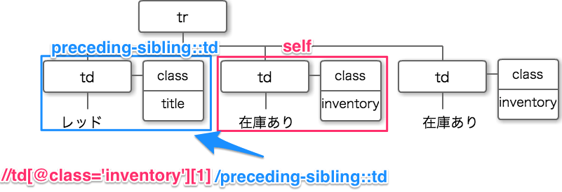


## 중복없이 추출

```html
<table>
  <tr>
    <td>레드</td>
    <td>레드</td>
    <td>레드</td>
  </tr>
  <tr>
    <td>블루</td>
  </tr>
  <tr>
    <td>그린</td>
  </tr>
</table>
```

이 HTML에서 중복없이 색상을 원하는 경우 아래와 같이 쓸 수 있습니다.

```python
//td[not(.=preceding::td)]
```

이 XPath는 td 요소 중 preceding 즉 앞에 나오는 요소와 일치하지 않는 것을 얻을 수 있습니다.


## XPath 관련 편리한 서비스

마지막으로 XPath를 얻을 때 추천 확장 기능을 소개합니다.'XPath Helper'입니다! !


###  XPath Helper

XPath Helper 브라우저에서 요소를 커서를 맞추는 것만으로 XPath를 확인할 수있는 매우 뛰어난 chrome 확장 기능입니다.

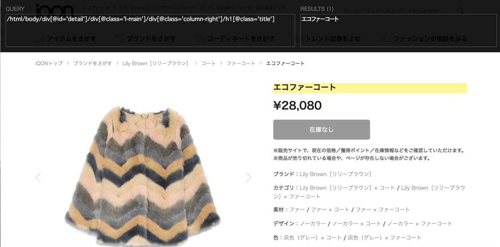

아래에서 다운로드 할 수 있습니다.

https://chrome.google.com/webstore/detail/xpath-helper/hgimnogjllphhhkhlmebbmlgjoejdpjl


이 확장 기능을 사용은Chrome 책갈피 막대의 x라고 써있는 아이콘을 클릭하거나 단축키 [Ctrl + Shift + X에서 시작합니다.그리고 요소를 시프트를 누른 상태에서 선택하면 요소의 XPath가 쉽게 얻을 수 있습니다.

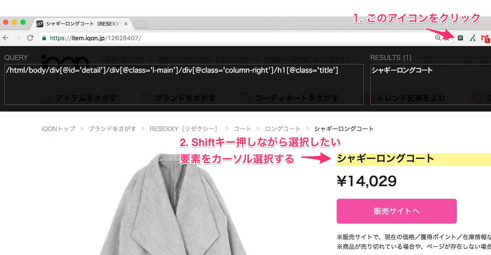

매우 쉽게 XPath를 얻을 수 있기 때문에 추천합니다


## 정리

이상이 크롤러 편리한 XPath 정리했습니다!XPath는 상대적으로 기억하기 쉽고 이해하기 쉬운 언어이기 때문에, 비 엔지니어에게도 매우 추천합니다.꼭 XPath Helper를 넣고 XPath를 시도하십시오!