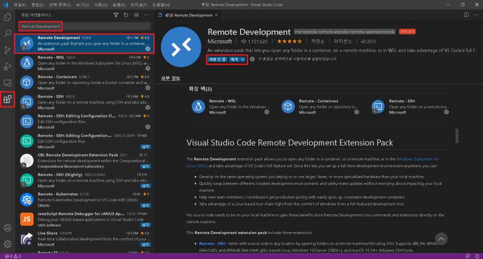
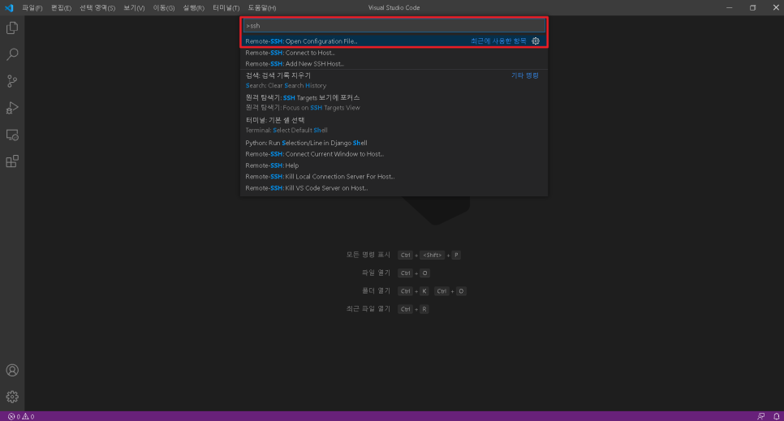
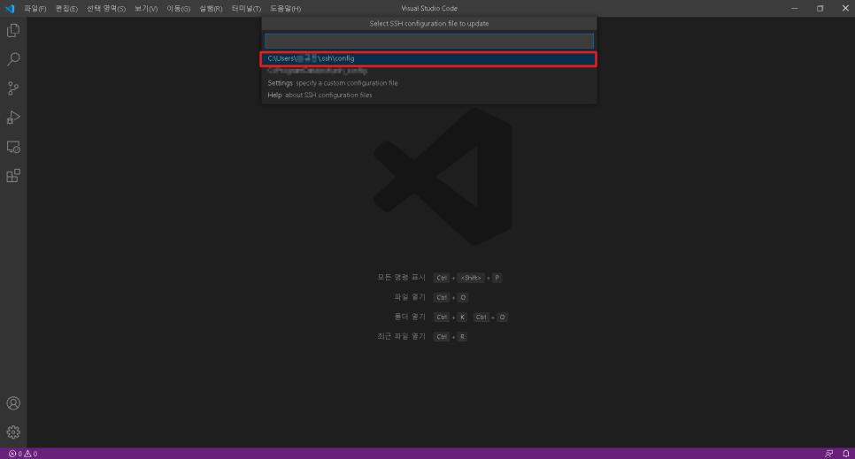
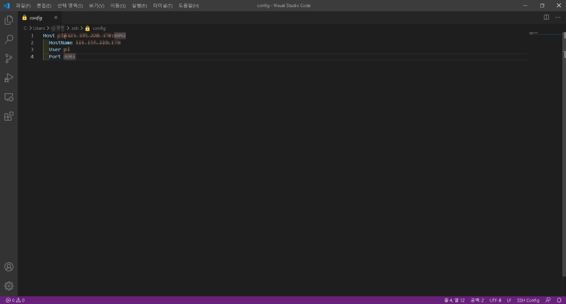
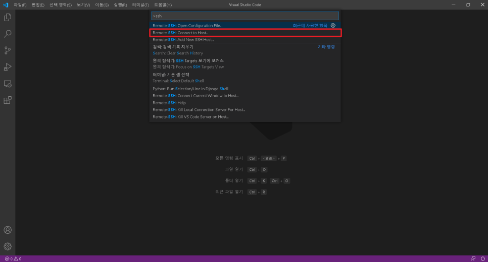

# vscode ftp 사용

출처: [[Visual Studio Code\] ftp/sftp를 이용하여 Linux 원격 개발 진행하기](https://developer-mistive.tistory.com/12)

개발을 하기에 앞서 개발 환경 구성이 중요한 것은 누구에게나 물어봐도 부족하지 않을 듯 싶어요.

Linux에서 gedit라던가 vi editor를 사용해도 되지만 익숙하지 않는 경우가 있죠.

그래서 가장 익숙한 visual studio code라던가, atom이라는 editor를 많이 사용을 하죠.

이런 editor를 Linux 환경에서도 사용하고 싶은데.... 해당 프로그램이 깔려있는 건 내 컴퓨터고, GUI가 제공되는 Linux 환경이라면 몰라도 그렇지 않은 환경이라면 상당히 코드 짜는데 빡침이 몰려올 수도 있을텐데요.

이런 것들을 위해서 vs code나 atom은 원격으로 Linux 환경에 접근이 가능하도록 하는 패키지가 있습니다.

그 중 이번에는 vs code를 이용해서 원격으로 개발을 수행하는 작업을 한 번 해보도록 하죠.

### 1. vs Code 설치

이건 너무나도 간단하니 pass, 그냥 구글에 검색해서 설치하면 됩니다 ㅎㅎㅎㅎ


### 2. ftp-simple 설치하기

ftp-simple은 vs code의 패키지 중 하나라고 볼 수 있습니다.

ftp-simple 설치 방법은 아래 이미지 파일을 참고하세용~



저 같은 경우는 이미 설치한 상태라서 ③번이 저렇게 나오는데 설치가 안되있다면 설치 버튼이 있습니다 ㅎㅎ


### 3. ftp-simple connection setting 파일 들어가기

f1을 눌러 명령창을 생성시키고 ftp-simple을 입력하여 Config-FTP connection setting을 클릭



저 같은 경우는 사용을 해서 "최근에 사용한 항목"란에 있지 처음 하시면 "기타 명령"란에 있을거에요.


### 4. FTP Setting 입력하기

아래와 같이 입력을 해주면 됩니다.

< >가 표시된 곳을 지우고 내용을 입력해주면 됩니다.

```json
{
	"name": "<이름 입력>",
    "host": "<ip 주소 입력>",
    "port": 22,       
    "type": "sftp",
    "username": "<사용자 이름>",
    "password": "<사용자 비밀번호>",
    "path": "<접근할 path>",
    "autosave": true,
    "confirm": false
}
```


예시

```json
	{
		"name": "VM-Ubuntux64",
		"host": "192.168.194.137",
		"port": 22,
		"type": "sftp",
		"username": "vsuser",
		"password": "vsuserpwd",
		"path": "/home/vsuser/projects/src",
		"autosave": true,
		"confirm": true
	}
```

저 같은 경우는 위와 같이 입력했어요.

일반적으로 ftp 원격 접속 과정에서 root로 접근하기 위해서는 linux단 내에서 추가적인 설정이 필요합니다.

root로 설정했다가 안된다고 뭐라하지 말아요.


그리고 password는 입력하지 않아도 무방합니다.

autosave는 말그대로 자동저장이고, confirm은 저장할 때마다 저장할 건지 물어보는건데 상당히 거슬리므로 false로 입력해줍니다.


위의 예시는 VMware에서 접근을 위한 것이고, 

만약 AWS server 같은 곳에서 접근을 하고 싶을 경우 



privateKey 항목을 추가해주고, key path를 기입해주시면 됩니다.

최종적으로 Config형식은 

```json
[    
    {
        "name": "AWS Server",
        "host": "11.22.333.444",
        "port": 22,
        "type": "sftp",
        "username": "ubuntu",
        "path": "/home/ubuntu/",
        "autosave": true,
        "confirm": false,
        "privateKey": "C:\\TEST\\Key.pem"
    },    
    {
        "name": "VMWARE Ubuntu_32bit_Local",
        "host": "111.222.33.444",
        "port": 22,
        "type": "sftp",
        "username": "ubuntu",
        "password": "password",
        "path": "/home",
        "autosave": true,
        "confirm": false
    }
]

```

을 만족하면 됩니다.


### 5. ftp-simple 실행하기






### 끝

