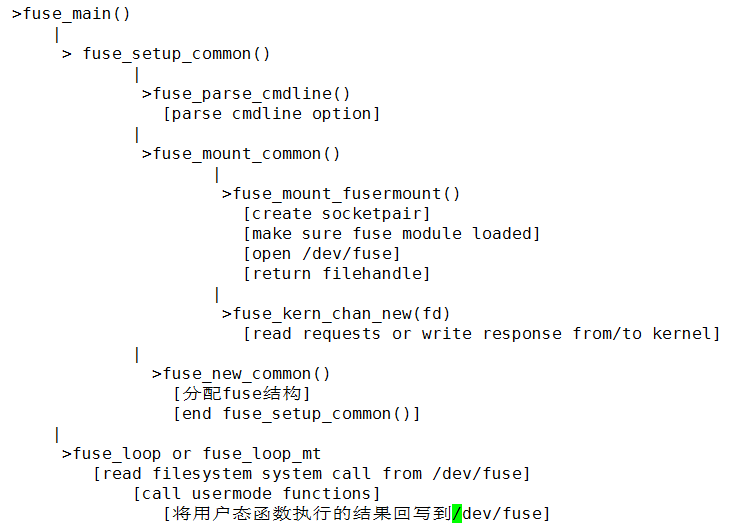
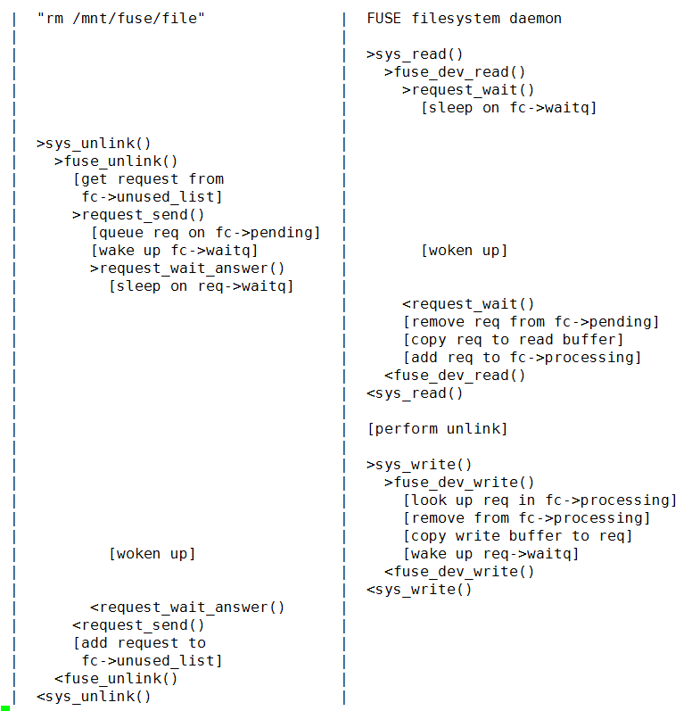

# 사용자 모드 파일 시스템 FUSE

출처: https://blog.csdn.net/ty_laurel/article/details/51685193


## 퓨즈 개요

FUSE (User State File System)는 사용자 공간에 구현 된 파일 시스템 프레임 워크로, FUSE 커널 모듈을 지원하므로 파일 시스템을 구현하기 위해 퓨즈에서 제공하는 인터페이스에 따라 특정 파일 작업 만 구현하면됩니다.

퓨즈가 출현하기 전에 Linux의 파일 시스템은 커널 상태로 완전히 구현되어 코드 작성 또는 디버깅 여부에 관계없이 특정 기능을 가진 파일 시스템을 작성하는 것은 작은 추가 만하더라도 매우 편리하지 않습니다. 커널에서 구현되는 작은 기능은 여전히 많은 작업을 수행해야합니다. 사용자 모드 파일 시스템 FUSE (2.6 커널 이후에 퓨즈가 지원됨)가 나타난 후에는 워크로드가 크게 줄어들고 디버깅에 매우 편리합니다. FUSE 파일 시스템을 작성할 때 커널 만 퓨즈 커널 모듈을로드하면되므로 커널을 다시 컴파일 할 필요가 없습니다.


## 퓨즈 기능

- 사용자 공간 파일 시스템 -- 유닉스 OS와 같은 프레임 워크
- 슈퍼 사용자가 아닌 사용자가 사용자 공간에서 파일 시스템을 개발할 수 있도록 허용
- fs-type 연산을 사용하는 커널의 API 인터페이스
- 여러 프로그래밍 언어 지원 (c, c ++, perl, java 등)
- 일반 사용자도 FUSE를 마운트 할 수 있습니다
- 커널을 다시 컴파일 할 필요가 없습니다


## 퓨즈 구성

퓨즈는 주로 세 부분으로 구성:  FUSE 커널 모듈, 사용자 공간 라이브러리 libfuse 및 마운트 도구 fusermount.

- 퓨즈 커널 모듈:  VFS와의 연결을 실현하고 사용자 공간 프로세스로 열 수있는 장치를 실현합니다 .VFS가 파일 작업 요청을 보내면 요청이 특정 형식으로 변환되어 장치를 통해 사용자 공간 프로세스로 전달됩니다. 요청 후 결과는 퓨즈 커널 모듈로 반환되며,이 결과는 Linux 커널에 필요한 형식으로 복원되어 VFS로 반환됩니다.
- fuse 라이브러리 libfuse: 커널 공간과 통신하고 /dev/fuse에서 요청을 수신하여 일련의 함수 호출로 변환하여 결과를 다시 /dev/fuse에 기록하며 제공된 기능은 퓨즈 파일 시스템을 마운트 및 마운트 해제 할 수 있습니다. Linux 커널은 요청을 읽고 커널에 응답을 보냅니다. Libfuse는 '고수준'동기 API와 '저수준'비동기 API의 두 가지 API를 제공합니다. 두 API 모두 커널로부터 요청을 받아 메인 프로그램 (fuse_main 함수)으로 전달합니다. 메인 프로그램은 해당 콜백 함수를 처리에 사용합니다. 고급 API를 사용하는 경우 콜백 함수는 inode 대신 파일 이름과 경로를 사용하여 작동하며 요청이 처리 될 때 콜백 함수가 반환됩니다. 저수준 API를 사용하는 경우 콜백 함수는 inode inode를 사용하여 작동해야하며 별도의 API 함수 세트를 사용하여 응답을 표시해야합니다.
- 장착 도구: 사용자 모드 파일 시스템의 마운트를 실현


## 퓨즈 메인 코드 파일

### in kernel：

- kernel/inode.c —> 주로 퓨즈 파일 드라이버 모듈의 등록을 완료하고 supper 블록 및 기타에 대한 유지 보수 기능을 제공합니다 (드라이버 조직 시작 파일)
- kernel/dev.c —> 퓨즈 용 (가상) 장치 드라이버
- kernel/control.c —> dentry 및 기타 유지 보수 제공
- kernel/dir.c —> 주로 디렉토리 inode의 색인 노드를 유지 보수합니다.
- kernel/file.c —> 주로 파일 inode의 인덱스 노드를 유지 보수합니다.


### in userspace：

- lib/helper.c —>  fuse_main ()  입구 (시작점)
- lib/fuse_kern_chan.c—>  퓨즈 애플리케이션 계층 액세스 (읽기 및 쓰기) 퓨즈 드라이버의 기능을 주로 실현
- lib/fuse_mt.c  —> 퓨즈 마운트 관리
- lib/fuse.c —> 메인 프레임과 '사용자 구현 파일 시스템 작업 코드'를 캡슐화하는 lib 라이브러리의 메인 프레임 파일
- lib/fuse_lowlevel.c –> fuse.c 등을위한 상대적으로 저수준 기능 패키징
- lib/fuse_loop.c —> fuse lib는 '퓨즈 드라이버'의 통신 캐시를 주기적으로 모니터링합니다.
- lib/fuse_loop_mt.c —> fuse_loop.c와 동일
- lib/fuse_session.c —> 퓨즈 세션 관리


## 퓨즈는 어떻게 작동합니까 (fuse-2.9)?

### 퓨즈 라이브러리

- 사용자 모드 프로그램이 fuse_main () (lib / helper.c)을 호출하면 먼저 fuse_setup_common ()을 호출합니다.이 함수는 먼저 사용자 모드 프로그램이 전달한 매개 변수를 분석 한 다음 fuse_mount_common ()을 호출합니다 (이 기능은 fuse_kern_mount ()의 기능 임) 패키지, lib / mount.c).  Fuse_main ()은 다음과 같은 매크로 정의 (include / fuse.h)입니다.

  ```c
  #define fuse_main(argc, argv, op, user_data) \
  fuse_main_real(argc, argv, op, sizeof(*(op)), user_data)
  ```

  

- fuse_kern_mount () 함수는 fuse_mount_fusermount ()를 호출하여 socketpair ()를 사용하여 UNIX 도메인 소켓을 작성한 다음 create subprocess를 사용하여 fusermount 프로그램을 실행하여 소켓의 한쪽 끝을 FUSE_COMMFD_ENV 환경 변수에 전달합니다.

- fusermount (util / fusermount.c)는 퓨즈 모듈이로드되었는지 확인한 다음 / dev / fuse를 열고 UNIX 소켓을 통해 파일 처리 핸들을 보냅니다. 부모 프로세스는 자식 프로세스가 복구를 완료 할 때까지 기다린 다음 fuse_mount_fusermount () 함수로 돌아갑니다.

- fuse_kern_mount ()는 / dev / fuse를 통해 파일 핸들을 fuse_kern_chan_new ()로 커널 데이터를 처리 한 다음 fuse_mount_common () 함수로 리턴합니다.

- fuse_setup_common () 함수는 fuse_new_common (lib / fuse.c)을 호출합니다. fuse_new_common () 함수는 퓨즈 데이터 구조를 할당하고 캐시 된 파일 시스템 데이터 이미지 캐시를 저장 및 유지하며 fuse_main ()으로 돌아갑니다.

- 마지막으로 fuse_main ()은 fuse_loop (lib / fuse.c) 또는 fuse_loop_mt () (lib / fuse_mt.c)를 호출합니다. 둘 다 fuse_main ()을 호출하기 전에 장치 / dev / fuse에서 파일 시스템 호출을 읽을 수 있습니다. Fuse_operations 구조에 저장된 사용자 모드 기능을 호출하십시오. 이러한 호출 결과는 / dev / fuse 장치에 다시 기록됩니다 (이 장치는 시스템 호출로 전달 될 수 있음).





### 커널 모듈

커널 모듈은 두 부분으로 구성됩니다.

첫 번째는 proc 파일 시스템 구성 요소입니다 (kernel / dev.c에 있음).

두 번째는 파일 시스템 호출 (kernel / file.c, kernel / inode.c, kernel / dir.c)입니다.

커널 / file.c, 커널 / inode.c, 커널 / dir.c의 모든 시스템 호출은 request_send () 또는 request_send_noreply () 또는 request_send_nonblock ()을 호출합니다. 대부분은 request_send () 함수를 호출하여 요청을 '요청 목록'구조 (fc-pending)에 추가 한 다음 응답을 기다립니다. Request_send_noreply () 및 request_send_nonblock ()은 비 차단적이고 응답에 응답하지 않는다는 점을 제외하고 request_send ()와 유사합니다. A
Kernel / dev.c의 proc 파일 시스템 구성 요소는 파일 IO 요청에 응답하고, fuse_dev_read ()는 파일 읽기를 처리하고, 요청 목록 구조 (요청 목록)에서 호출 프로그램으로 명령을 리턴합니다. Fuse_dev_write ()는 파일 쓰기를 처리하고 데이터 쓰기를 완료 한 후 요청 구조에 넣습니다 (요청 목록 구조 및 request_send () 함수를 통해 시스템 호출을 리턴 할 수 있음).



#### 사용자 프로세스는 운영 체제와 상호 작용합니다 (예 : 파일 읽기).

퓨즈 파일 시스템은 기존 ext4 파일 시스템에 마운트되어 있습니다.

- \1. 사용자 프로세스가 파일 읽기 요청을 발행합니다.
- \2. 요청이 커널 시스템 호출로 변환되고 커널 VFS 계층이 퓨즈 파일 시스템 커널 모듈을 호출합니다.
- \3. 퓨즈 커널 모듈은 / dev / fuse를 통해 읽기 요청을 퓨즈 사용자 모드 프로세스로 전달합니다.
- \4. 퓨즈 데몬은 사용자가 구현 한 읽기 인터페이스에 따라 새로운 시스템 호출을 생성하고 마지막으로 ext4 파일 시스템의 읽기 작업 기능을 호출하여 저장 매체에서 읽기 작업에 필요한 데이터를 추출합니다 (페이지 캐시가 있으며 직접 읽거나 그렇지 않은 경우 읽기). 디스크);
- \5. 커널은 데이터를 퓨즈 파일 시스템으로 반환합니다.
- \6. 사용자 레벨 파일 시스템은 커널 조작을 다시 호출하여 데이터를 사용자 프로세스로 리턴합니다.
- \7. 커널은 데이터를 사용자 프로세스에 전달하여 작업을 완료합니다.


#### 라이브러리 함수 fuse_main ()의 특정 처리 흐름 :

- \1. 장치 파일 / dev / fuse를 먼저여십시오.
- \2. 그런 다음 FUSE 파일 시스템을 마운트하십시오.
- \3. FUSE 파일 시스템 포인터를 생성하십시오.
- \4. FUSE 파일 시스템의 작동 기능 세트를 초기화하십시오.
- \5. 신호 처리 기능 세트를 초기화하십시오.
- \6. 대기 루프를 입력하십시오.
  장치 파일 / dev / fuse에서 커널 모듈의 요청을 읽습니다.
  해당 조작 기능을 실행하고 리턴 된 결과를 얻으십시오.
  커널에 반환 된 응답 결과를 장치 파일 / dev / fuse에 씁니다.


### 주의

퓨즈는 기본적으로 기존 파일 시스템에서 (데이터 처리시) (특정 구현은 기존 파일 시스템과 동일한 레벨에 있음) 퓨즈는 기본 디스크 데이터의 액세스에 참여하지 않으며 읽기 및 기록 된 데이터는 단지 논리적 작업입니다.


## 퓨즈 설치 및 사용

패키지 다운로드 https://github.com/libfuse/libfuse/releases :
소프트웨어 패키지를 다운로드하여 압축을 풀고 컴파일하고 설치하십시오.

``` bash
./configure
make
make install
```

압축 해제 된 디렉토리에는 example이라는 디렉토리가 있으며, 퓨즈와 함께 제공되는 여러 퓨즈 사용자 모드 구현 예제가 있으며 테스트를 위해 실행할 수 있습니다. 
퓨즈 설치 후,이 디렉토리에있는 파일들도 성공적으로 컴파일되었습니다. 그냥 실행하십시오 (디렉토리 dir은 마운트 포인트입니다. 마운트에 성공한 후,이 디렉토리에있는 파일의 조작은 퓨즈 자체에 의해 구현 된 연산 기능을 호출합니다) ) :

