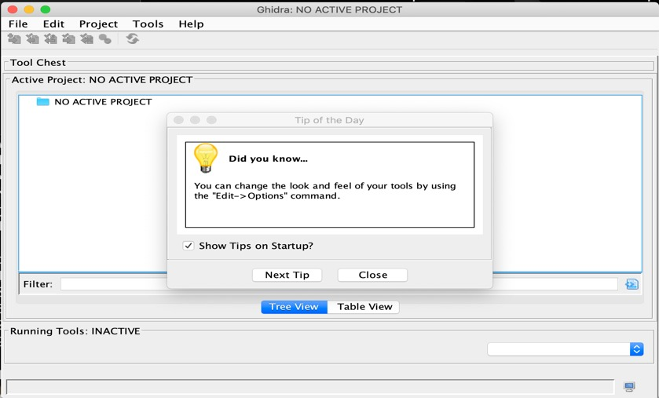
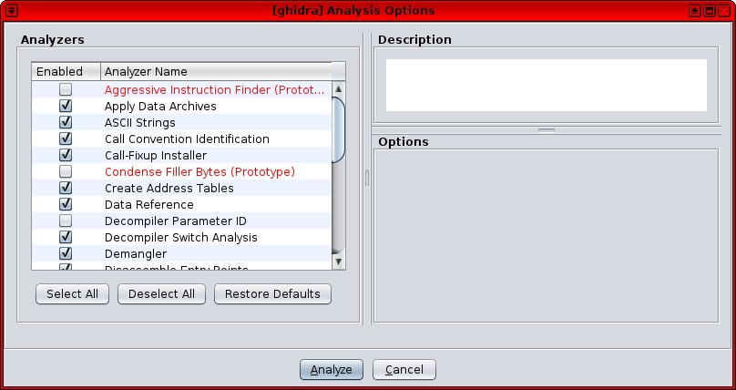
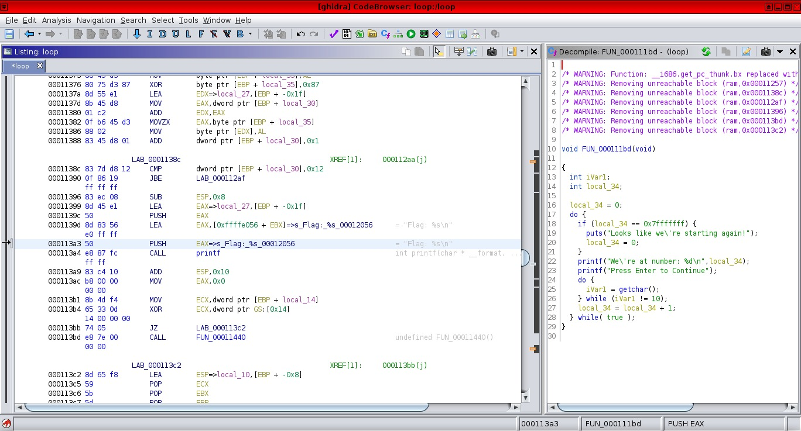

#   NSA가 만든 무료 리버스 엔지니어링 툴, "기드라" 사용 방법

원문보기: 
[http://www.itworld.co.kr/news/122618#csidx851603c5d59a73386469243365fa9de ](http://www.itworld.co.kr/news/122618#csidx851603c5d59a73386469243365fa9de)  

  초대형 악성코드 스턱스넷(Stuxnet)을 만든 미국 국가안보국(NSA)이 이번에는 악성코드를 연구하는 리버스 엔지니어(reverse engineering)의 저변 확대를 위해 오픈소스 리버스 엔지니어링 프레임워크인 기드라(Ghidra)를 공개했다. 

결과적으로 리버스 엔지니어링 시장을 오랫동안 석권해왔던 IDA 프로(IDA Pro)의 위상이 흔들리고, 많은 사람이 막대한 IDA 프로 라이선스 비용을 내지 않고도 리버스 엔지니어링 방법을 배울 수 있게 됐다.

기존 IDA 프로 사용자 입장에서는 이미 구축된 워크플로우와 커스터마이징한 부분을 기드라로 옮기기 위해 필요한 시간과 노력을 감안할 때 적어도 당분간은 툴을 바꿀 이유가 없으므로 급격한 전환은 없을 것으로 보인다. 그러나 관련 생태계가 발전할수록 기드라는 IDA 프로의 시장 점유율을 뺏고 이 툴의 도태를 가속화할 가능성이 높다.

지난 4월 RSA에서 아파치 라이선스에 따라 출시된 기드라는 필요에 맞게 손쉽게 수정이 가능해 보안 연구원들은 빠르게 기드라 소스코드를 해킹하기 시작했다. 라이선스를 받은 프로그램이 정확히 몇 대의 컴퓨터에 설치되었는지 따질 필요도 없다. 필요한 만큼 얼마든지 많은 워크스테이션(또는 서버)에 기드라를 설치할 수 있다.

기드라는 불과 몇 개월 전에 나왔지만 그 사이 이미 다수로부터 IDA 프로의 대안으로 충분하다는 평가를 받았다. 기드라를 시작하기 위해 알아야 할 점을 살펴보자.

### 기드라는 무엇인가

  기드라는 미국 정부가 자체적으로 개발한 리버스 엔지니어링 프레임워크다. 위키리크스는 지난 2017년 볼트 7(Vault 7) 조사 활동의 일부로 기드라의 존재를 공개했고 NSA는 이후 2019년 RSA에서 그 소스코드를 공식적으로 공개했다. 많은 이가 NSA의 행보를 두고 조직 홍보를 위한 움직임으로 해석했다.

 기드라를 공개한 NSA의 동기가 무엇이든 기드라가 유용하다는 사실에는 논쟁의 여지가 없다. 기드라의 특징은 리버스 컴파일러, 상황별 도움말 메뉴, 전문가가 아닌 사용자에게 초점을 맞춘 사용자 인터페이스 등이다. 필자는 지금까지 리버스 엔지니어링을 다룬 경험이 없음에도 1시간이 채 안 되는 시간에 기드라에서 별 어려움 없이 어셈블리(assembly)를 편집하고 바이너리(binaries)를 재컴파일하는 단계에 이르렀다.

  이 프레임워크 자체는 크로스 플랫폼이며 윈도우와 리눅스, 맥에서 실행되지만 실제 사용자들은 OS X 버전은 다소 불안정하므로 가능하면 리눅스나 윈도우 버전을 사용할 것을 권하고 있다(본지에서는 리눅스 버전을 사용했다).

기드라는 헤드리스(headless) 모드를 지원하므로 연구원은 수에 제한없이 클라우드 인스턴스를 가동하고 대규모로 리버스 엔지니어링을 할 수 있다. IDA 프로에서 똑같이 하려면 기술적으로 어렵고 비용도 매우 많이 든다. 또한 대용량 바이너리를 리버스 엔지니어링할 때 헤드리스 모드에서 서버로 기드라를 배포해 그룹 협업을 지원할 수 있다. IDA 프로에는 이 기능이 없다.

###  기드라 시작하기 

리버스 엔지니어링을 마스터하기란 매우 어렵지만 기드라를 시작하기는 상당히 쉽다. 리버스 엔지니어링을 처음 접하는 초보자를 위한 리버스 엔지니어링을 위한 자습 도구격 바이너리인 "crackme"도 온라인에 수없이 많다. 구글에서 풍부한 crackme 자습서와 안내서도 찾아볼 수 있다.

초급 프로그래밍 경험이 있으면 도움이 되고 C에 대한 지식도 유용하다. 약간의 어셈블리도 필요하다.

###  약간의 어셈블리도 필요

리버스 엔지니어링 입문자에게 가장 유용한 기능 가운데 하나는 기드라의 디컴파일러다. 쇼군 랩(Shogun Lab)의 취약점 연구원인 스티븐 패터슨은 "어셈블리의 일부분을 선택하면 디컴파일러 창에서 디컴파일된 코드도 함께 강조 표시된다. 고수준 코드가 디스어셈블된 코드와 어떻게 연결되는지 이해하는 데 도움이 된다"고 말했다.

패터슨은 "기드라는 리버스 엔지니어링에 입문하고자 하는 사람도 접근하기 용이하도록 진입 장벽을 낮췄다"고 덧붙였다.

숙련된 리버스 엔지니어라면 기드라에 포함된 연습 파일이 기드라를 빠르게 이해하는 데 도움이 될 것이다. 스크립트나 기타 커스터마이징 방법을 사용해 기드라의 작동 방식을 원하는 대로 수정할 수도 있다. IDA 프로의 사유 코드베이스와 다른 점이다.

###  기드라와 IDA 프로 비교

숙련된 리버스 엔지니어들 사이의 평가는 팽팽하다. 기드라는 NSA의 프로덕션에 사용될만큼 잘 개발된, 성숙한 소프트웨어 프로젝트이며 많은 부분에서 IDA 프로를 대체할 수 있지만 인프라와 워크플로우가 이미 확립된 조직에서는 툴을 변경하는 데 따르는 비용이 기존 IDA 프로 라이선스를 유지하는 비용보다 더 클 수 있다.

마이클 그룬(@0x6d696368)은 지난 주 블로그 글에서 "현재 솔루션에서 사용하는 툴, 헬퍼, 스크립트를 기드라에서는 사용할 수 없다. 이런 요소에 의존하고 있고 모든 것을 기드라로 이식할 시간이 없는 경우도 충분히 있을 것이다"고 말했다.

그룬은 "작고 단순한 것들의 부재가 모여 결국 많은 조직에서 기드라를 사용할 수 없는 수준에 이르는 것이다. 또한 기존 툴 체인에 상당한 엔지니어링을 투입한 경우가 많다. 수많은 플러그인, 확장, 워크플로, 과거 분석, 교육된 담당자 등을 생각해 보라. 기드라에서는 아무것도 없이 백지 상태에서 다시 시작해야 한다"고 설명했다.

그러나 기드라의 협업 툴을 높게 평가하는 리버스 엔지니어도 있다. 컴시큐리스(Comsecuris)의 총괄 책임자인 랄프-필립 와인만은 "협업이 가장 핵심적인 기능이다. 컴시큐리스는 직원들이 서로 다른 도시에 거주하는, 지리적으로 분산된 조직이다. 따라서 효율적인 협업이 가능한 소프트웨어가 필수적인데 IDA는 유감스럽게도 그 조건에 해당되지 않는다"고 말했다.

기드라가 단기간 내에 기존 조직의 작업 방식을 뒤바꿀 가능성은 높지 않지만 확실히 진입 장벽을 낮추는 역할을 하며 새로운 세대의 리버스 엔지니어를 양성하는 데 도움이 될 것이다. 중장기적으로는 무료 오픈소스 툴인 기드라가 IDA 프로의 시장 점유율을 빼앗을 수밖에 없다. 언젠가 NSA 악성코드를 찾아 리버스 엔지니어링하는 기드라 사용자도 나올 수 있다. editor@itworld.co.kr

