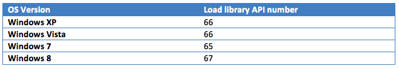

# Windows의 커널에서 사용자 영역 코드를 실행하는 방법

출처: https://www.stormshield.com/news/how-to-run-userland-code-from-the-kernel-on-windows/

**Windows NT 4.0 이전에는 Windows 하위 시스템의 그래픽 부분이 완전히 사용자 영역에서 구현되었습니다. NT 4.0부터 Microsoft는 Windows Manager와 그래픽 장치 인터페이스의 많은 부분을 Win32k.sys 구성 요소의 커널 모드로 이동하기로 결정했습니다. 그러나 구현의 일부는 여전히 사용자 영역에 있으며 커널 구성 요소는 사용자 모드 코드를 다시 호출해야 합니다. 이를 위해 Microsoft는 커널이 사용자 영역 코드를 호출할 수 있도록 하는 '역' 시스템 호출을 구현했습니다. 전체 프로세스는 이미 이전 기사에서 논의되고 설명되었으므로 다시 자세히 설명하지 않겠습니다. [Tarjei Mandt 백서](http://mista.nu/research/mandt-win32k-paper.pdf)) 를 참조하십시오.메커니즘에 대한 포괄적인 설명이 포함되어 있습니다. 이 게시물에서는 Windows(Windows XP에서 Windows 8까지)가 이 메커니즘을 사용하여 실행 중인 프로세스에서 모듈을 로드하는 방법을 자세히 설명합니다. 메커니즘을 이해하면 자신의 목적, 특히 Windows 운영 체제의 커널 부분에서 코드를 실행하는 동안 프로세스에 사용자 지정 DLL을 삽입하는 방법으로 사용할 수 있습니다. [@zer0mem](http://www.zer0mem.sk/?p=410) 이 게시한 최근 기사 는 '역' 시스템 호출 메커니즘을 사용하여 커널 코드에서 사용자 모드로 코드를 실행합니다. 이 게시물은 파일 시스템에 Windows 바이너리 파일을 자유롭게 드롭할 수 있는 경우 다른 접근 방식을 제공합니다**


## 사용자 모드 콜백 연습

### 일반 메커니즘

커널에서 사용자 코드를 호출할 수 있는 함수는 Windows 커널 내부에 있으며 KeUserModeCallback이라는 이름으로 내보낸 함수입니다. KeUserModeCallback의 프로토타입은

초기화는 user32!UserClientDllInitialize 함수(user32 DLL의 진입점)에서 발생하며 기본적으로 KernelCallbackTable 필드가 내보내지지 않은 user32!apfnDispatch 기호를 가리키도록 합니다.

``` c++
NTSTATUS KeUserModeCallback (
  IN ULONG ApiNumber,
  IN PVOID InputBuffer,
  IN ULONG InputLength,
  OUT PVOID *OutputBuffer,
  OUT PULONG OutputLength
);
```

이 함수는 WDK 헤더에 없기 때문에 MmGetSystemRoutineAddress 호출을 사용하여 동적으로 검색해야 합니다.

이 함수가 기본적으로 하는 일은 이러한 매개변수를 사용자 영역 스택에 복사하고 사용자 영역 코드(ntdll!KiUserCallbackDispatcher 함수에서)로 다시 반환하는 것입니다.

호출 가능한 함수는 ApiNumber 매개변수로 식별됩니다. 이것은 프로세스 환경 블록의 KernelCallbackTable 필드를 통해 액세스할 수 있는 배열의 0부터 시작하는 인덱스입니다.

이 필드는 프로세스에서 user32 모듈이 로드될 때 초기화됩니다(초기화 전 필드는 NULL임). 초기화는 user32!UserClientDllInitialize 함수(user32 DLL의 진입점)에서 발생하며 기본적으로 KernelCallbackTable 필드가 내보내지지 않은 user32!apfnDispatch 기호를 가리키도록 합니다.

```
kd> dt nt!_PEB @$peb
+0x000 InheritedAddressSpace : 0 ''
+0x001 ReadImageFileExecOptions : 0 ''
+0x002 BeingDebugged : 0 ''
+0x003 SpareBool : 0 ''
+0x004 Mutant : 0xffffffff Void
+0x008 ImageBaseAddress : 0x00400000 Void
+0x00c Ldr : 0x00251e90 _PEB_LDR_DATA
+0x010 ProcessParameters : 0x00020000 _RTL_USER_PROCESS_PARAMETERS
+0x014 SubSystemData : (null)
+0x018 ProcessHeap : 0x00150000 Void
+0x01c FastPebLock : 0x7c990620 _RTL_CRITICAL_SECTION
+0x020 FastPebLockRoutine : 0x7c911000 Void
+0x024 FastPebUnlockRoutine : 0x7c9110e0 Void
+0x028 EnvironmentUpdateCount : 1
+0x02c KernelCallbackTable : 0x7e392970 Void
+0x030 SystemReserved : [1] 0
+0x034 AtlThunkSListPtr32 : 0
...
```

이 테이블에는 user32 모듈에 있는 다양한 userland 호출 가능 함수에 대한 함수 포인터가 포함되어 있습니다. 내용(따라서 함수의 인덱스)과 테이블의 길이는 운영 체제 버전에 따라 다릅니다.

다음은 Windows XP SP3 32비트 프로세스에서 기능 테이블을 표시하는 예(잘림)입니다.

```
kd> dps 0x7e392970 L0n98
7e392970 7e3a7f3c USER32!__fnCOPYDATA
7e392974 7e3d87b3 USER32!__fnCOPYGLOBALDATA
...
7e392a38 7e3d8eb9 USER32!__ClientCopyDDEIn1
7e392a3c 7e3d8efb USER32!__ClientCopyDDEIn2
7e392a40 7e3d8f5e USER32!__ClientCopyDDEOut1
7e392a44 7e3d8f2d USER32!__ClientCopyDDEOut2
7e392a48 7e3aeb09 USER32!__ClientCopyImage
7e392a4c 7e3d8f92 USER32!__ClientEventCallback
7e392a50 7e3b19f6 USER32!__ClientFindMnemChar
7e392a54 7e3a28f3 USER32!__ClientFontSweep
7e392a58 7e3d8e4c USER32!__ClientFreeDDEHandle
7e392a5c 7e3a82ff USER32!__ClientFreeLibrary
7e392a60 7e39f4b2 USER32!__ClientGetCharsetInfo
7e392a64 7e3d8e83 USER32!__ClientGetDDEFlags
7e392a68 7e3d8fdc USER32!__ClientGetDDEHookData
7e392a6c 7e3cf9f5 USER32!__ClientGetListboxString
7e392a70 7e39ec46 USER32!__ClientGetMessageMPH
7e392a74 7e3a16eb USER32!__ClientLoadImage
7e392a78 7e3a8023 USER32!__ClientLoadLibrary
7e392a7c 7e3aec03 USER32!__ClientLoadMenu
7e392a80 7e39ee0d USER32!__ClientLoadLocalT1Fonts
7e392a84 7e3a09e4 USER32!__ClientLoadRemoteT1Fonts
7e392a88 7e3d907b USER32!__ClientPSMTextOut
7e392a8c 7e3d90d1 USER32!__ClientLpkDrawTextEx
7e392a90 7e3d9135 USER32!__ClientExtTextOutW
7e392a94 7e3d919a USER32!__ClientGetTextExtentPointW
7e392a98 7e3d9019 USER32!__ClientCharToWchar
7e392a9c 7e39ed14 USER32!__ClientAddFontResourceW
7e392aa0 7e39a13e USER32!__ClientThreadSetup
7e392aa4 7e3d9253 USER32!__ClientDeliverUserApc
7e392aa8 7e3d91f1 USER32!__ClientNoMemoryPopup
7e392aac 7e3aa740 USER32!__ClientMonitorEnumProc
7e392ab0 7e3d944a USER32!__ClientCallWinEventProc
7e392ab4 7e3d8e15 USER32!__ClientWaitMessageExMPH
7e392ab8 7e3acf8e USER32!__ClientWOWGetProcModule
7e392abc 7e3d948d USER32!__ClientWOWTask16SchedNotify
7e392ac0 7e3d9266 USER32!__ClientImmLoadLayout
7e392ac4 7e3d92c2 USER32!__ClientImmProcessKey
...
7e392af4 7e3d950c USER32!__fnOUTLPSCROLLBARINFO
```


### KeUserModeCallback 호출 조건

KeUserModeCallback을 호출하기 전에 먼저 프로세스 환경 블록의 KernelCallbackTable 필드가 NULL이 아닌지 확인해야 합니다(KeUserModeCallback은 이를 수행하지 않습니다). 이 필드는 32비트 시스템에서는 오프셋 0x2c이고 64비트 시스템에서는 0x58입니다(Windows XP에서 Windows 8까지). 그렇게 하지 않으면 결국 BSOD가 발생합니다.

Windows XP에서 운영 체제는 KeUserModeCallback 함수를 호출하기 위해 현재 스레드의 상태에 어떤 조건도 두지 않으므로 원할 때마다 함수를 호출하는 것이 안전합니다.

Windows Vista부터는 상황이 다릅니다. 실제로 KeUserModeCallback 함수는 현재 _KTHREAD 구조의 플래그 필드에 CallOutActive 플래그가 있는지 확인합니다(이 필드는 적어도 nt!KeExpandKernelStackAndCalloutEx 함수에 의해 설정됨). 존재하는 경우 운영 체제는 0x107 문서화되지 않은 코드로 버그 체크를 발행합니다.

Windows 8에서 Microsoft 개발자는 호출이 성공할 수 있도록 더 많은 제약 조건을 추가했습니다.

Windows 8에서 수행하는 첫 번째 검사는 현재 스레드가 PASSIVE_LEVEL에서 실행되는지 확인하는 것입니다. 그렇지 않은 경우 운영 체제는 코드 0x4A(IRQL_GT_ZERO_AT_SYSTEM_SERVICE)로 버그 체크를 발행합니다.

그런 다음 운영 체제는 APC가 활성화되어 있는지 확인합니다. 그렇지 않은 경우 운영 체제는 코드 1(APC_INDEX_MISMATCH)로 버그 체크를 발행합니다.

마지막으로 운영 체제는 현재 스레드의 CallbackNestingLevel 필드를 확인합니다. 이 값이 32에 도달하면 0xC00000FD(STATUS_STACK_OVERFLOW)와 같은 코드와 함께 함수가 실패합니다. 이 필드는 사용자 모드 콜백에 대한 중첩 호출 수를 기록하기 위해 KeUserModeCallback에 의해 설정됩니다.

## 

## 라이브러리 로드를 위한 사용자 모드 콜백

흥미로운 함수 중 user32!__ClientLoadLibrary 함수 포인터를 볼 수 있습니다.

이 기능은 기본적으로 win32k.sys에서 실행 중인 프로세스에 uxtheme.dll을 삽입하는 데 사용되어 운영 체제에서 애플리케이션에 비주얼 스타일을 적용할 수 있습니다.

이 작업은 두 가지입니다. 첫째, 마치 사용자 영역 코드에 의해 로드된 것처럼 프로세스 메모리에 모듈을 효과적으로 로드합니다. 그런 다음 ThemeInitApiHook이라는 함수가 호출되어 uxtheme.dll이 user32가 사용하는 다양한 기능에 대한 대체 구현을 제공할 수 있는 기회를 제공합니다. 이 초기화 함수가 호출되는 방법과 패치된 함수의 용도에 대한 자세한 내용은 다루지 않을 것입니다. 특정 초기화 함수를 호출하지 않고 모듈을 로드하는 데 필요한 매개변수를 설명하려고 합니다.

### 기능 인덱스

요청된 첫 번째 매개변수는 ApiNumber입니다. '라이브러리 로드' 기능의 값은 운영 체제 버전에 따라 다릅니다.


이제부터 인덱스는 운영 체제 버전(32비트 또는 64비트)에 의존하지 않습니다.

### 입력 버퍼

함수의 두 번째 및 세 번째 매개변수는 입력 버퍼와 관련 길이(바이트)입니다.

'라이브러리 로드' 기능에 대한 입력 버퍼는 다음 구조로 설명됩니다.

```cpp
typedef struct _USERHOOK
{
    DWORD      dwBufferSize;
    DWORD      dwAdditionalData;
    DWORD      dwFixupsCount;
    LPVOID     pbFree
    DWORD      offCbkPtrs;
    DWORD      bFixed;
    UNICODE_STRING lpDLLPath;
    union
    {
        DWORD      lpfnNotify
        UNICODE_STRING lpInitFunctionName;
    }
    DWORD      offCbk[2];
} _USERHOOK_s;
```

이 구조는 사용자 모드 콜백을 위해 win32k.sys 드라이버에 존재하는 보다 일반적인 메커니즘의 특수화입니다. 고정 헤더(dwBufferSize에서 bFixed로)와 가변 길이 데이터(lpDLLPath에서 시작)로 구성됩니다.

**dwBufferSize** 는 가변 길이 데이터를 포함한 전체 버퍼의 길이를 포함합니다.
**dwAdditionalData** 는 가변 길이 데이터의 길이를 포함합니다.
**pbFree** 는 가변 길이 데이터의 끝을 가리키는 포인터입니다.

이 동적 버퍼가 어떻게 할당되고 이전 필드가 Windows 루틴에서 사용되는지에 대한 구현 세부 정보는 다루지 않습니다. KeUserModeCallback을 호출하기 위해 버퍼가 채워지는 방식을 모방해야 합니다.

*참고: 이 구조가 할당 및 업데이트되는 방법을 이해하려면 win32k!ClientLoadLibrary에서 호출하는 win32k!AllocCallbackMessage 및 win32k!CaptureCallbackData 함수를 볼 수 있습니다.*

#### 재배치 가능한 버퍼

KeUserModeCallback 호출자가 제공한 버퍼는 커널 메모리에 있습니다. 버퍼는 사용자 영역 함수에 의해 처리되기 위해 결국 프로세스의 사용자 메모리에 상주해야 합니다(사용자 영역 스택에 복사됨).

버퍼 위치를 독립적으로 만들기 위해 Windows 개발자는 '수정'으로 구성된 간단한 메커니즘을 구현했습니다. bFixed가 FALSE이면 모든 포인터는 주소를 포함하지 않지만 구조의 시작 부분에 상대적인 오프셋을 포함합니다.

예를 들어 Windows XP 32비트에서 user32!__ClientLoadLibrary에 전달된 버퍼를 살펴보겠습니다.

```markup
kd> db ef5a78e0 L68
ef5a78e0 68 00 00 00 40 00 00 00-01 00 00 00 48 79 5a ef h...@.......HyZ.
ef5a78f0 24 00 00 00 00 00 00 00-3e 00 40 00 28 00 00 00 $.......>.@.(...
ef5a7900 40 9e 00 00 1c 00 00 00-43 00 3a 00 5c 00 57 00 @.......C.:.\.W.
ef5a7910 49 00 4e 00 44 00 4f 00-57 00 53 00 5c 00 73 00 I.N.D.O.W.S.\.s.
ef5a7920 79 00 73 00 74 00 65 00-6d 00 33 00 32 00 5c 00 y.s.t.e.m.3.2.\.
ef5a7930 75 00 78 00 74 00 68 00-65 00 6d 00 65 00 2e 00 u.x.t.h.e.m.e...
ef5a7940 64 00 6c 00 6c 00 00 00 d.l.l...
dwBufferSize: 0x68
dwAdditionalData: 0x40
dwFixupCounts: 1
pbFree: 0xef5a7948
offCbkPtrs: 0x24 -> 0xef5a7904
bFixed : FALSE
lpDLLPath : (Length: 0x3e, MaximumLength: 0x40, Buffer: 0x28)
```

버퍼에는 1개의 수정이 포함됩니다(dwFixupsCount = 1). 이 수정을 포함하는 배열은 구조의 시작 부분에서 오프셋 0x24에 있습니다(따라서 주소 0xef5a7904에 있음). 이 배열의 첫 번째이자 유일한 요소는 수정할 값의 오프셋입니다. 이것은 UNICODE_STRING 버퍼입니다(오프셋 0x1c에서 값 0x28). 고정 후 버퍼는 실제 메모리 주소(0xef5a78e0+ 0x28 = 0xef5a7908)를 가리킵니다.

이 해결은 버퍼가 사용자 랜드 스택에 복사된 후 user32의 FixupCallbackPointers 함수에 의해 수행됩니다.

이 함수의 코드는 다음과 같습니다.

```markup
void FixupCallbackPointers(_USERHOOK_s *pData)
{
LPWORD offsetPointers;
DWORD fixup;
offsetPointers = (LPBYTE)pData + pData->offCbkPtrs;
for(fixup=0;fixup < pData->dwFixupsCount;fixup++)
{
pData[*offsetPointers] += (LPVOID)pData;
offsetPointers++;
}
}
```

### 라이브러리별 매개변수 로드

KeUserModeCallback에 제공된 입력 버퍼의 동적 부분에서 첫 번째 매개변수는 로드할 모듈의 이름입니다. 구조의 lpDLLPath 필드에 지정됩니다. 모듈은 결국 kernel32!LoadLibraryExW 함수에 대한 호출에 의해 로드됩니다.

버퍼에 전달된 두 번째 매개변수는 라이브러리가 로드되면 호출할 함수를 설명하며 운영 체제 버전에 따라 다릅니다.

Windows XP에서 필드(lpfnNotify)는 호출할 함수의 로드된 모듈에 상대적인 오프셋입니다. Windows Vista부터 필드(lpInitFunctionName)는 호출할 함수의 이름입니다. 이 함수는 GetProcAddress의 도움으로 검색되기 때문에 내보내야 합니다.

초기화 함수 호출을 건너뛰려면 Windows XP에서 lpfnNotify에 0 값을 지정하거나 Windows Vista에서 시작하여 함수 이름(dwFixupsCount = 1 및 offCbk[1] = 0)에 재배치를 지정하지 마십시오.

### 출력 버퍼

출력 시 KeUserModeCallback은 성공하면 OutputBuffer 및 OutputLength 매개변수를 호출 결과로 채웁니다.

로드 라이브러리의 경우 전체 출력 버퍼의 내용이 조사되지 않았습니다. 그러나 출력 버퍼의 시작 부분은 다음 구조와 일치합니다.

 

```markup
typedef struct _LOAD_OUTPUT
{
LPVOID lpBaseAddress;

} _LOAD_OUTPUT_s;
```

lpBaseAddress 필드는 로드된 모듈의 기본 주소를 포함합니다.

## 

## Wow64는 어떻습니까?

지금까지 설명한 내용은 32비트 운영 체제의 32비트 프로세스와 64비트 시스템의 64비트 프로세스와 관련이 있습니다. 그러나 64비트 시스템의 32비트 프로세스는 어떻습니까?

좋은 소식은 커널 관점에서 동일하게 작동하므로 우리가 설명한 내용이 여전히 관련이 있다는 것입니다.

Wow64 프로세스에서 첫 번째 변경 사항은 프로세스 환경 블록의 KernelCallbackTable 필드가 이제 Wow64win 모듈 함수를 가리키는 것입니다.

```markup
kd> dps 0x00000000`73e51510 L0n105
00000000`73e51510 00000000`73e82894 wow64win!whcbfnCOPYDATA
00000000`73e51518 00000000`73e82a28 wow64win!whcbfnCOPYGLOBALDATA
...
00000000`73e516a0 00000000`73e87dc8 wow64win!whcbClientCopyDDEIn1
00000000`73e516a8 00000000`73e87f78 wow64win!whcbClientCopyDDEIn2
00000000`73e516b0 00000000`73e880b8 wow64win!whcbClientCopyDDEOut1
00000000`73e516b8 00000000`73e88280 wow64win!whcbClientCopyDDEOut2
00000000`73e516c0 00000000`73e883c0 wow64win!whcbClientCopyImage
00000000`73e516c8 00000000`73e884e8 wow64win!whcbClientEventCallback
00000000`73e516d0 00000000`73e8862c wow64win!whcbClientFindMnemChar
00000000`73e516d8 00000000`73e8878c wow64win!whcbClientFreeDDEHandle
00000000`73e516e0 00000000`73e888a4 wow64win!whcbClientFreeLibrary
00000000`73e516e8 00000000`73e889b4 wow64win!whcbClientGetCharsetInfo
00000000`73e516f0 00000000`73e88aec wow64win!whcbClientGetDDEFlags
00000000`73e516f8 00000000`73e88c04 wow64win!whcbClientGetDDEHookData
00000000`73e51700 00000000`73e88d6c wow64win!whcbClientGetListboxString
00000000`73e51708 00000000`73e88f14 wow64win!whcbClientGetMessageMPH
00000000`73e51710 00000000`73e89088 wow64win!whcbClientLoadImage
00000000`73e51718 00000000`73e8920c wow64win!whcbClientLoadLibrary
00000000`73e51720 00000000`73e89370 wow64win!whcbClientLoadMenu
00000000`73e51728 00000000`73e894c4 wow64win!whcbClientLoadLocalT1Fonts
00000000`73e51730 00000000`73e895ac wow64win!whcbClientPSMTextOut
00000000`73e51738 00000000`73e89718 wow64win!whcbClientLpkDrawTextEx
...
00000000`73e51850 00000000`73e8c6a8 wow64win!whcbfnINPGESTURENOTIFYSTRUCT
```

``

이러한 함수가 하는 일은 64비트와 32비트 구조 간에 추가 마샬링을 수행하는 것입니다.

로드 라이브러리 기능과 관련하여 wow64win!whcbClientLoadLibrary 함수는 먼저 상대 오프셋을 해결하는 wow64win!FixupCaptureBuf64를 호출합니다.

원래 버퍼에는 커널에서 수신한 원시 데이터가 포함되어 있습니다.

```markup
0:000> db 00000000006fdde8 L00000000000000c8
00000000`006fdde8 c8 00 00 00 70 00 00 00-02 00 00 00 00 00 00 00 ....p...........
00000000`006fddf8 f0 d0 e1 02 80 f8 ff ff-48 00 00 00 00 00 00 00 ........H.......
00000000`006fde08 00 00 00 00 00 00 00 00-3e 00 40 00 00 00 00 00 ........>.@.....
00000000`006fde18 58 00 00 00 00 00 00 00-20 00 22 00 00 00 00 00 X....... .".....
00000000`006fde28 98 00 00 00 00 00 00 00-30 00 00 00 40 00 00 00 ........0...@...
00000000`006fde38 00 00 00 00 00 00 00 00-43 00 3a 00 5c 00 57 00 ........C.:.\.W.
00000000`006fde48 69 00 6e 00 64 00 6f 00-77 00 73 00 5c 00 73 00 i.n.d.o.w.s.\.s.
00000000`006fde58 79 00 73 00 74 00 65 00-6d 00 33 00 32 00 5c 00 y.s.t.e.m.3.2.\.
00000000`006fde68 75 00 78 00 74 00 68 00-65 00 6d 00 65 00 2e 00 u.x.t.h.e.m.e...
00000000`006fde78 64 00 6c 00 6c 00 00 00-54 00 68 00 65 00 6d 00 d.l.l...T.h.e.m.
00000000`006fde88 65 00 49 00 6e 00 69 00-74 00 41 00 70 00 69 00 e.I.n.i.t.A.p.i.
00000000`006fde98 48 00 6f 00 6f 00 6b 00-00 00 00 00 00 00 00 00 H.o.o.k.........
00000000`006fdea8 00 00 00 00 00 00 00 00 ........
```

``

원래 버퍼에서 2개의 수정 사항이 선언됩니다. 의사 포인터는 64비트 길이입니다(이전 이미지에서 노란색과 녹색).

Wow64win!FixupCaptureBuf64는 상대 오프셋을 절대 주소로 바꿉니다. 모든 재배치가 이루어지므로 수정 횟수를 '0'으로 설정합니다.

```markup
0:000> db 00000000006fdde8 Lc8
00000000`006fdde8 c8 00 00 00 70 00 00 00-00 00 00 00 00 00 00 00 ....p...........
00000000`006fddf8 f0 d0 e1 02 80 f8 ff ff-48 00 00 00 00 00 00 00 ........H.......
00000000`006fde08 00 00 00 00 00 00 00 00-3e 00 40 00 00 00 00 00 ........>.@.....
00000000`006fde18 40 de 6f 00 00 00 00 00-20 00 22 00 00 00 00 00 @.o..... .".....
00000000`006fde28 80 de 6f 00 00 00 00 00-30 00 00 00 40 00 00 00 ..o.....0...@...
00000000`006fde38 00 00 00 00 00 00 00 00-43 00 3a 00 5c 00 57 00 ........C.:.\.W.
00000000`006fde48 69 00 6e 00 64 00 6f 00-77 00 73 00 5c 00 73 00 i.n.d.o.w.s.\.s.
00000000`006fde58 79 00 73 00 74 00 65 00-6d 00 33 00 32 00 5c 00 y.s.t.e.m.3.2.\.
00000000`006fde68 75 00 78 00 74 00 68 00-65 00 6d 00 65 00 2e 00 u.x.t.h.e.m.e...
00000000`006fde78 64 00 6c 00 6c 00 00 00-54 00 68 00 65 00 6d 00 d.l.l...T.h.e.m.
00000000`006fde88 65 00 49 00 6e 00 69 00-74 00 41 00 70 00 69 00 e.I.n.i.t.A.p.i.
00000000`006fde98 48 00 6f 00 6f 00 6b 00-00 00 00 00 00 00 00 00 H.o.o.k.........
00000000`006fdea8 00 00 00 00 00 00 00 00 ........
```

``

두 번째 단계는 32비트 코드 예상과 일치하는 레이아웃으로 구조의 정적 부분만 포함하는 또 다른 버퍼를 빌드합니다.

```markup
0:000> db 6fdd20 L28
00000000`006fdd20 c8 00 00 00 70 00 00 00-00 00 00 00 f0 d0 e1 02 ....p...........
00000000`006fdd30 48 00 00 00 00 00 00 00-3e 00 40 00 40 de 6f 00 H.......>.@.@.o.
00000000`006fdd40 20 00 22 00 80 de 6f 00 ."...o.
```

``

그런 다음 컨트롤은 32비트 운영 체제에서 실행되는 것처럼 작업을 수행하는 user32!__ClientLoadLibrary 함수로 전달됩니다.

지정된 모듈의 로딩은 마치 userland 프로세스에 의해 호출된 것처럼 수행되기 때문에 표준 제한 사항 및 동작이 적용됩니다. 특히 DLL 리디렉션이 적용되고 c:\Windows\System32에 있는 DLL을 로드하면 자동으로 c:\Windows\SysWOW64로 리디렉션됩니다.

 

## 결론

user32 모듈을 사용하는 경우 KeUserModeCallback 함수를 사용하여 프로세스에서 사용자 정의 라이브러리를 로드할 수 있습니다. 실제로 거의 모든 최종 사용자 응용 프로그램이 이 모듈을 사용하므로 강력한 제약 조건은 아닙니다. 이 기능과 관련 매개변수가 문서화되어 있지 않기 때문에 이 기능은 향후 버전에서 변경될 수 있습니다(지난 15년 동안 크게 변경되지 않았더라도).

커널에서 사용자 모드 코드를 실행하는 다른 방법을 조사하는 데 관심이 있다면 [Nynaeve](http://www.nynaeve.net/?p=200) 에서 게시한 6개 부분으로 구성된 기사를 볼 수도 있습니다 .

