# React Native Tutorial

출처: https://www.tutorialspoint.com/react_native/index.htm

React Native는 네이티브 모바일 앱을 빌드하기위한 JavaScript 프레임 워크입니다. React 프레임 워크를 사용하고 많은 양의 내장 구성 요소와 API를 제공합니다.

### Audience

이 튜토리얼은 모바일 구축 기술을 배우고 자하는 JavaScript 및 React 개발자를 위해 설계되었습니다. 이 과정을 따라하면 React 및 JavaScript 지식을 확장하고 함수형 프로그래밍의 개념을 배우고 모바일 세계에 들어갈 준비를 할 수 있습니다. JavaScript 세계가 앞으로 나아가고 있으므로이 튜토리얼에서는 이를 따라 가고 EC6 구문을 사용할 것입니다.

### Prerequisites

이 튜토리얼을 따르려면 React에 익숙하고 탄탄한 JavaScript 지식이 있어야합니다. React에 대한 경험이 없더라도 따라갈 수 있어야합니다. 이 튜토리얼에서는 몇 가지 기본적인 React 개념을 설명합니다.


## React Native - Overview

React Native 개념을 더 잘 이해하기 위해 공식 문서에서 몇 줄을 빌릴 것입니다.

React Native를 사용하면 JavaScript 만 사용하여 모바일 앱을 빌드 할 수 있습니다. React와 동일한 디자인을 사용하므로 선언적 구성 요소에서 풍부한 모바일 UI를 구성 할 수 있습니다. React Native를 사용하면 모바일 웹 앱, HTML5 앱 또는 하이브리드 앱을 빌드하지 않습니다. Objective-C 또는 Java를 사용하여 빌드 된 앱과 구별 할 수없는 실제 모바일 앱을 빌드합니다. React Native는 일반 iOS 및 Android 앱과 동일한 기본 UI 구성 요소를 사용합니다. JavaScript와 React를 사용하여 이러한 빌딩 블록을 모으기 만하면됩니다.

### React Native Features

다음은 React Native의 기능입니다.

- **React** − JavaScript를 사용하여 웹 및 모바일 앱을 빌드하기위한 프레임 워크입니다.
- **Native** − JavaScript로 제어되는 기본 구성 요소를 사용할 수 있습니다.
- **Platforms** − React Native는 IOS 및 Android 플랫폼을 지원합니다.

### React Native Advantages

다음은 React Native의 장점입니다.

- **JavaScript** − 기존 JavaScript 지식을 사용하여 기본 모바일 앱을 빌드 할 수 있습니다.
- **Code sharing** − 대부분의 코드를 다른 플랫폼에서 공유 할 수 있습니다.
- **Community** − React 및 React Native 주변의 커뮤니티는 규모가 크며 필요한 모든 답변을 찾을 수 있습니다.

### React Native Limitations

다음은 React Native의 한계입니다.

- **Native Components** − 아직 생성되지 않은 네이티브 기능을 생성하려면 플랫폼 별 코드를 작성해야합니다.


## React Native - Environment Setup

React Native의 환경을 설정하기 위해 설치해야 할 몇 가지 사항이 있습니다. 우리는 build 플랫폼으로 OSX(실제 설명은 windows 로 되어 있음)를 사용할 것입니다.

| Sr.No. |    Software    |                         Description                          |
| ------ | :------------: | :----------------------------------------------------------: |
| 1      | NodeJS and NPM | [NodeJS 환경 설정 튜토리얼을 따라 NodeJS를 설치할 수 있습니다.](https://www.tutorialspoint.com/nodejs/nodejs_environment_setup.htm) |

### 1 단계 : create-react-native-app 설치

시스템에 NodeJS 및 NPM을 성공적으로 설치 한 후 create-react-native-app 설치를 진행할 수 있습니다 (아래 표시된대로 전역).

``` shell
C:\Users\Tutorialspoint> npm install -g create-react-native-app
```

### 2 단계 : 프로젝트 생성

필요한 폴더를 탐색하고 아래와 같이 새 반응 네이티브 프로젝트를 만듭니다.

``` sh
C:\Users\Tutorialspoint>cd Desktop
C:\Users\Tutorialspoint\Desktop>create-react-native-app MyReactNative
```

위의 명령을 실행하면 다음과 같은 내용으로 지정된 이름의 폴더가 생성됩니다.

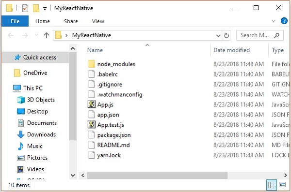

### 3 단계 : NodeJS Python Jdk8

시스템에 Python NodeJS 및 jdk8이 설치되어 있는지 확인하고 설치하십시오. 이 외에도 특정 문제를 피하기 위해 최신 버전의 yarn 를 설치하는 것이 좋습니다.


### 4 단계 : React Native CLI 설치

아래와 같이 install -g react-native-cli 명령을 사용하여 npm에 react 네이티브 명령 줄 인터페이스를 설치할 수 있습니다.

``` shell
npm install -g react-native-cli
```

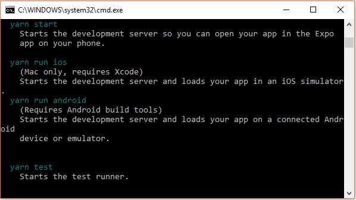

### 5 단계 : React Native 시작

설치를 확인하려면 프로젝트 폴더를 찾아보고 시작 명령을 사용하여 프로젝트를 시작해보십시오.

``` shell
C:\Users\Tutorialspoint\Desktop>cd MyReactNative
C:\Users\Tutorialspoint\Desktop\MyReactNative>npm start
```

모든 것이 잘되면 아래와 같이 QR 코드를 받게됩니다.

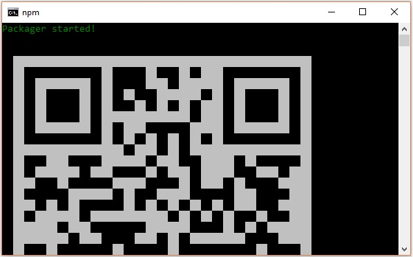

지시에 따라 Android 기기에서 React 네이티브 앱을 실행하는 한 가지 방법은 expo를 사용하는 것입니다. 안드로이드 장치에 엑스포 클라이언트를 설치하고 위에서 얻은 QR 코드를 스캔하십시오.

### 6 단계 : 프로젝트 꺼내기

Android 스튜디오를 사용하여 Android 에뮬레이터를 실행하려면 ctrl + c를 눌러 현재 명령 줄에서 나옵니다.

그런 다음 run eject 명령을 다음과 같이 실행하십시오.

``` shell
npm run eject
```

이렇게하면 꺼낼 수있는 옵션이 표시되고 화살표를 사용하여 첫 번째 항목을 선택한 다음 Enter 키를 누릅니다.

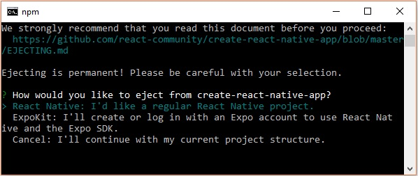

그런 다음 홈 화면에 앱 이름과 Android 스튜디오 및 Xcode 프로젝트의 프로젝트 이름을 제안해야합니다.

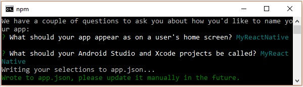

프로젝트가 성공적으로 배출되었지만 다음과 같은 오류가 발생할 수 있습니다.

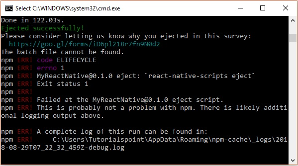

이 오류를 무시하고 다음 명령을 사용하여 android 용 react native를 실행하십시오.

``` shell
react-native run-android
```

그러나 그 전에 안드로이드 스튜디오를 설치해야합니다.

### 7 단계 : Android Studio 설치

Https://developer.android.com/studio/ 웹 페이지를 방문하여 android studio를 다운로드하십시오.

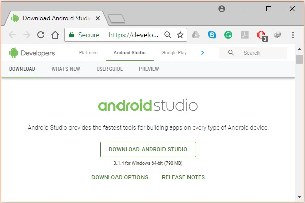

설치 파일을 다운로드 한 후 더블 클릭하여 설치를 진행합니다.

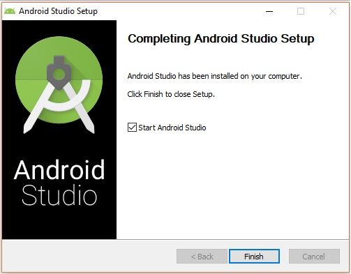

### 8 단계 : AVD Manager 구성

AVD Manager를 구성하려면 메뉴 모음에서 해당 아이콘을 클릭합니다.

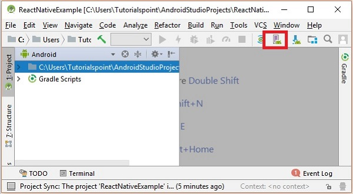

### 9 단계 : AVD Manager 구성

기기 정의를 선택하세요. Nexus 5X가 권장됩니다.

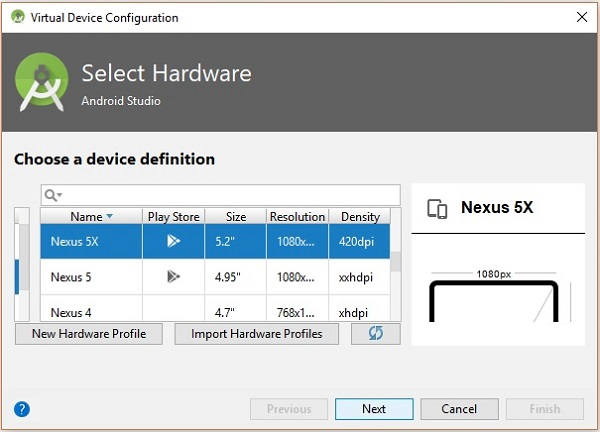

다음 버튼을 클릭하면 시스템 이미지 창이 나타납니다. X86 이미지 탭을 선택합니다.

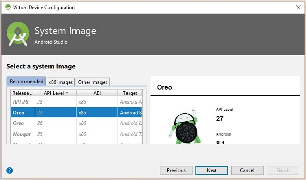

그런 다음 Marshmallow를 선택하고 다음을 클릭하십시오.

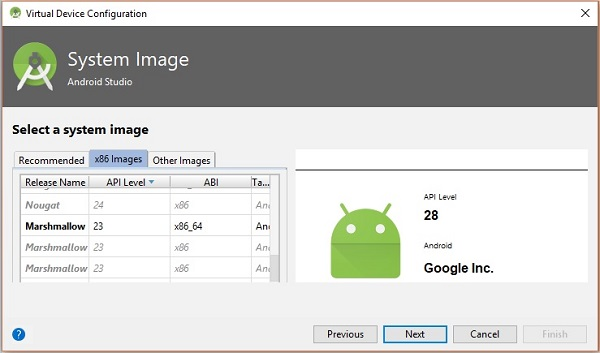

마지막으로 마침 버튼을 클릭하여 AVD 구성을 완료합니다.

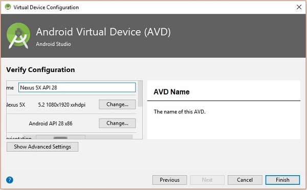

가상 장치를 구성한 후 Actions 열 아래의 재생 버튼을 클릭하여 Android 에뮬레이터를 시작합니다.

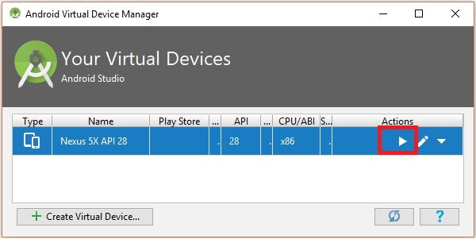

### 10 단계 : Android 실행

명령 프롬프트를 열고 프로젝트 폴더를 탐색 한 다음 `react-native run-android` 명령을 실행합니다.

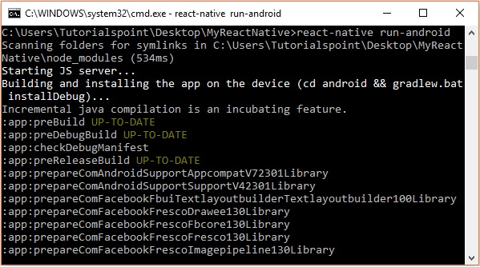

앱 실행은 상태를 볼 수있는 다른 프롬프트에서 시작됩니다.

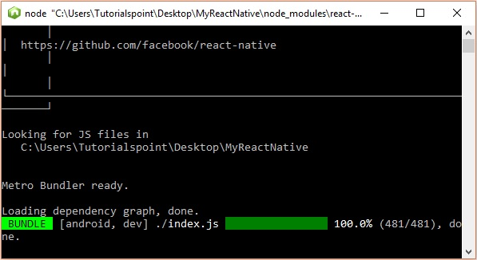

Android 에뮬레이터에서 기본 앱의 실행을 다음과 같이 볼 수 있습니다.

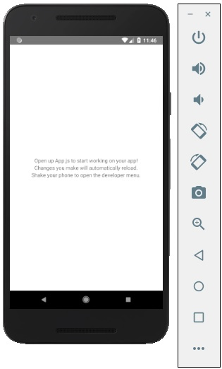

### 11 단계 : local.properties

프로젝트 폴더 SampleReactNative/android (이 경우)에서 android 폴더를 엽니 다. 이름이 local.properties 인 파일을 만들고 다음 경로를 추가합니다.

```
sdk.dir = /C:\\Users\\Tutorialspoint\\AppData\\Local\\Android\\Sdk
```

여기에서 Tutorialspoint를 사용자 이름으로 바꿉니다.

### 12 단계 : 핫 리로딩

그리고 애플리케이션을 빌드하기 위해 App.js를 수정하면 변경 사항이 Android 에뮬레이터에서 자동으로 업데이트됩니다.

그렇지 않은 경우 Android 에뮬레이터를 클릭하고 ctrl + m을 누른 다음 Enable Hot Reloading 옵션을 선택합니다.

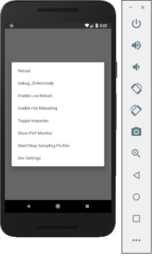


## React Native - App

기본 앱을 열면 app.js 파일이 다음과 같은 것을 확인할 수 있습니다.

``` js
import React from 'react';
import { StyleSheet, Text, View } from 'react-native';

export default class App extends React.Component {
   render() {
      return (
         <View style = {styles.container}>
            <Text>Open up App.js to start working on your app!</Text>
            <Text>Changes you make will automatically reload.</Text>
            <Text>Shake your phone to open the developer menu.</Text>
         </View>
      );
   }
}

const styles = StyleSheet.create({
   container: {
      flex: 1,
      backgroundColor: '#fff',
      alignItems: 'center',
      justifyContent: 'center',
   },
});
```

### Output

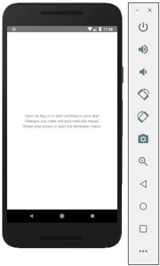

### Hello world

"Tutorialspoint에 오신 것을 환영합니다"라는 간단한 메시지를 표시하려면 CSS 부분을 제거하고 아래와 같이 `<view></view>` 안에 `<text></text> `태그로 포장 할 메시지를 삽입합니다.

``` js
import React from 'react';
import { StyleSheet, Text, View } from 'react-native';

export default class App extends React.Component {
   render() {
      return (
         <View>
            <Text>Welcome to Tutorialspoint</Text>
         </View>
      );
   }
}
```

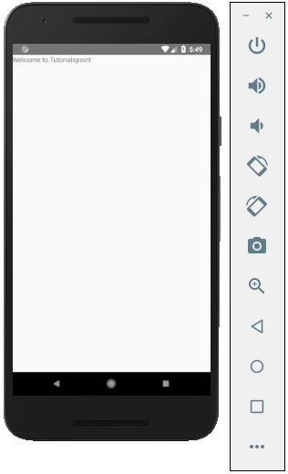


## React Native - State

React Components 내부의 데이터는 state와 props로 관리됩니다. 이 장에서 우리는 state 에 대해 이야기 할 것입니다.

### State 와 Props의 차이점

**state**는 변경 가능하지만 **props** 는 변경 불가능합니다. 즉, state 는 나중에 업데이트 할 수 있지만 props는 업데이트 할 수 없습니다.

#### state 사용

이것이 우리의 루트 구성 요소입니다. 우리는 대부분의 챕터에서 사용될 홈을 가져오고 있습니다.

**App.js**

``` js
import React from 'react';
import { StyleSheet, Text, View } from 'react-native';

export default class App extends React.Component {
   state = {
      myState: 'Lorem ipsum dolor sit amet, consectetur adipisicing elit, used do eiusmod
      tempor incididunt ut labore et dolore magna aliqua. Ut enim ad minim veniam, quis
      nostrud exercitation ullamco laboris nisi ut aliquip ex ea commodo consequat.
      Duis aute irure dolor in reprehenderit in voluptate velit esse cillum dolore eu
      fugiat nulla pariatur. Excepteur sint occaecat cupidatat non proident, sunt in
      culpa qui officia deserunt mollit anim id est laborum.'
   }
   render() {
      return (
      <View>
         <Text> {this.state.myState} </Text>
      </View>
      );
   }
}
```

다음 스크린 샷과 같이 state 에서 에뮬레이터 텍스트를 볼 수 있습니다.


#### state 업데이트

state 는 변경 가능하므로 **deleteState** 함수를 생성하여 업데이트하고 **onPress = {this.deleteText}** 이벤트를 사용하여 호출 할 수 있습니다.

**Home.js**

``` js
import React, { Component } from 'react'
import { Text, View } from 'react-native'

class Home extends Component {
   state = {
      myState: 'Lorem ipsum dolor sit amet, consectetur adipisicing elit, sed 
         do eiusmod tempor incididunt ut labore et dolore magna aliqua.
         Ut enim ad minim veniam, quis nostrud exercitation ullamco laboris nisi
         ut aliquip ex ea commodo consequat. Duis aute irure dolor in reprehenderit 
         in voluptate velit esse cillum dolore eu fugiat nulla pariatur.
         Excepteur sint occaecat cupidatat non proident, sunt in culpa qui officia
         deserunt mollit anim id est laborum.'
   }
   updateState = () ⇒ this.setState({ myState: 'The state is updated' })
   render() {
      return (
         <View>
            <Text onPress = {this.updateState}>
               {this.state.myState}
            </Text>
         </View>
      );
   }
}
export default Home;
```

**NOTES** −  모든 장에서 상태 저장 (컨테이너) 구성 요소에는 클래스 구문을 사용하고 상태 비 저장 (표현형) 구성 요소에는 함수 구문을 사용합니다. 다음 장에서 구성 요소에 대해 자세히 알아볼 것입니다.

또한 updateState에 화살표 함수 구문을 사용하는 방법을 배웁니다. 이 구문은 어휘 범위를 사용하며이 키워드는 환경 개체 (Class)에 바인딩됩니다. 이로 인해 예기치 않은 동작이 발생할 수 있습니다.

메서드를 정의하는 다른 방법은 EC5 함수를 사용하는 것이지만 이 경우 생성자에서 이를 수동으로 바인딩해야합니다. 이를 이해하려면 다음 예를 고려하십시오.

``` js
class Home extends Component {
   constructor() {
      super()
      this.updateState = this.updateState.bind(this)
   }
   updateState() {
      //
   }
   render() {
      //
   }
}
```


## React Native - Props

지난 장에서 우리는 변경 가능한 **state** 를 사용하는 방법을 보여주었습니다. 이 장에서는 **state** 와 **props**을 결합하는 방법을 보여줍니다.

프리젠 테이션 구성 요소는 **props**을 전달하여 모든 데이터를 가져와야합니다. Container Component에만 **state**가 있어야합니다.


### Container Component

이제 Container Component가 무엇이며 어떻게 작동하는지 이해할 것입니다.

#### Theory

이제 Container Component를 업데이트합니다. 이 Component 는 state 를 처리하고 프리젠테이션 구성 요소에 props 을 전달합니다.

Container Component는 상태 처리에만 사용됩니다. 보기(스타일링 등)와 관련된 모든 기능은 프레젠테이션 구성 요소에서 처리됩니다.

#### Example

마지막 장의 예제를 사용하려면 이 요소가 사용자에게 텍스트를 표시하는 데 사용되기 때문에 렌더링 기능에서 Text 요소를 제거해야 합니다. 이것은 프레젠테이션 구성 요소 내부에 있어야 합니다.

아래 주어진 예제의 코드를 검토해 보겠습니다. PresentationalComponent를 가져와서 render 함수에 전달할 것입니다.

PresentationalComponent를 가져와서 render 함수에 전달한 후에는 props를 전달해야 합니다. MyText = {this.state.myText} 및 deleteText = {this.deleteText} 를 PresentationalComponent 에 추가하여 소품을 전달합니다. 이제 Presentational 구성 요소 내부에서 액세스할 수 있습니다.

**App.js**

``` javascript
import React from 'react';
import { StyleSheet, Text, View } from 'react-native';
import PresentationalComponent from './PresentationalComponent'

export default class App extends React.Component {
   state = {
      myState: 'Lorem ipsum dolor sit amet, consectetur adipisicing elit, used do eiusmod
      tempor incididunt ut labore et dolore magna aliqua. Ut enim ad minim veniam, quis
      nostrud exercitation ullamco laboris nisi ut aliquip ex ea commodo consequat. Duis
      aute irure dolor in reprehenderit in voluptate velit esse cillum dolore eu fugiat
      nulla pariatur. Excepteur sint occaecat cupidatat non proident, sunt in culpa qui
      officia deserunt mollit anim id est laborum.'
   }
   updateState = () => {
      this.setState({ myState: 'The state is updated' })
   }
   render() {
      return (
         <View>
            <PresentationalComponent myState = {this.state.myState} updateState = {this.updateState}/>
         </View>
      );
   }
}
```


### Presentational Component

이제 프레젠테이션 구성 요소가 무엇이며 어떻게 작동하는지 이해할 것입니다.

#### Theory

프레젠테이션 구성 요소는 사용자에게 view를 제공하는 용도로만 사용해야 합니다. 이러한 구성 요소에는 상태가 없습니다. 그들은 모든 데이터와 기능을 props로 부터  받습니다.

가장 좋은 방법은 가능한 한 많은 프레젠테이션 구성 요소를 사용하는 것입니다.

#### Example

이전 장에서 언급했듯이 프레젠테이션 구성 요소에 EC6 함수 구문을 사용하고 있습니다.

컴포넌트는 props를 수신하고 뷰 요소를 반환하고 {props.myText}를 사용하여 텍스트를 표시하고 사용자가 텍스트를 클릭할 때 {props.deleteText} 함수를 호출합니다.

``` js
import React, { Component } from 'react'
import { Text, View } from 'react-native'

const PresentationalComponent = (props) => {
   return (
      <View>
         <Text onPress = {props.updateState}>
            {props.myState}
         </Text>
      </View>
   )
}
export default PresentationalComponent
```

이제 State 챕터에서와 동일한 기능을 갖습니다. 유일한 차이점은 코드를 컨테이너와 프리젠테이션 구성 요소로 리팩토링했다는 것입니다.

앱을 실행하고 다음 스크린샷과 같이 텍스트를 볼 수 있습니다.


텍스트를 클릭하면 화면에서 제거됩니다.

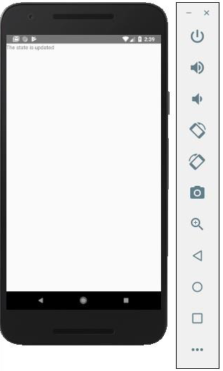


## React Native - Styling

React Native에서 elements  의 스타일을 지정하는 몇 가지 방법이 있습니다.

**style** property 를 사용하여 스타일을 인라인으로 추가할 수 있습니다. 그러나 이것은 코드를 읽기가 어려울 수 있기 때문에 모범 사례가 아닙니다.

이 장에서는 **Stylesheet** 를 사용하여 스타일을 지정합니다.


### Container Component

이 섹션에서는 이전 장의 컨테이너 구성 요소를 단순화합니다.

**App.js**

``` js
import React from 'react';
import { StyleSheet, Text, View } from 'react-native';
import PresentationalComponent from './PresentationalComponent'

export default class App extends React.Component {
   state = {
      myState: 'This is my state'
   }
   render() {
      return (
         <View>
            <PresentationalComponent myState = {this.state.myState}/>
         </View>
      );
   }
}
```


### Presentational Component

다음 예에서는 StyleSheet를 가져옵니다. 파일 맨 아래에서 스타일시트를 만들고 이를 스타일 상수에 할당합니다. 스타일은 camelCase에 있으며 스타일 지정에 px 또는 %를 사용하지 않습니다.

텍스트에 스타일을 적용하려면 Text 요소에 style = {styles.myText} 속성을 추가해야 합니다.

**PresentationalComponent.js**

``` js
import React, { Component } from 'react'
import { Text, View, StyleSheet } from 'react-native'

const PresentationalComponent = (props) => {
   return (
      <View>
         <Text style = {styles.myState}>
            {props.myState}
         </Text>
      </View>
   )
}
export default PresentationalComponent

const styles = StyleSheet.create ({
   myState: {
      marginTop: 20,
      textAlign: 'center',
      color: 'blue',
      fontWeight: 'bold',
      fontSize: 20
   }
})
```

앱을 실행하면 다음과 같은 출력을 받게 됩니다.

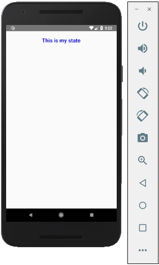


## React Native - Flexbox

다양한 화면 크기를 수용하기 위해 React Native는 Flexbox 지원을 제공합니다.

React Native - Styling 장에서 사용한 것과 동일한 코드를 사용할 것입니다. **PresentationalComponent**만 변경할 것입니다.

### Layout

원하는 레이아웃을 달성하기 위해 flexbox는 flexDirection justifyContent 및 alignItems의 세 가지 주요 속성을 제공합니다.

다음 표는 가능한 옵션을 보여줍니다.

|    Property    |                            Values                            |                         Description                          |
| :------------: | :----------------------------------------------------------: | :----------------------------------------------------------: |
| flexDirection  |                       'column', 'row'                        | 요소를 수직 또는 수평으로 정렬할지 여부를 지정하는 데 사용됩니다. |
| justifyContent | 'center', 'flex-start', 'flex-end', 'space-around', 'space-between' | 요소가 컨테이너 내부에 어떻게 배포되어야 하는지 결정하는 데 사용됩니다. |
|   alignItems   |       'center', 'flex-start', 'flex-end', 'stretched'        | 보조 축(flexDirection의 반대)을 따라 컨테이너 내부에 요소가 어떻게 분산되어야 하는지 결정하는 데 사용됩니다. |

항목을 세로로 정렬하고 중앙 집중화하려면 다음 코드를 사용할 수 있습니다.

**App.js**

```js
import React, { Component } from 'react'
import { View, StyleSheet } from 'react-native'

const Home = (props) => {
   return (
      <View style = {styles.container}>
         <View style = {styles.redbox} />
         <View style = {styles.bluebox} />
         <View style = {styles.blackbox} />
      </View>
   )
}

export default Home

const styles = StyleSheet.create ({
   container: {
      flexDirection: 'column',
      justifyContent: 'center',
      alignItems: 'center',
      backgroundColor: 'grey',
      height: 600
   },
   redbox: {
      width: 100,
      height: 100,
      backgroundColor: 'red'
   },
   bluebox: {
      width: 100,
      height: 100,
      backgroundColor: 'blue'
   },
   blackbox: {
      width: 100,
      height: 100,
      backgroundColor: 'black'
   },
})
```

**Output**

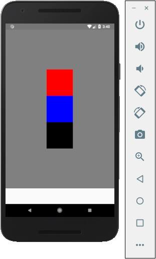

항목을 오른쪽으로 이동해야 하고 항목 사이에 공백을 추가해야 하는 경우 다음 코드를 사용할 수 있습니다.

**App.js**

```js
import React, { Component } from 'react'
import { View, StyleSheet } from 'react-native'

const App = (props) => {
   return (
      <View style = {styles.container}>
         <View style = {styles.redbox} />
         <View style = {styles.bluebox} />
         <View style = {styles.blackbox} />
      </View>
   )
}

export default App

const styles = StyleSheet.create ({
   container: {
      flexDirection: 'column',
      justifyContent: 'space-between',
      alignItems: 'flex-end',
      backgroundColor: 'grey',
      height: 600
   },
   redbox: {
      width: 100,
      height: 100,
      backgroundColor: 'red'
   },
   bluebox: {
      width: 100,
      height: 100,
      backgroundColor: 'blue'
   },
   blackbox: {
      width: 100,
      height: 100,
      backgroundColor: 'black'
   },
})
```

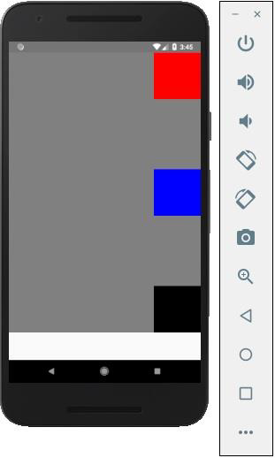


## React Native - ListView

이 장에서는 React Native에서 목록을 만드는 방법을 보여줍니다. Home 컴포넌트에서 List를 가져와서 화면에 보여줄 것입니다.

**App.js**

``` js
import React from 'react'
import List from './List.js'

const App = () => {
   return (
      <List />
   )
}
export default App
```

목록을 생성하기 위해 map() 메소드를 사용할 것입니다. 이것은 항목 배열을 반복하고 각각을 렌더링합니다.

**List.js**

``` js
import React, { Component } from 'react'
import { Text, View, TouchableOpacity, StyleSheet } from 'react-native'
   
class List extends Component {
   state = {
      names: [
         {
            id: 0,
            name: 'Ben',
         },
         {
            id: 1,
            name: 'Susan',
         },
         {
            id: 2,
            name: 'Robert',
         },
         {
            id: 3,
            name: 'Mary',
         }
      ]
   }
   alertItemName = (item) => {
      alert(item.name)
   }
   render() {
      return (
         <View>
            {
               this.state.names.map((item, index) => (
                  <TouchableOpacity
                     key = {item.id}
                     style = {styles.container}
                     onPress = {() => this.alertItemName(item)}>
                     <Text style = {styles.text}>
                        {item.name}
                     </Text>
                  </TouchableOpacity>
               ))
            }
         </View>
      )
   }
}
export default List

const styles = StyleSheet.create ({
   container: {
      padding: 10,
      marginTop: 3,
      backgroundColor: '#d9f9b1',
      alignItems: 'center',
   },
   text: {
      color: '#4f603c'
   }
})
```

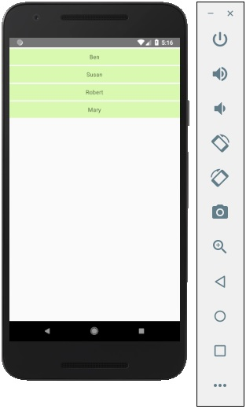

목록의 각 항목을 클릭하여 이름으로 경고를 트리거할 수 있습니다.

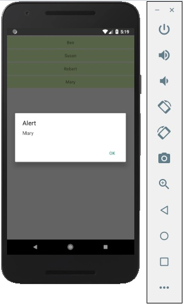


## React Native - Text Input

이 장에서는 React Native에서 TextInput 요소를 사용하는 방법을 보여줍니다.

홈 구성 요소는 입력을 가져오고 렌더링합니다.

**App.js**

``` js
import React from 'react';
import Inputs from './inputs.js'

const App = () => {
   return (
      <Inputs />
   )
}
export default App
```

### Inputs

초기 상태를 정의합니다.

초기 상태를 정의한 후 handleEmail 및 handlePassword 함수를 생성합니다. 이러한 함수는 상태를 업데이트하는 데 사용됩니다.

Login() 함수는 상태의 현재 값을 경고합니다.

또한 자동 대문자 사용을 비활성화하고 Android 기기에서 하단 테두리를 제거하고 자리 표시자를 설정하기 위해 텍스트 입력에 몇 가지 다른 속성을 추가합니다.

**inputs.js**

```js
import React, { Component } from 'react'
import { View, Text, TouchableOpacity, TextInput, StyleSheet } from 'react-native'

class Inputs extends Component {
   state = {
      email: '',
      password: ''
   }
   handleEmail = (text) => {
      this.setState({ email: text })
   }
   handlePassword = (text) => {
      this.setState({ password: text })
   }
   login = (email, pass) => {
      alert('email: ' + email + ' password: ' + pass)
   }
   render() {
      return (
         <View style = {styles.container}>
            <TextInput style = {styles.input}
               underlineColorAndroid = "transparent"
               placeholder = "Email"
               placeholderTextColor = "#9a73ef"
               autoCapitalize = "none"
               onChangeText = {this.handleEmail}/>
            
            <TextInput style = {styles.input}
               underlineColorAndroid = "transparent"
               placeholder = "Password"
               placeholderTextColor = "#9a73ef"
               autoCapitalize = "none"
               onChangeText = {this.handlePassword}/>
            
            <TouchableOpacity
               style = {styles.submitButton}
               onPress = {
                  () => this.login(this.state.email, this.state.password)
               }>
               <Text style = {styles.submitButtonText}> Submit </Text>
            </TouchableOpacity>
         </View>
      )
   }
}
export default Inputs

const styles = StyleSheet.create({
   container: {
      paddingTop: 23
   },
   input: {
      margin: 15,
      height: 40,
      borderColor: '#7a42f4',
      borderWidth: 1
   },
   submitButton: {
      backgroundColor: '#7a42f4',
      padding: 10,
      margin: 15,
      height: 40,
   },
   submitButtonText:{
      color: 'white'
   }
})
```

입력 필드 중 하나를 입력할 때마다 상태가 업데이트됩니다. 제출 버튼을 클릭하면 입력의 텍스트가 대화 상자 안에 표시됩니다.

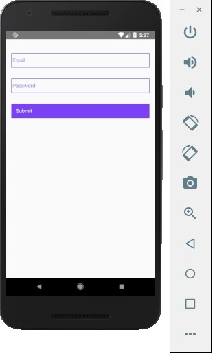

입력 필드 중 하나를 입력할 때마다 상태가 업데이트됩니다. 제출 버튼을 클릭하면 입력의 텍스트가 대화 상자 안에 표시됩니다.

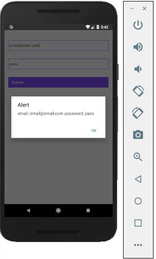


## React Native - ScrollView

https://www.tutorialspoint.com/react_native/react_native_scrollview.htm

