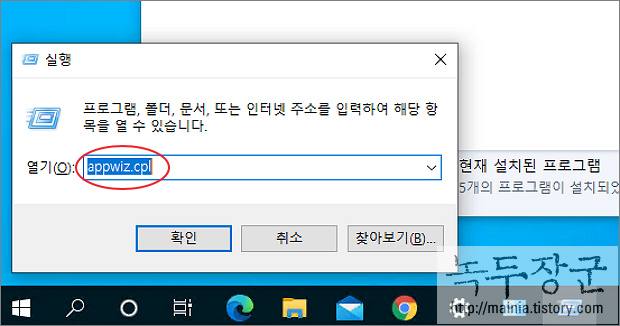
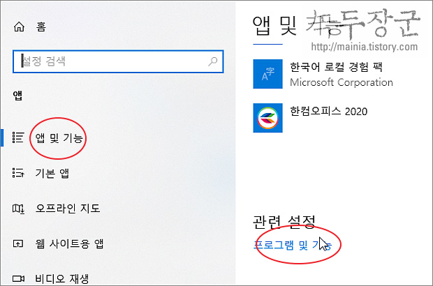
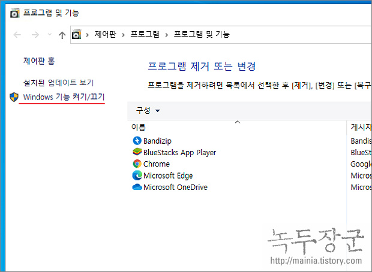
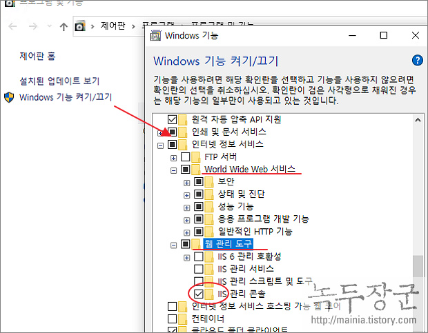
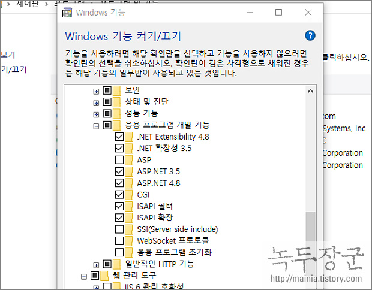
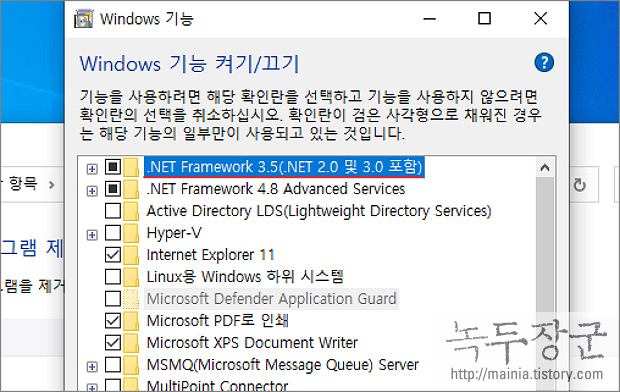
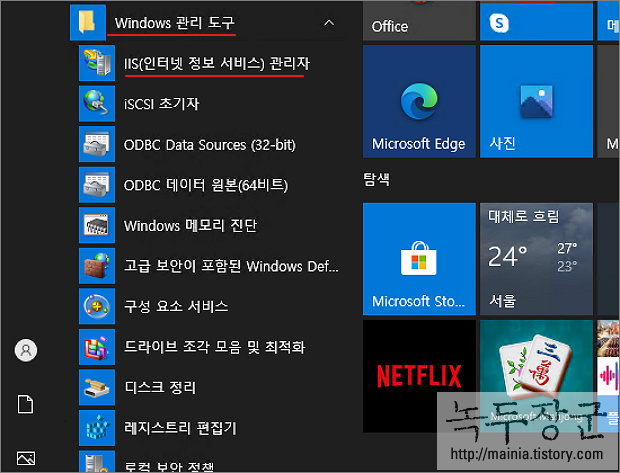
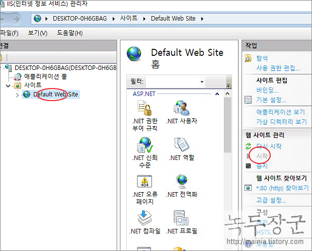
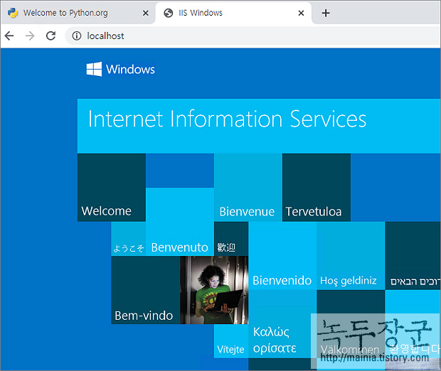

# 윈도우10 IIS 설치 및 구동 하기

출처: https://mainia.tistory.com/6131

asp.net 으로 작성한 웹 애플리케이션을 구동하기 위해서는 IIS 웹 서버가 필요합니다. 여기에 PHP 와 Tomcat 도 연동이 가능합니다. 저는 워드프레스를 IIS 웹 서버로 띄워서 테스트하고 있습니다. 굳이 윈도우 서버가 필요하지 않습니다. 윈도우10 home, pro 버전에서도 설치가 가능하기 때문입니다. 이미 윈도우10 안에 IIS 가 내장되어 있으며, Windows 기능 켜기/끄기 를 통해 바로 설치할 수 있습니다. 반드시 .NET Framework 도 설치해야 합니다. 간혹 구동이 안된다는 분들은 .NET Framework 설치를 빠트리곤 합니다.

 

 

 

**[****목차]** **1.**  **프로그램 제거/변경 제어판 접속하기** **2.**  **IIS** **기능 켜기** 3.  **IIS** **웹 서버 구동과 확인하기**

 

 

**◎** **1.** **프로그램 제거/변경 제어판 접속하기**

 

 

▼ 제어판의 ***"프로그램 및 기능"\*** 화면으로 접속하기 위한 방법 두 가지를 소개합니다. 첫 번째는 ***"윈도우키 + R"\*** 단축키를 눌러 실행창을 띄웁니다. 그리고 ***appwiz.cpl\*** 입력하고 Enter 를 누릅니다.

 

▼ 두 번째 방법은 윈도우 설정창을 통해서 진입하는 것입니다. ***윈도우 설정 > 앱 > 앱 및 기능 > 프로그램 및 기능\*** 링크를 클릭합니다. 

 

▼ 위의 두 가지 방법 중 하나를 이용해서 프로그램 및 기능 화면을 띄우고 왼쪽 사이드에 있는 ***Windows 기능 켜기/끄기\*** 를 클릭합니다. 

 

※ 아래는 참고하면 좋을 만한 글들의 링크를 모아둔 것입니다. ※ ▶ [윈도우10 IIS 웹서버에 자신이 만든 웹 페이지 올리는 방법](https://mainia.tistory.com/6132) ▶ [윈도우10 아파치 웹 서버 설치하기](https://mainia.tistory.com/5572) ▶ [윈도우10 아파치 Apache 웹 서버 서비스에 등록해서 사용하는 방법](https://mainia.tistory.com/5352) ▶ [윈도우10 IIS 에 PHP 구동하는 방법](https://mainia.tistory.com/6422) ▶ [윈도우10 IIS 에서 워드프레스 구동하기](https://mainia.tistory.com/6236)

 

 

 

 

**◎** **2. IIS** **기능 켜기**

 

 

▼ IIS 구동을 위해 설치해야 할 프로그램들은 Windows 기능 목록에 있습니다. 목록 아래로 내려가서 ***"인터넷 정보 서비스"\*** 항목을 확장합니다. 하위에 ***World Wide Web 서비스\***와 ***웹 관리 도구\***를 체크합니다. 웹 관리 도구에는 ***IIS 관리 콘솔\***만 체크합니다. 

 

▼ 다음은 인터넷 정보 서비스 > World Wide Web 서비스 > 응용 프로그램 개발 기능 를 확장해서 상세 목록을 띄웁니다. IIS 에서 응용프로그램을 실행하기 위한 설치 목록들 입니다.

l "ASP.NET 3.5" 또는 "ASP.NET 4.7" : asp.net 프로그램을 실행

l "CGI(Common Gateway Interface)" : IIS 가 외부 프로그램을 실행시키는 방법을 제공. CGI 방식의 요청을 위한 프로그램

l "ISAPI(Internet Server Application Programming Interface)" : PHP 와 Java 응용프로그램의 연동 가능

 

 

▼ 마지막으로 .NET Framework 3.5 를 설치합니다. 이것이 설치되어 있지 않으면 IIS 가 동작하지 않습니다. 

 

 

 

**◎** **3. IIS** **웹 서버 구동과 확인하기**

 

 

▼ ***Windows\*** ***기능\*** 목록에서 설치하고 싶은 것들을 체크하고 확인 버튼을 눌러 창을 닫으면 프로그램 설치를 시작합니다. 프로그램 설치가 완료된 후 재부팅 할 필요는 없습니다. IIS 실행을 위해 메뉴에서 ***Windows 관리 도구 > IIS(인터넷 정보 서비스) 관리자\***를 찾습니다. 

 

▼ 인터넷 정보 서비스 관리자를 실행합니다. 왼쪽 트리에서 ***사이트 > Default Web Site\*** 를 선택합니다. 오른쪽 화면으로 가서 ***작업 > 웹 사이트 관리\*** 섹션에 3개의 버튼이 있는데, ***시작\*** 을 클릭해서 웹 서버를 구동합니다. 

 

▼ 실제 웹 서버가 구동되었는지 확인하기 위해서 웹 브라우저로 접속해 보겠습니다. 아래 주소에서 포트 번호인 80 은 입력하지 않아도 됩니다. http 기본 프로토콜이 80 이기 때문입니다. 웹 브라우저에 그림과 같은 화면이 뜨면 구동을 완료한 것입니다. 

 

***http://localhost:80\*** 

 

※ 아래는 참고하면 좋을 만한 글들의 링크를 모아둔 것입니다. ※ ▶ [윈도우10 IIS 웹서버에 자신이 만든 웹 페이지 올리는 방법](https://mainia.tistory.com/6132) ▶ [윈도우10 아파치 웹 서버 설치하기](https://mainia.tistory.com/5572) ▶ [윈도우10 아파치 Apache 웹 서버 서비스에 등록해서 사용하는 방법](https://mainia.tistory.com/5352) ▶ [윈도우10 IIS 에 PHP 구동하는 방법](https://mainia.tistory.com/6422) ▶ [윈도우10 IIS 에서 워드프레스 구동하기](https://mainia.tistory.com/6236)