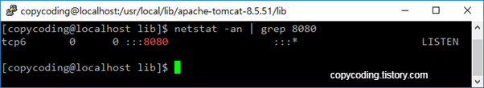

# CentOS 7 톰캣(tomcat 8.5) 설치

출처: https://copycoding.tistory.com/291

CentOS에 tomcat을 설치하고 구동하려면 java가 설치되어 있어야 합니다. CentOS 7에는 OpenJDK가 설치되어 있으니 별도로 java를 설치하지 않아도 됩니다.

 

### 1. 파일 다운로드

 

Tomcat을 설치하기 위해 톰캣 사이트에 들어가 직접 다운로드 받아 사용할 수도 있지만 터미널에서 바로 다운로드 받을 수도 있습니다. 그러려면 다운받을 파일명을 알고 있어야 하는데 그렇지 못하다면 한번은 톰캣 사이트에 한번 접속해야 합니다.

다운로드 페이지에서 자신에게 적합한 버전을 찾아 다운받을 파일을 선택 하고 마우스 우측 버튼을 클릭하여 링크 주소를 복사해 옵니다. 복사한 주소는 앞에 wget을 붙여주어 명령어를 완성 시키고 실행 합니다.

 

$ **wget http://mirror.apache-kr.org/tomcat/tomcat-8/v8.5.51/bin/apache-tomcat-8.5.51.tar.gz**

명령어를 입력하고 잠시 기다리면 다운로드가 완료 됩니다.

 

### 2. 설치

 

설치 작업은 먼저 tar 명령을 이용하여 다운받은 파일의 압축을 풀어 줍니다.

$ **tar –zxvf apache-tomcat-8.5.51.tar.gz**

 

압축이 풀리면 그냥 현재의 폴더에 놓고 사용해도 되지만 혼자 사용 하는게 아니라면 root로 로그인 해서 모두가 사용하고 관리도 일관성 있도록 추가 작업을 진행 합니다.

 

일단 압축을 풀어준 폴더를 이동 합니다. 물론 개인적인 기호에 따라 다른 폴더로 이동해도 됩니다.

\# **mv /home/copycoding/apache-tomcat-8.5.51.tar.gz /usr/local/lib**

/usr/local/lib에 이동이 되었는지 확인 합니다.

이렇게 압축을 풀어주는 것으로 설치는 완료 됩니다.

 

 

### 3. 환경 설정

 

마지막으로 환경 설정만 잡아주면 로그인한 사용자는 어느 폴더에서건 사용이 가능합니다.

/etc/profile을 열고 설정을 추가 합니다.

\# **vi /etc/profile**

 

CATALINA_HOME=/usr/local/lib/apache-tomcat-8.5.51CLASSPATH=.:$JAVA_HOME/lib/tools.jar:$CATALINA_HOME/lib/jsp-api.jar:$CATALINA_HOME/lib/servlet-api.jarPATH=$PATH:$JAVA_HOME/bin:$JRE_HOME/bin:$CATALINA_HOME/binexport JAVA_HOMEexport JRE_HOMEexport CLASSPATH CATALINA_HOME

 

JAVA 설정과 석여있긴 한데 tomcat 설정 부분(CATALINA)만 보시면 됩니다.

profile을 수정 하였으니 source 명령어로 수정사항을 반영 합니다.

\# **source /etc/profile**

설정 작업도 완료가 되었습니다.

 

### 4. 실행

 

이제 실행을 해 봅니다.

 

\# **/usr/local/lib/apache-tomcat-8.5.51/bin/startup.sh**

tomcat이 구동 되었고 포트가 listen 상태인지도 확인 합니다.

 

$ **netstat -an | grep 8080**

잘 떠있군요. 그럼 브라우저로 접속을 해보면

연결 오류가 발생 하는군요.  보안을 위한 방화벽이 작동되어 차단이 된것 입니다. 방화벽 차단을 위해 다음 명령을 입력 합니다.

 

**# firewall-cmd --permanent --zone=public --add-port=8080/tcp**

**# firewall-cmd --reload**

 

이제 다시 접속해 볼까요?

 

\# **/usr/local/lib/apache-tomcat-8.5.51/bin/startup.sh**

다시 사이트에 접속 합니다.

성공 입니다. tomcat 을 중지하려면 다음 명령을 사용 합니다.

\# **/usr/local/lib/apache-tomcat-8.5.51/bin/****shutdown.sh**

\- copy coding -