# Amplication

출처: https://docs.amplication.com/docs/


## Getting Started


### Amplication 문서

Amplication은 오픈 소스 개발 도구입니다. 전문 Node.js 개발자가 반복적 인 코딩 작업에 시간을 소비하지 않고 양질의 Node.js 애플리케이션을 개발할 수 있도록 도와줍니다.

Amplication은 TypeScript 및 Node.js를 기반으로 모든 기능을 갖춘 앱을 자동 생성합니다.

생성 된 앱에는 NestJS, Prisma, REST API, GraphQL API, React 관리 UI, 인증, 권한 부여 및 로깅이 포함됩니다.

- 데이터 모델 및 역할 기반 액세스 제어를 쉽게 생성하고 Amplication이 애플리케이션을 생성하도록합니다.
- 애플리케이션의 소스 코드를 즉시 다운로드하거나 새로운 Pull Request를 GitHub 저장소로 푸시하세요.
- 코딩 기술로 애플리케이션을 계속 개발하고 언제든지 Amplication으로 돌아와 모델과 역할을 추가하고 새 버전을 생성하십시오.
- 선택적으로 데이터베이스, Node.js 애플리케이션 및 React 클라이언트로 Docker 컨테이너를 다운로드하거나 빌드하고 애플리케이션을 클라우드 또는 로컬 환경에 지속적으로 배포합니다.


### 생성 된 앱

Amplication은 TypeScript 및 Node.js를 기반으로 사람이 읽을 수 있고 편집 가능한 모든 기능을 갖춘 앱을 자동 생성합니다.

생성 된 앱에는 NestJS, Prisma, REST API, GraphQL API, React 관리 UI, 인증, 권한 부여 및 로깅이 포함됩니다.

이 기사에서는 응용 프로그램의 구조와 그 뒤에있는 기술에 대한 세부 정보를 찾을 수 있습니다.


#### Technologies

생성 된 앱은 다음과 같은 검증 된 오픈 소스 기술로 빌드됩니다.


##### Server-side

- [NestJS](https://nestjs.com/) - 효율적이고 안정적이며 확장 가능한 서버 측 애플리케이션을 구축하기위한 진보적 인 Node.js 프레임 워크입니다.
- [Prisma](https://www.prisma.io/) - Node.js 및 TypeScript를위한 차세대 ORM.
- [PostgreSQL](https://www.postgresql.org/) - 세계에서 가장 진보 된 오픈 소스 관계형 데이터베이스
- [Passport](http://www.passportjs.org/) - Node.js에 대한 간단하고 눈에 잘 띄지 않는 인증
- [GraphQL](https://graphql.org/) - API 용 쿼리 언어입니다.
- [Swagger UI](https://swagger.io/) - OpenAPI 사양에 기반한 REST API에 대한 시각적 문서입니다.
- [Jest](https://jestjs.io/) -단순성에 초점을 맞춘 즐거운 JavaScript 테스팅 프레임 워크.
- [Docker](https://www.docker.com/) - 애플리케이션을 개발, 배송 및 실행하기위한 개방형 플랫폼입니다.


##### Client-Side

- [ReactJS](https://reactjs.org/) - 사용자 인터페이스 구축을위한 JavaScript 라이브러리.
- [Axios](https://github.com/axios/axios) - 브라우저 및 node.js 용 Promise 기반 HTTP 클라이언트..
- [Formik](https://formik.org/) - 번거롭지 않은 양식 유효성 검사를 위해 후크 및 구성 요소를 리 액트합니다.


#### 프로젝트 구조

생성 된 앱은 각각 별도의 폴더에있는 두 개의 프로젝트에서 빌드됩니다.

- Server - REST API, GraphQL, 서비스 등을 포함한 모든 서버 구성 요소.
- Admin - 모든 데이터 모델에 대한 CRUD 작업을위한 양식을 포함한 관리 UI의 경우.


##### Server

서버 프로젝트는 REST API, GraphQL API, 인증, 권한 부여, 로깅, 데이터 유효성 검사 및 데이터베이스 연결과 같은 애플리케이션의 모든 백엔드 서비스를 제공합니다.

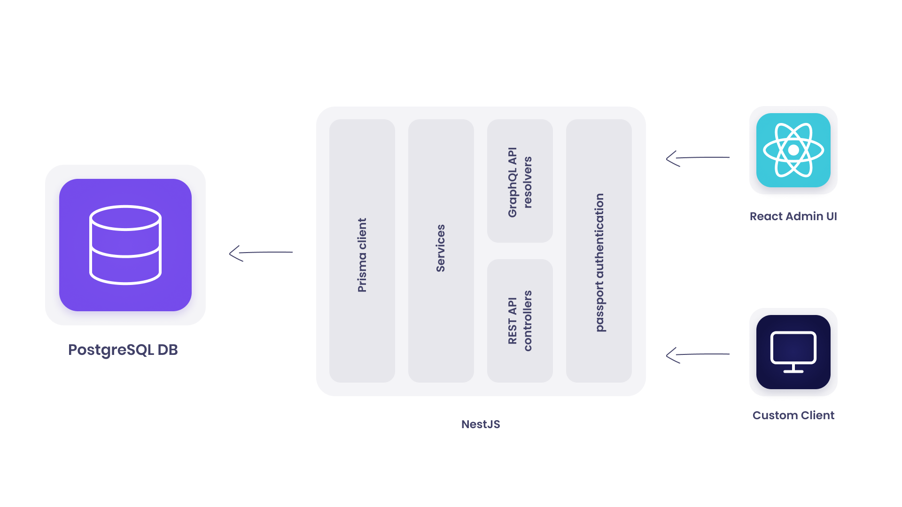

##### Admin

Admin 프로젝트는 React 애플리케이션에 애플리케이션의 모든 데이터 모델을 만들고 편집 할 수있는 기성 양식을 제공합니다. React 앱은 서버와 함께 작동하도록 미리 구성되어 있으며 라우팅 및 탐색, 인증, 권한, 메뉴, 탐색 경로, 오류 처리 등 클라이언트를위한 모든 상용구 및 기반과 함께 제공됩니다.

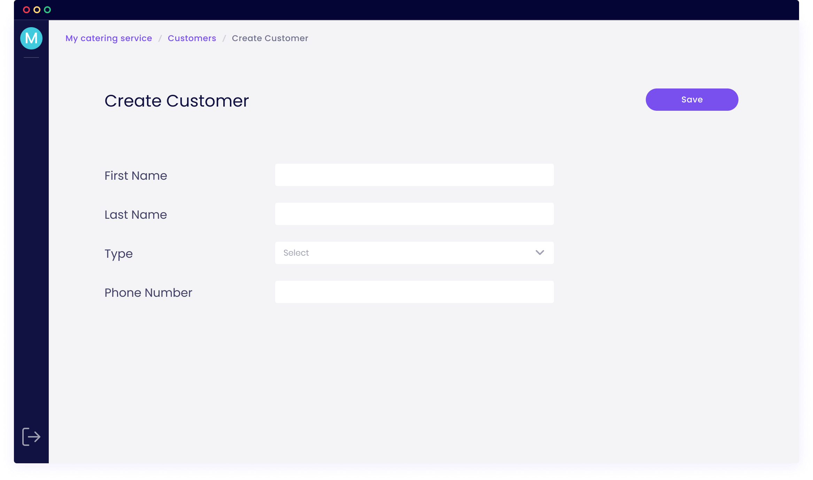


##### 더 알아보기

- [애플리케이션에 사용자 지정 코드를 추가하는 방법](https://docs.amplication.com/docs/how-to/custom-code)


### 첫 번째 응용 프로그램

출처: https://docs.amplication.com/docs/first-app

시작하는 방법을 모르십니까? 이 자습서에서는 애플리케이션 생성, 엔터티 추가, 역할 추가 및 엔터티에 대한 권한 설정 단계를 안내합니다.

또한 변경 사항을 커밋하고 버전을 관리하는 방법과 마지막으로 앱을 빌드하고 생성 된 소스 코드를 다운로드하는 방법을 볼 수 있습니다.

Let’s get started.

#### 새 앱 만들기

- [app.amplication.com](https://app.amplication.com/) 에 로그인합니다. 내 앱 페이지로 이동해야합니다. My Apps 페이지가 아닌 경우 왼쪽 상단 모서리에있는 Amplication 로고를 클릭하여이 페이지로 이동하십시오. 이것이 우리의 시작점입니다.
- 내 앱 페이지에서 **Create New App**을 클릭합니다.
- 새 앱 대화 상자에서 앱의 이름을 "Task Management"로 지정하고 설명을 "My first app for task management"로 입력합니다.
- **Create App** 을 클릭합니다.

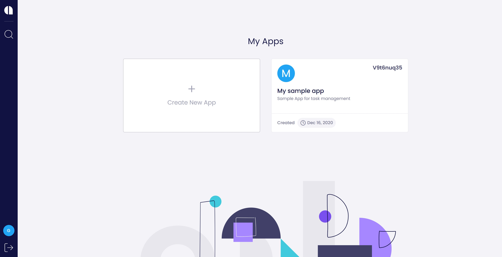


#### Create an Entity

엔터티 아이콘 (왼쪽 사이드 바, 일명 기본 메뉴)을 클릭하여 엔터티 페이지로 이동하면 여기에 애플리케이션의 모든 엔터티가 표시됩니다.

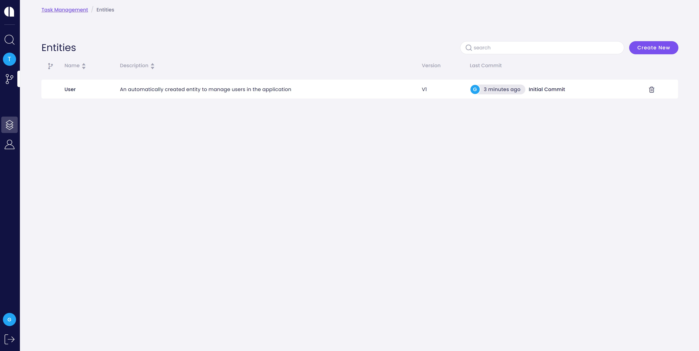

```
TIP
현재 새 앱을 만들 때 자동 생성 된 "사용자"엔터티 만 있습니다.
```

이 자습서의 목적을 위해 이제 "Project"라는 다른 엔터티를 추가합니다.

1. Click **Create New**.
2. New Entity 대화 상자에서 "Project"를 입력합니다.
3. Click **Create Entity**.

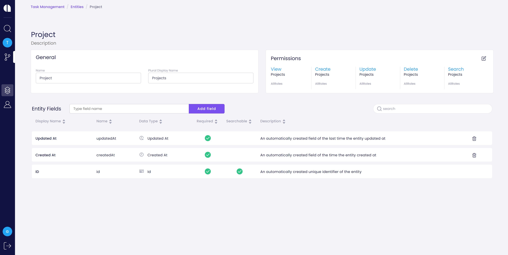

이제 새 "프로젝트"엔티티가 있습니다. 추가 된 엔터티에는 "복수 표시 이름"과 같은 자동 생성 값과 일부 기본 필드 (ID, 만든 날짜 및 업데이트 날짜)가 함께 제공됩니다.

##### 항목 필드 추가

프로젝트를 설명하려면 몇 가지 새 필드를 추가하십시오. 이 자습서의 목적을 위해 다음 필드를 추가합니다.

- Name – 프로젝트 이름 저장
- Description – 프로젝트에 대한 자세한 설명을 저장하기 위해
- Start Date – 이 프로젝트가 시작되는 날짜를 저장하기 위해
- Owner – 사용자를 프로젝트의 소유자로 지정

##### 이름 필드 만들기

1. 엔터티 필드 텍스트 상자 (필드 목록 위)에 "Name"을 입력합니다.
2. 필드 추가를 클릭하거나 Enter를 누르십시오. 새 필드가 목록에 추가됩니다.
3. 필드의 속성 패널이 열립니다. 필수 필드 토글을 클릭하여 이름 필드를 필수로 만드십시오.
4. 다른 속성 (검색 가능 비활성, 데이터 유형 'Single Line Text'및 최대 길이 '1000')에 대해서는 기본값을 그대로 둡니다.

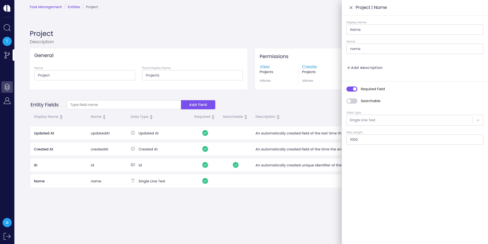

```
TIP
모든 변경 사항은 자동으로 저장됩니다.
```

##### 설명 필드 만들기

1. 엔터티 필드 텍스트 상자에 'Description'을 입력합니다.
2. 필드 추가를 클릭하거나 Enter를 누르십시오. 새 필드가 목록에 추가됩니다.
3. 필드의 속성 패널이 열립니다. 기본값 (필수 필드 및 검색 가능 비활성화, 데이터 유형 'Multi Line Text'및 최대 길이 '1000')을 그대로 둡니다.

##### 시작 날짜 필드 만들기

1. 엔터티 필드 텍스트 상자에 "Start Date"를 입력합니다.

```
INFO
공백이 지원되므로 설명 필드 이름을 입력 할 때 유용합니다. 값은 필드의 표시 이름으로 저장됩니다. 표시 이름 외에도 각 필드에는 공백이나 특수 문자가 포함되지 않은 자동 생성 된 이름이 있습니다. 이 이름은 나중에 API 엔드 포인트 및 생성 된 코드의 다른 위치에 사용됩니다. 필요한 경우 필드의 속성 패널에서 필드 이름을 수동으로 변경할 수 있습니다.
```

2. **Add field** 를 클릭하거나 Enter를 누르십시오. 새 필드가 목록에 추가됩니다.
3. 필드의 속성 패널이 열립니다. 기본값 (필수 필드 및 검색 가능 비활성, 데이터 유형 'Date Time'및 시간대 'Local Time')을 그대로 둡니다.

##### 소유자 필드 만들기

1. 엔터티 필드 텍스트 상자에 "Owner"를 입력합니다.
2. **Add field** 를 클릭하거나 Enter를 누르십시오. 새 필드가 목록에 추가됩니다.
3. 필드의 속성 패널이 열립니다. 데이터 유형을 'Single Line Text'에서 'Relation to another Entity'로 변경합니다.
4. 관련 항목 ID 필드에서 'User'를 선택합니다.
5. 필수 필드 토글을 클릭하여 "Owner"필드를 필수로 만드십시오.

```
TIP
먼저 원하는 모든 필드를 차례로 추가하고 나중에 각 필드의 속성을 설정하는 것이 더 쉬울 수 있습니다.
```

##### 액세스 권한 설정

사용자가 엔티티에 액세스 할 수 있도록 허용하려면 해당 권한을 설정해야합니다.

다음 작업 각각에 대해 권한을 별도로 제어 할 수 있습니다.

- **View**
- **Create**
- **Update**
- **Delete**
- **Search**

기본적으로 이러한 모든 작업은 허용되지 않으므로 누구에게 어떤 작업이 허용되는지 결정해야합니다. 이것은 역할이 편리한 곳입니다.

##### 역할 생성

Roles 아이콘 (왼쪽 사이드 바, 일명 기본 메뉴)을 클릭하여 역할 페이지로 이동하면 여기에 애플리케이션의 모든 역할이 표시됩니다.

```
TIP
현재는 새 앱을 만들 때 자동 생성 된 기본 'User'역할 만 있습니다.
```

이 자습서의 목적을 위해 이제 "Admin"와 "Manager"라는 두 가지 역할을 추가 할 것입니다.

1. 역할 이름 입력 텍스트 상자에 'Admin'을 입력합니다.
2. **Add Role** 를 클릭하거나 Enter를 누르십시오. 새 역할이 목록에 추가됩니다.
3. 이 단계를 반복하여 'Manager'역할을 추가합니다.

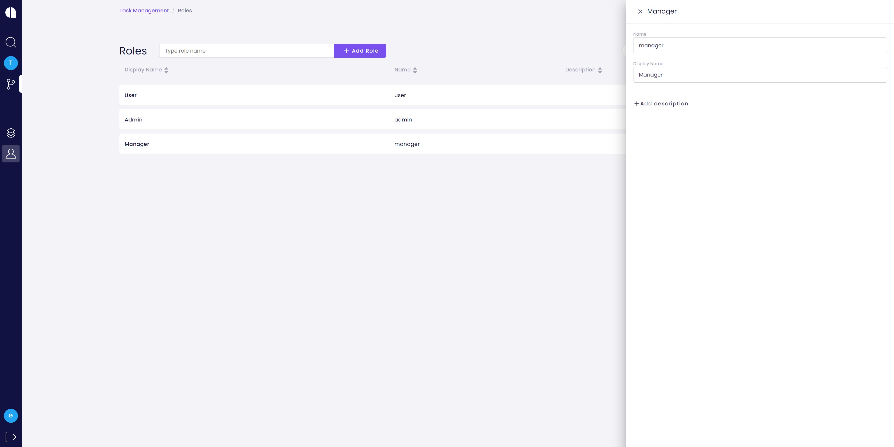

##### 엔티티 권한 설정

1. 주 메뉴에서 *Entities* 아이콘을 클릭하여 *Entities* 페이지를 엽니다.
2. *Project* entity 를 클릭합니다.
3. 프로젝트 페이지 권한 패널에서 편집 아이콘 (연필)을 클릭합니다. 권한 설정이 열립니다.
4. 모든 역할에 대해 모든 작업 (View, Create, Update, Delete, and Search)이 활성화되었는지 확인하여 시작합니다.
5. 삭제 권한을 'All Roles'에서 'Granular'로 변경하여 권한을 미세 조정 한 다음 제시된 역할에서 'Admin'역할을 선택합니다. 이렇게하면 관리자 역할을 담당하는 사용자 만 프로젝트를 삭제할 수 있습니다.

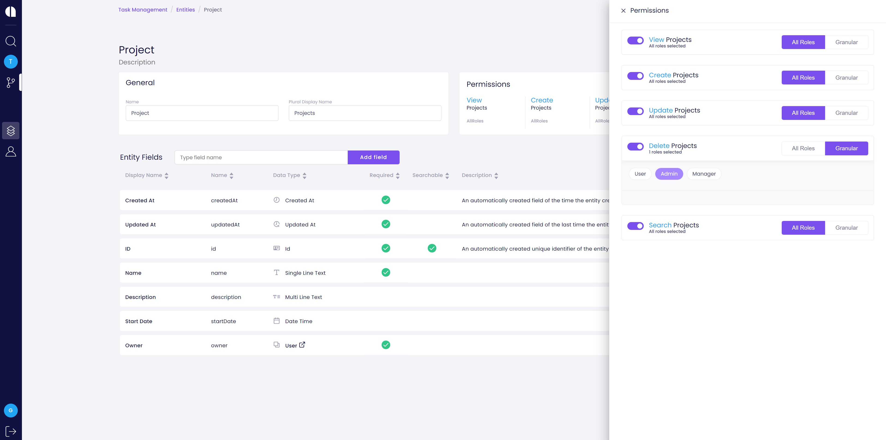

```
INFO
모든 작업의 필드에 대해 전역적으로가 아니라 특정 필드에 대한 작업 권한을 설정할 수 있습니다. 예를 들어, 사용자가 프로젝트 기한을 변경 (업데이트)하지 못하도록 방지하고 관리자는 그렇게 할 수 있도록 허용 할 수 있습니다. 
필드 수준에서 권한을 지정하려면 :
1. 작업의 권한 범위를 '세분화-Granular'로 설정합니다.
2. 이 작업과 관련된 역할을 선택합니다.
3. Add Field 를 클릭합니다. (삭제 작업의 경우 특정 필드에 대한 권한을 설정하는 옵션이 없습니다.)
4. 목록에서 필드를 선택합니다.
5. 이러한 각 필드에 대해 클릭하여 작업을 수행할 수 있는 역할을 설정합니다. 예를 들어 '필드 업데이트'소유자 아래의 관리자를 클릭합니다.
```

##### 변경 사항 커밋

Amplication에서 작업하는 동안 변경 사항은 자동으로 저장되지만 커밋되지는 않습니다. 커밋 된 변경 사항 만 애플리케이션의 다음 버전에 포함됩니다.

주 메뉴 (왼쪽 사이드 바)의 보류중인 변경 컨트롤에서 커밋 대기중인 보류중인 변경 사항 수를 확인할 수 있습니다.

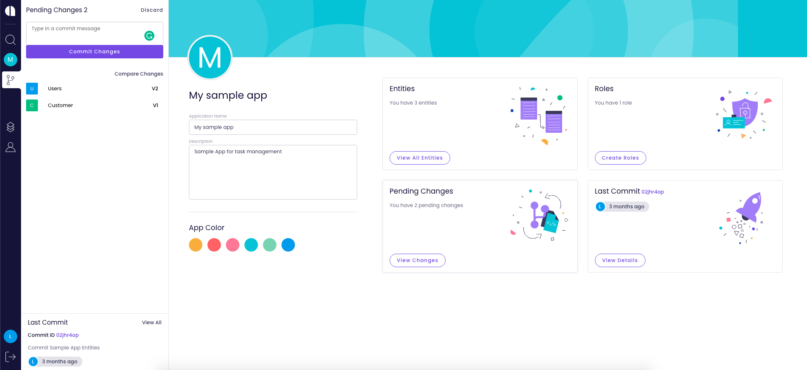

이 튜토리얼의 목적을 위해 첫 번째 커밋을 만들어 보겠습니다.

이 페이지에서 Project 엔터티 생성이 커밋되지 않았 음을 확인할 수 있습니다.

1. 커밋 메시지 대화 상자에서 커밋중인 변경 사항에 대한 설명을 작성합니다 (예 : 'Added Project Entity and Manager and Admin roles').
2. **Commit Changes** 를 클릭합니다. 모든 변경 사항이 커밋됩니다. 앱의 첫 번째 버전 빌드가 자동으로 생성됩니다!
3. 빌드 프로세스가 완료된 후 코드 생성 행에서 다운로드 아이콘을 클릭하여 앱의 .zip 파일을 가져옵니다. 이제 원하는 곳에 배포 할 준비가되었습니다.

#### 앱을 조금 더 발전시키기

이제 엔터티를 만들고, 변경 사항을 커밋하고, 새 버전을 빌드하는 방법을 알았으니, 다른 엔터티를 추가하고 커밋하기 전에 변경 사항을 비교하는 방법을 배우면서 조금 더 나아가 보겠습니다.

##### 태스크 엔티티 생성

이 자습서의 목적을 위해 이제 "Task"라는 다른 엔터티를 추가합니다.

1. 엔티티 아이콘 (왼쪽 사이드 바, 일명 기본 메뉴)을 클릭하여 엔티티 페이지로 이동하십시오.
2. **Create New** 를 클릭합니다.
3. New Entity 대화 상자에서“Task”를 입력합니다.
4. **Create Entity** 를 클릭합니다.
5. 엔터티에는 몇 가지 기본 필드가 있습니다. 다음과 같이 더 많은 필드를 추가합니다. 필드를 추가하는 방법을 기억하지 못하는 경우 위의 [항목 필드 추가 섹션](#항목 필드 추가)을 참조하십시오.

| Field Name        | Data Type                  | Properties                                                   |
| ----------------- | -------------------------- | ------------------------------------------------------------ |
| Title             | Single Line Text           | Required                                                     |
| Estimation (days) | Whole Number               |                                                              |
| Start Date        | Date Time                  |                                                              |
| Status            | Option Set                 | Required, 4 options:<br/>New<br/>Pending<br/>Ongoing<br/>Done |
| Project           | Relation to another Entity | Related to: Project                                          |
| Assigned To       | Relation to another Entity | Related to: User                                             |

작업의 필드 목록은 이제 다음과 같아야합니다.

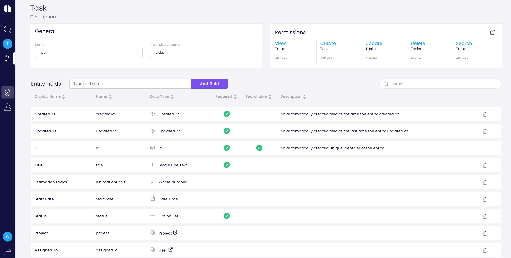

##### 프로젝트 엔터티 업데이트

이제 프로젝트 엔터티를 몇 가지 변경하겠습니다.

1. Entities 아이콘 (왼쪽 사이드 바, 일명 기본 메뉴)을 클릭하여 Entities 페이지로 이동하십시오.
2. *Project* 엔터티를 선택합니다.
3. 'Due Date'라는 새 필드를 추가하고 데이터 유형을 'Date Time'으로 설정합니다.
4. 기존 *Owner* 필드를 선택하고 표시 이름을 'Project Owner'로 변경하십시오.

##### 커밋하기 전에 보류중인 변경 사항 비교

이러한 변경이 의도적 인 것인지 확인하기 전에 변경된 내용을 항상 확인하는 것이 좋습니다. 

그렇게하려면 :

1. **Compare Changes** 를 클릭하십시오.
2. *Pending Changes* 페이지가 열리고 변경된 사항과 추가 된 사항이 표시됩니다.
   - Task 엔티티가 생성되었습니다.
   - *Project* entity 가 업데이트되었습니다.

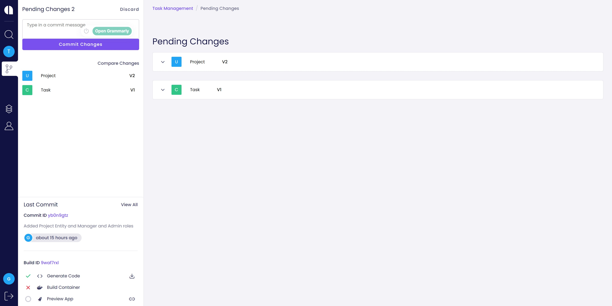

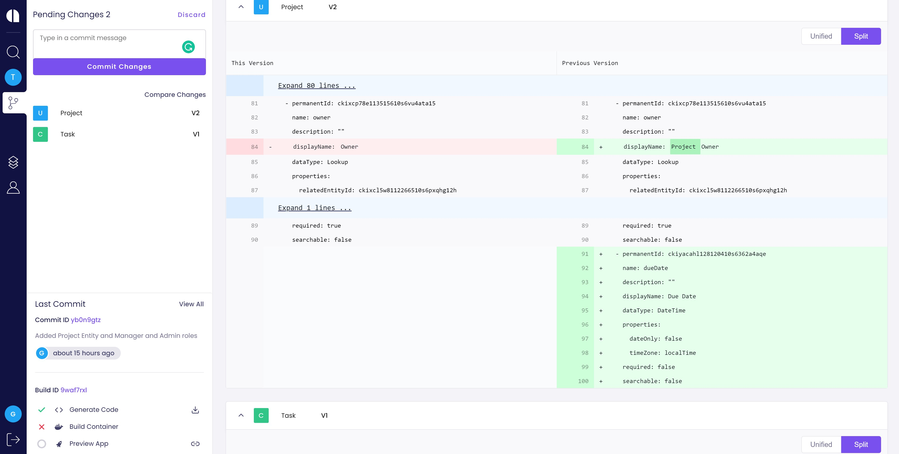

3. 이러한 변경 사항은 의도적 인 것이며 기꺼이 커밋 했으므로 Commit Changes를 클릭합니다.

**이제 새 버전의 앱을 빌드 할 준비가되었습니다. Great work!**


### GitHub와 동기화

Amplication은 앱의 코드를 GitHub 저장소로 푸시 할 수 있습니다. 앱에 대한 모든 권한을 제공하고 Amplication에서 생성 된 코드와 변경 사항을 쉽게 추적 할 수 있습니다.

#### 일반

- Amplication에서 생성하는 모든 커밋에 대해 업데이트 된 코드를 사용하여 새로운 Pull Request를 GitHub 저장소로 푸시합니다.
- 변경 사항을 브랜치에 병합하는 방법과 여부를 항상 선택할 수 있습니다.
- 풀 요청은 저장소의 기본 브랜치 (일반적으로 마스터 또는 메인)를 기반으로하는 새 브랜치에서 생성됩니다.
- Amplication의 코드는 선택한 저장소의 루트에 상대적으로 생성됩니다.
- 선택한 저장소는 비워 둘 수 없으므로 루트 폴더에 파일을 하나 이상 만드십시오.

GitHub에서 새 리포지토리를 만들려면 [여기](https://github.com/new) 에서 만들 수 있습니다. 새 저장소가 비어 있지 않은지 확인하려면 README 파일로 이 저장소 초기화를 선택하십시오.

#### Amplication이 GitHub 계정에 액세스하도록 승인

애플리케이션을 GitHub와 통합하기 전에 Amplication이 GitHub 계정에 액세스 할 수 있도록 승인해야합니다.

1. 기본 메뉴에서 **Sync With Github** 아이콘을 클릭하여 설정 페이지로 이동합니다.
2. **Sync With Github** 토글 버튼을 클릭하여 인증 프로세스를 시작합니다.
3. 새 창에서 Amplication이 GitHub 계정에 액세스하도록 허용하는 요청을 수락합니다.

#### 사용할 GitHub 저장소 선택

인증 프로세스를 완료 한 후 통합에 사용할 GitHub 저장소를 선택해야합니다.

1. **Select Repository** 버튼을 클릭합니다.
2. 사용하려는 저장소를 선택하십시오.

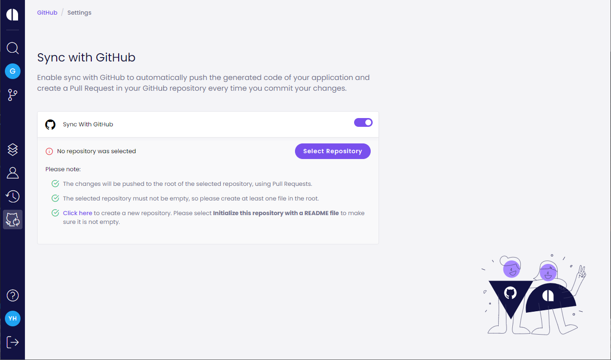


#### GitHub에서 새 Pull  요청 생성

Amplication은 변경 사항을 커밋 할 때마다 자동으로 새로운 Pull Request를 GitHub 저장소로 푸시합니다.

프로세스를 테스트하려면 애플리케이션을 변경하고 커밋하면됩니다.

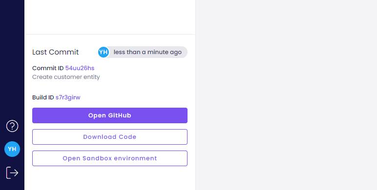

마지막 커밋 섹션에서 GitHub 열기를 클릭하여 GitHub에서 새 풀 요청을 봅니다.

이제 Amplication에서 생성 된 코드 변경 사항을보고 변경 사항을 병합 할 수 있습니다.

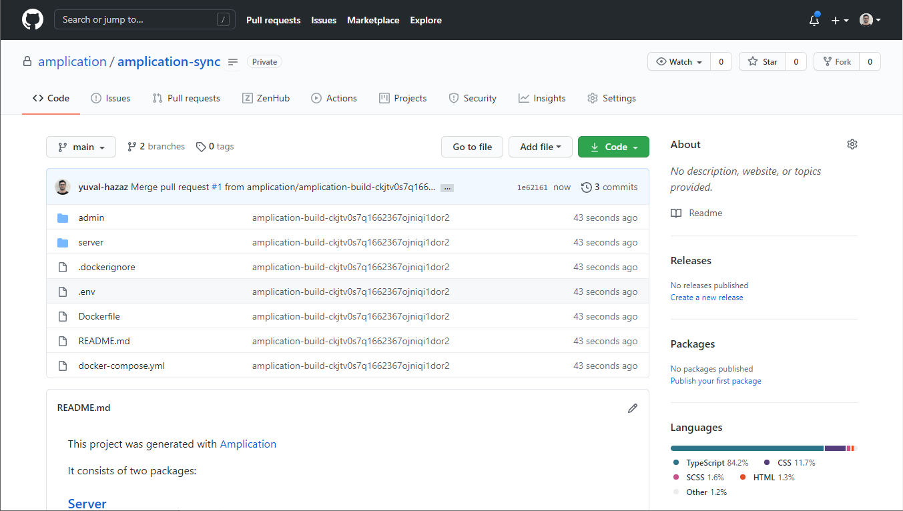


#### 더 알아보기

- [애플리케이션에 사용자 지정 코드를 추가하는 방법](https://docs.amplication.com/docs/how-to/custom-code)


### 앱 배포 방법

Amplication으로 생성 된 애플리케이션은 API를 실행하는 서버와 데이터베이스라는 두 가지 주요 구성 요소로 구성됩니다.

배포와 관련하여 다음 옵션 중 하나를 선택할 수 있습니다.

- 테스트 및 개발 목적으로 Amplication 클라우드에 배포합니다.
- 생성 된 소스 코드를 다운로드하고 선호하는 IDE 및 로컬 도구로 프로세스를 계속합니다.
- Docker 컨테이너를 구축하고 클라우드, 데이터 센터 또는 서버에 배포합니다.


#### Amplication 클라우드에 지속적으로 배포

Amplication으로 작업 할 때 커밋 된 모든 변경 사항은 Amplication 클라우드의 샌드 박스 환경에 지속적으로 배포되므로 테스트 및 개발 목적으로 애플리케이션에 쉽게 액세스 할 수 있습니다.

빌드 패널에서 "Preview App"링크를 클릭하여 애플리케이션 관리 UI의 로그인 페이지에 액세스합니다.

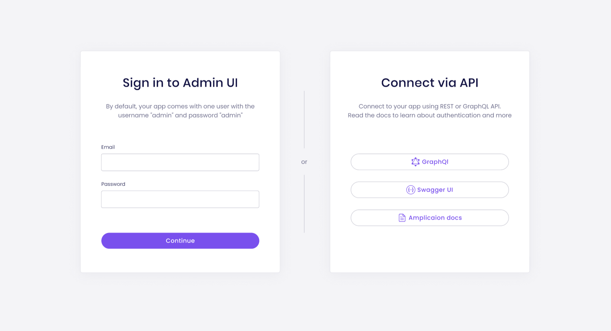

기본적으로 앱에는 사용자 이름 'admin'과 비밀번호 'admin'이 있습니다. 이 자격 증명을 사용하여 앱에 액세스하고 다른 사용자를 만듭니다.

/api로 이동하거나 'View API Docs'를 클릭하여 API의 전체 Swagger 문서를 볼 수도 있습니다.

Amplication에서 제공하는 샌드 박스 환경은 프로덕션 용도가 아니지만 (현재 환경의 모든 기존 데이터는 각 배포 후 제거됨) 앱을 개발하는 동안 좋은 시작점입니다. 샌드 박스 환경은 Amplication의 다른 모든 환경과 마찬가지로 완전히 무료입니다.

우리는 다가오는 릴리스에서 데이터 보존이 가능한 프로덕션과 같은 (아직 베타 버전임을 기억하십시오) 환경을 제공하기 위해 노력하고 있습니다. 뉴스와 업데이트를 계속 지켜봐주십시오.


#### 앱의 소스 코드 다운로드

Amplication에서 만든 모든 것은 정말 깔끔하고 읽기 쉬운 TypeScript 코드로 생성됩니다. 이미 배치 프로세스가 있거나 앱을 완전히 제어하려는 경우 언제든지 Amplication에서 소스 코드를 다운로드하여 계속 진행할 수 있습니다.

언제든지 돌아와 Amplication에서 앱을 업데이트 한 다음 업데이트 된 버전을 다운로드 할 수 있습니다.

소스 코드를 다운로드하려면 빌드 패널에서 'Download'를 클릭하십시오. 두 개의 프로젝트가 포함 된 ZIP 파일이 생성됩니다.

1. 모든 모듈, 서비스, 컨트롤러, Prisma ORM 클라이언트 및 API의 Swagger 문서를 포함하는 NestJS 앱.
2. API를 사용하는 것 외에도 데이터베이스에서 CRUD 쿼리를 실행하기위한 관리 UI가있는 React 앱.

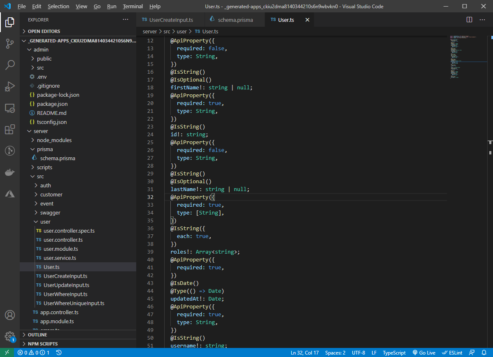

코드를 로컬에서 사용하려면 머신에 Node v14, npm 및 Docker가 설치되어 있어야합니다.

앱 사용을 시작하려면 ZIP 파일을 로컬 폴더에 추출하고 다음 명령을 실행하십시오.

``` bash
npm i
npm run docker:db
npm run db:init
npm start
```


#### Docker 컨테이너 배포

Docker 컨테이너를 쉽게 빌드하여 배포를 위해 앱을 준비 할 수도 있습니다. 앱은 항상 필요한 모든 구성 및 스크립트로 생성됩니다.

먼저 앱의 소스 코드를 다운로드하고 ZIP 파일을 로컬 폴더에 추출합니다 (이전 섹션에서 설명한 것과 동일).

기능 데이터베이스가있는 Docker에서 앱을 실행하려면 docker-compose 명령을 실행하십시오.

``` bash
docker-compose up
```


### API 사용

Amplication으로 생성 된 모든 애플리케이션은 REST 및 GraphQL의 두 가지 유형의 API로 생성됩니다.

이 기사에서는 이러한 API를 연결, 인증 및 사용하는 방법을 배웁니다.

#### 인증

더 많은 인증 공급자를 추가하기 위해 노력하고 있지만 현재 귀하의 서버는 기본 HTTP 인증으로 보호됩니다.

API에 요청을 보내려면 Authorization : Basic [credentials] 형식으로 Basic HTTP 인증 헤더를 제공해야합니다. 여기서 credentials는 문자열 'username : password'의 Base64 인코딩입니다.

기본적으로 앱은 사용자 이름이 'admin'이고 비밀번호가 'admin'인 사용자 한 명과 함께 제공됩니다. 다음 헤더를 사용하여 기본 사용자로 인증 할 수 있습니다.

``` bash
Authorization: Basic YWRtaW46YWRtaW4=
```

```
TIP
도구를 사용하여 헤더를 만들 수 있습니다. 온라인에서 사용할 수있는 여러 generators 가 있습니다.
```

#### REST API

REST API는 애플리케이션 루트의 /api에서 사용할 수 있습니다. /api로 직접 이동하면 모든 리소스 및 작업 목록과 함께 API에 대한 문서가 표시됩니다.

개발 및 테스트 목적으로 swagger UI를 사용하여 API에 대한 요청을 실행할 수 있습니다. 먼저 'Authorize'버튼을 클릭하고 사용자 이름과 비밀번호를 입력하면 인증 헤더가 자동으로 추가됩니다.

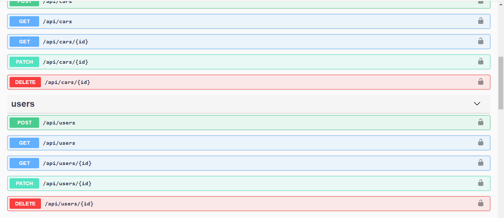

REST API는 모든 데이터 모델에 대한 메서드를 제공합니다. 각 모델에 대해 5 개의 엔드 포인트를 찾을 수 있습니다. 예를 들어 사용자 모델에서 다음과 같은 엔드 포인트를 찾을 수 있습니다.

- `GET /api/users` - 사용자 목록을 얻기
- `GET /api/users/:id` - ID로 단일 사용자를 얻기
- `POST /api/users` - 새 사용자를 만들기
- `PATCH /api/users/:id` - ID로 기존 사용자를 업데이트하기
- `DELETE /api/users/:id` - ID로 사용자를 삭제하기


#### GraphQL API

GraphQL API는 애플리케이션 루트의 /graphql에서 사용할 수 있습니다.

/graphql로 직접 이동하면 Apollo Server에서 제공하는 GraphQL Playground가 표시됩니다.

개발 및 테스트 목적으로 GraphQL Playground를 사용하여 API에 대한 쿼리 및 변형을 실행할 수 있습니다. 먼저 화면 하단의 'HTTP HEADERS'탭을 클릭하고 다음 형식으로 인증 헤더를 추가합니다.

``` xml
{
  "Authorization": "Basic YWRtaW46YWRtaW4="
}
```

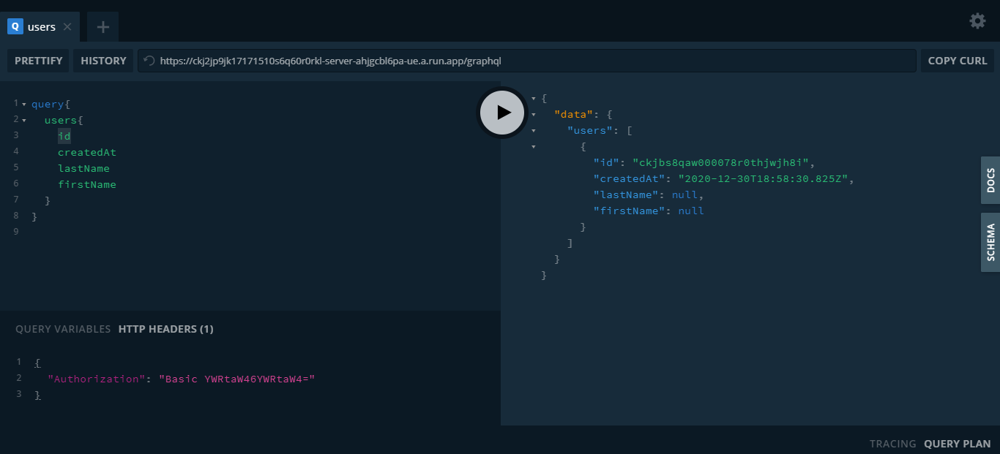

GraphQL API는 모든 데이터 모델에 대한 쿼리 및 변형을 제공합니다. 각 모델에 대해 2 개의 쿼리와 3 개의 변형을 찾을 수 있습니다. 예를 들어, 사용자 모델의 경우 다음을 찾을 수 있습니다.

##### Queries

- `users` - 사용자 목록을 얻기
- `user` - ID 로 단일 사용자를 얻기

##### Mutations

- CreateUser-새 사용자를 만듭니다.
- UpdateUser-ID로 기존 사용자를 업데이트합니다.
- DeleteUser-ID로 사용자를 삭제합니다.

모든 쿼리 및 변형에 대한 전체 문서를 보려면 오른쪽의 DOCS 탭을 클릭하십시오.


## How To

### 새 앱 만들기

출처: https://docs.amplication.com/docs/how-to/create-app

1. 왼쪽 상단 모서리에있는 Amplication 로고를 클릭하여 My Apps 페이지로 이동합니다.
2. 내 앱 페이지에서 **Create New App** 를 클릭합니다.
3. 새 앱 대화 상자에서 앱 이름과 설명을 입력합니다.
4. **Create App** 을 클릭합니다.

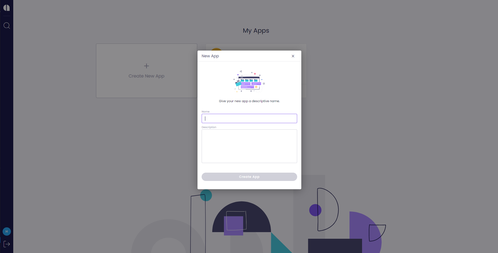


### 개발 환경에서 애플리케이션 실행

출처: https://docs.amplication.com/docs/how-to/dev-env

로컬 개발 환경에서 생성 된 애플리케이션을 빌드하고 실행하려면 이 튜토리얼을 따르십시오. 이 기사에서는 VS 코드가 데모에 사용되지만 프로세스는 모든 IDE에서 또는 npm CLI를 사용하여 명령 줄에서 직접 수행 할 수 있습니다.

#### 요약

이 기사에서는 다음 단계를 수행합니다.

1. 응용 프로그램 다운로드
2. npm에서 서버용 패키지 설치
3. 데이터베이스에 대한 Docker 컨테이너 시작
4. 데이터베이스 초기화
5. 서버 실행
6. 관리 UI 용 npm에서 패키지 설치
7. 관리 UI 실행

```
IMPORTANT
시작하기 전에 Node.js 14, npm 및 Docker가 설치되어 있는지 확인하십시오.
```

#### 응용 프로그램 다운로드

먼저 Amplication에서 애플리케이션 소스 코드를 다운로드해야합니다.

1. Amplication이 업데이트 된 소스 코드를 생성하도록 모든 변경 사항을 커밋합니다.
2. 최신 커밋에서 다운로드 버튼을 클릭하십시오. ZIP 파일을 받게됩니다.
3. ZIP 파일을 로컬 폴더에 추출합니다.
4. 좋아하는 IDE로 애플리케이션 열기

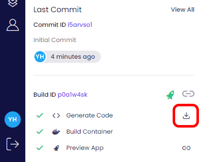

#### npm에서 서버용 패키지 설치

애플리케이션이 패키지 관리를 위해 npm을 사용하고 있습니다. 필요한 모든 패키지를 설치하려면 다음 단계를 따르십시오.

1. 명령 줄 도구 열기
2. **Server** 폴더로 이동

``` bash
cd server
```

3. npm install 또는 npm i를 실행하여 모든 패키지를 다운로드하고 설치하십시오.

   ``` bash
   npm install
   ```

   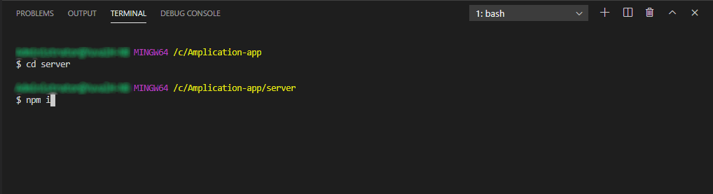

#### 데이터베이스에 대한 Docker 컨테이너 시작

애플리케이션은 postgreSQL DB에 대한 기본 연결과 함께 제공됩니다. 데이터베이스를 시작하려면 다음 명령을 사용하여 도커 컨테이너를 실행해야합니다.

``` bash
npm run docker:db
```

#### 데이터베이스 초기화

이제 데이터베이스에 애플리케이션 스키마를 생성해야합니다. 이를 위해 Amplication은 Prisma와 prisma migrate 명령을 사용합니다.

명령 줄 도구에서 다음 명령을 실행합니다.

``` bash
npm run db:init
```

```
TIP
전체 prisma 명령 또는 기타 스크립트를 보려면 package.json 파일을 열고 스크립트 섹션에서 관련 명령을 찾을 수 있습니다.
```

#### 서버 실행

이제 서버가 준비되었습니다! 다음 명령을 실행하여 서버를 시작하십시오.

``` bash
npm run start
```

기본적으로 서버는 이제 http://localhost:3001에서 사용할 수 있습니다.

이 URL 중 하나를 열어보고 재미있게 보내십시오.

- http://localhost:3001/api
- http://localhost:3001/graphql

서버의 기술과 구조에 대해 자세히 알아 보려면 [이 기사](https://docs.amplication.com/docs/getting-started) 를 읽어보십시오.

#### 관리 UI 용 npm에서 패키지 설치

이제 서버가 준비되었으므로 애플리케이션의 모든 데이터 모델을 만들고 편집 할 수있는 기성 양식이있는 React 클라이언트 인 Admin UI를 빌드하고 실행할 수 있습니다.

클라이언트에 필요한 모든 패키지를 설치하려면 다음 단계를 따르십시오.

1. 명령 줄 도구에서 Admin 폴더를 이동합니다. 아직 Server 폴더에있는 경우 다음 명령을 실행하십시오.

   ``` bash
   cd ../admin
   ```

2. npm install 또는 npm i 를 실행하여 모든 패키지를 다운로드하고 설치하십시오.

   ``` bash
   npm install
   ```

#### 관리 UI 실행

Admin UI로 React 애플리케이션을 실행하려면 다음 명령을 실행하십시오.

``` bash
npm run start
```

기본적으로 클라이언트는 이제 http://localhost:3000 에서 사용할 수 있습니다.


### 애플리케이션에 사용자 지정 코드 추가

Amplication으로 빌드 된 애플리케이션이 완벽하게 작동하고 출시 된대로 사용할 수 있지만 핵심 비즈니스 로직 및 기타 기능을 앱에 추가 할 수 있습니다.

#### 비전

곧 구현 될 우리의 비전은 데이터 모델 업데이트, 권한 변경, 역할 추가 등을 위해 Amplication에서 작업 할 수있는 기능을 유지하면서 애플리케이션에 사용자 지정 코드를 추가 할 수 있다는 것입니다.

이를 위해 Amplication은 사전 정의 된 정책을 기반으로 Git을 통해 변경 사항을 병합하여 Amplication에 대한 링크를 잃지 않고 서비스, 컨트롤러, 리졸버 등을 추가하고 업데이트 할 수 있습니다. Amplication으로 반복적 인 작업에 시간을 절약하는 동시에 코드의 자유와 힘을 갖게됩니다.

이 기능이 준비 될 때까지 변경 사항을 직접 추적해야합니다. GitHub 또는 기타 git 서비스를 사용하는 것이 좋습니다.

```
INFO
이 기능이 준비 될 때까지 Amplication의 변경 사항을 수동으로 병합하는 것이 너무 복잡하다고 생각되면 먼저 요구 사항에 대해 철저히 생각한 다음 Amplication으로 모델과 권한 스키마를 구축하는 것이 좋습니다. 여전히 상용구, 권한, API, React 구조 등에 많은 시간을 절약 할 수 있습니다.
```

#### Examples

다음은 애플리케이션의 여러 계층에 사용자 지정 코드를 추가하는 방법의 몇 가지 예입니다.

이 예제의 목적은 서버에있는 각 구성 요소의 계층 구조와 책임에 익숙해지는 것입니다.

- [Example: How to add a business logic to a service](https://docs.amplication.com/docs/custom-code/business-logic)
- [Example: How to add an action to a REST API controller](https://docs.amplication.com/docs/custom-code/controller-action)


