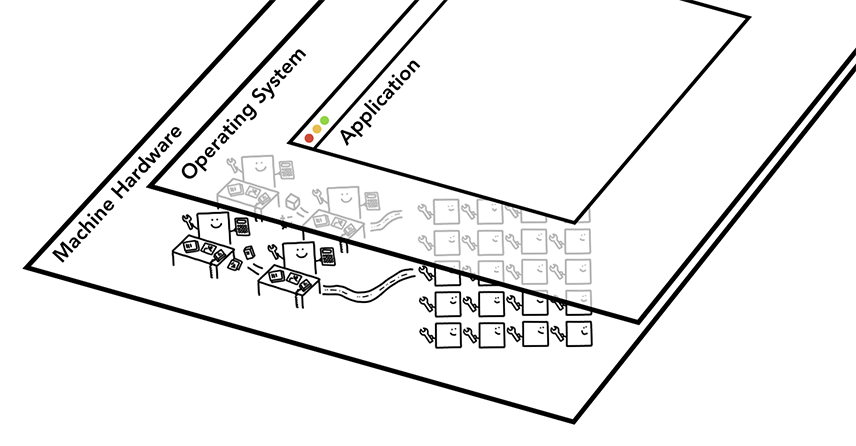
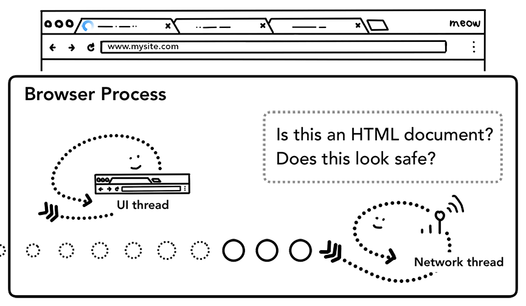
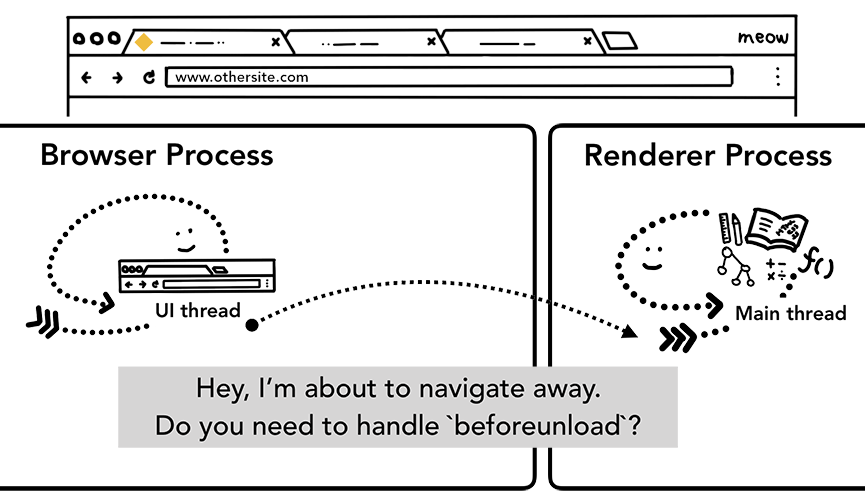
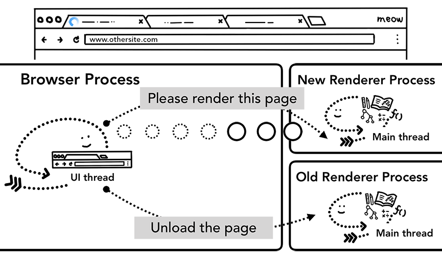
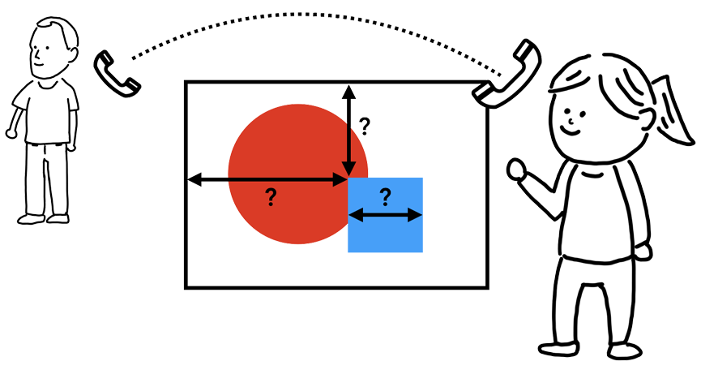
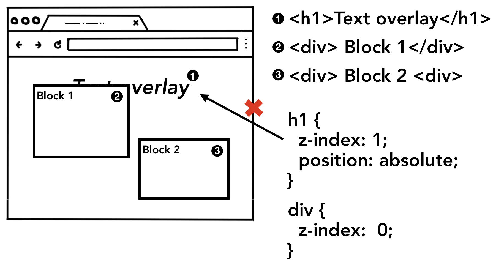
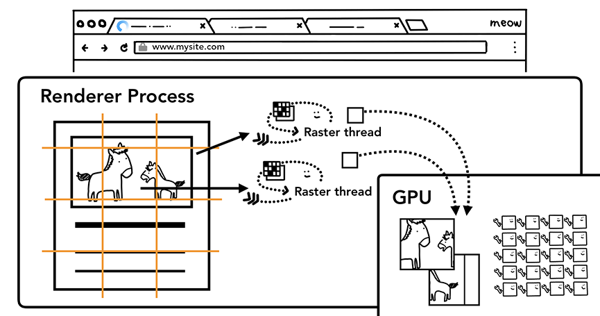
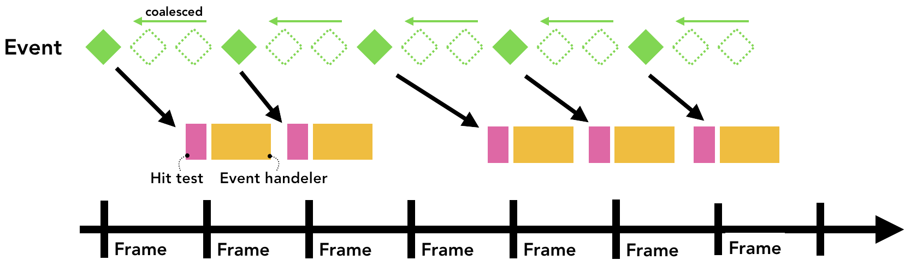

# 최신 브라우저의 내부 살펴보기

출처: https://d2.naver.com/helloworld/2922312


# 1 - CPU, GPU, 메모리 그리고 다중 프로세스 아키텍처


이 글은 [Google Developers 사이트](https://developers.google.com/)에 공개된 [Mariko Kosaka](https://developers.google.com/web/resources/contributors/kosamari)의 "Inside look at modern web browser"(최신 브라우저의 내부 살펴보기) 시리즈를 번역한 글입니다. 이  시리즈는 Chrome을 중심으로 최신 브라우저를 들여다봅니다. Chrome이 속도뿐만 아니라 안정성을 위해 어떤 아키텍처를  사용하는지 설명하는 것에서 시작해, 웹 페이지가 어떤 단계를 거쳐 화면에 그려지는지 설명합니다. 이와 더불어 성능 향상을 위해 웹 개발자가 고려하면 좋을 사항도 다룹니다.

시리즈의 첫 번째 글인 "[Inside look at modern web browser (part 1)](https://developers.google.com/web/updates/2018/09/inside-browser-part1)"에서는 Chrome의 프로세스 모델을 다룹니다. Chrome이 채택한 다중 프로세스 아키텍처의 장점과 한계를 살펴보고, 다중 프로세스  아키텍처의 한계를 극복하기 위한 노력인 '서비스화(servicification)'를 설명합니다.

> **저작권** 
>   이 글의 원문은 다음과 같은 저작권 기준을 따릅니다.  
>
> *Except as otherwise noted, the content of this page is licensed under the [Creative Commons Attribution 3.0 License](https://creativecommons.org/licenses/by/3.0/), and code samples are licensed under the [Apache 2.0 License](https://www.apache.org/licenses/LICENSE-2.0). For details, see our [Site Policies](https://developers.google.com/terms/site-policies). Java is a registered trademark of Oracle and/or its affiliates.*  

  

## CPU, GPU, 메모리 그리고 다중 프로세스 아키텍처

4부로 구성된 이 시리즈는 Chrome의 내부를 고수준 아키텍처부터 렌더링 파이프라인의 세세한 부분까지 살펴본다. 브라우저가 어떻게 코드를 작동하는 웹 사이트로 바꾸는지 궁금했던 적이 있거나 성능을 향상시킨다는 기술이 왜 도움이 되는지 잘 모르고  있었다면 이 시리즈를 통해 알 수 있을 것이다.

첫 번째 글에서는 컴퓨터 실행과 관련된 핵심 용어와 Chrome의 다중 프로세스 아키텍처를 살펴보겠다.

> **참고** 
>   CPU와 GPU, 프로세스와 스레드에 대해 잘 알고 있다면 "[브라우저 아키텍처](https://d2.naver.com/helloworld/2922312#ch4)"부터 읽어도 된다.  

  

## 컴퓨터의 핵심은 CPU와 GPU이다

브라우저가 실행되는 환경을 이해하려면 몇 가지 컴퓨터 부품과 그 기능을 이해해야 한다.

  

### CPU

첫 번째로 볼 부품은 CPU(central processing unit, 중앙처리장치)이다. CPU는 컴퓨터의 두뇌라 할 수 있다. 다음 그림에서 사무원으로 묘사된 CPU 코어는 여러 종류의 작업을 하나씩 순서대로 처리할 수 있다. CPU 코어는  수학이나 예술은 물론 고객 전화에 응대하는 방법도 알고 있다. 예전에는 대부분의 CPU가 단일 칩이었다. CPU 코어 하나는  동일한 칩에 있는 또 다른 CPU나 마찬가지이다. 최신 하드웨어는 보통 하나 이상의 코어를 사용해 스마트폰이나 노트북의 실행  성능을 높인다.


그림 1 각자 자리에서 작업을 수행하는 사무원과 같은 4개의 CPU 코어

  

### GPU

GPU(graphics processing unit, 그래픽처리장치)는 컴퓨터의 또 다른 부품이다. CPU와 달리 GPU는  간단한 작업에만 특화되어 있지만 여러 GPU 코어가 동시에 작업을 수행할 수 있다. 그래픽처리장치라는 이름에서 알 수 있듯이  GPU는 그래픽 작업을 처리하기 위해 개발되었다. 그래서 그래픽 관련 설명에서 "GPU를 사용한다"나 "GPU의 지원을 받는다"와 같은 말이 빠른 렌더링과 매끄러운 상호작용에 관련된 표현이다. 최근 몇 년 동안 GPU 가속을 통해 GPU가 단독으로 처리할 수 있는 계산이 점점 더 많아졌다.


그림 2 렌치만 가지고 있어 제한된 작업만 처리하는 수많은 GPU 코어

> **역주** 
>   특정 작업을 CPU가 아닌 다른 특별한 장치를 통해 수행 속도를 높이는 것을 '하드웨어 가속(hardware accelerated)'이라 한다. 그래픽이나 사운드와 관련된 작업에 하드웨어 가속을 많이 사용한다. 
>   브라우저에서 하드웨어 가속은 주로 GPU를 사용한 그래픽 작업의 가속을 의미한다. 간단한 작업을 동시에 수많은 코어가 수행하는 GPU의 특성을 기반으로 그래픽 작업이 훨씬 빠르게 처리될 수 있다. 다음에 링크된 동영상을 보면 GPU의 특성을 조금 더 쉽게 이해할 수 있을 것이다. 
>   \- [Mythbusters Demo GPU versus CPU](https://www.youtube.com/watch?v=-P28LKWTzrI)  

컴퓨터나 스마트폰에서 애플리케이션을 실행할 때 애플리케이션을 구동하는 것이 바로 CPU와 GPU이다. 일반적으로 애플리케이션은 운영체제에서 제공하는 메커니즘을 통해 CPU와 GPU에서 실행된다.



그림 3 컴퓨터 아키텍처의 세 가지 층위. 맨 아래부터 순서대로 하드웨어(machine hardware), 운영체제, 애플리케이션의 순서로 층을 이룬다.

  

## 프로세스와 스레드로 프로그램 실행

브라우저 아키텍처를 살펴보기 전에 파악해야 할 또 다른 개념은 프로세스와 스레드이다. 프로세스는 애플리케이션이 실행하는 프로그램이라 할 수 있다. 스레드는 프로세스 내부에 있으며 프로세스로 실행되는 프로그램의 일부를 실행한다.


그림 4 프로세스(테두리가 있는 상자로 표현)와 그 안에서 실행되는 스레드(추상적으로 그린 물고기로 표현)

애플리케이션을 시작하면 프로세스가 하나 만들어진다. 프로세스가 작업을 하기 위해 스레드를 생성할 수도 있지만 선택 사항이다. 운영체제는 프로세스가 작업할 메모리를 "한 조각" 주는데, 이 전용 메모리 공간에 애플리케이션의 모든 상태가 저장된다.  애플리케이션을 닫으면 프로세스가 사라지고 운영체제가 메모리를 비운다.


그림 5 할당받은 메모리 공간과 애플리케이션의 데이터를 저장하는 프로세스

프로세스는 여러 작업을 수행하기 위해 운영체제에 다른 프로세스를 실행하라고 요청할 수 있다. 그러면 메모리의 다른 부분이 새 프로세스에 할당된다. 두 프로세스가 서로 정보를 공유해야 할 때는 IPC(inter process communication,  프로세스 간 통신)를 사용한다. 많은 애플리케이션이 이러한 방식으로 작동하도록 설계되어 있다. 그래서 작업 프로세스가 응답하지  않을 때 애플리케이션의 다른 부분을 실행하는 프로세스를 중지하지 않고도 응답하지 않는 프로세스를 다시 시작할 수 있다.


그림 6 IPC를 통해 통신하는 개별 프로세스

  

## 브라우저 아키텍처

그렇다면 브라우저는 프로세스와 스레드를 어떻게 사용할까? 스레드를 많이 사용하는 프로세스 하나만 사용할 수도 있고, 스레드를 조금만 사용하는 프로세스를 여러 개 만들어 IPC로 통신할 수도 있다.


그림 7 서로 다른 브라우저 아키텍처의 프로세스와 스레드

여기에서 주목해야 할 중요한 점은 이러한 서로 다른 아키텍처가 구현 세부 사항이라는 점이다. 브라우저를 만드는 방법에 대한 표준은 없다. 브라우저마다 접근 방식이 완전히 다를 수 있다.

이 시리즈에서는 다음 그림에 표현된 Chrome의 최근 아키텍처를 살펴보겠다.

제일 위에 있는 브라우저 프로세스는 애플리케이션의 각 부분을 맡고 있는 다른 프로세스를 조정한다. 렌더러 프로세스는 여러  개가 만들어져 각 탭마다 할당된다. 최근까지 Chrome은 탭마다 프로세스를 할당했다. 이제는 사이트(iframe에 있는 사이트  포함)마다 프로세스를 할당한다("[프레임별로 실행되는 렌더러 프로세스 - 사이트 격리](https://d2.naver.com/helloworld/2922312#ch8)" 참고).

> **역주** 
>   탭마다 프로세스를 할당하는 방법을 'process per tab'이라 하고, 사이트마다 프로세스를 할당하는 방법을 'process per site'라고 한다. Chrome의 `chrome://flags/#enable-site-per-process` 설정에서 할당 방법을 변경할 수 있다. 프로세스를 할당하는 모델에 관한 좀 더 자세한 내용은 Chromium 프로젝트 사이트의 "[Process Models](https://www.chromium.org/developers/design-documents/process-models)" 글을 참고한다.  
>
> 


그림 8 Chrome의 다중 프로세스 아키텍처. Chrome은 탭마다 렌더러 프로세스를 실행하기 때문에 렌더러 프로세스를 여러 겹으로 표현했다.

  

## 어떤 프로세스가 무엇을 담당하나

다음은 Chrome의 각 프로세스가 무엇을 제어하는지 설명하는 표이다.

| 프로세스          | 프로세스가 제어하는 부분                                     |
| ----------------- | ------------------------------------------------------------ |
| 브라우저 프로세스 | 주소 표시줄, 북마크 막대, 뒤로 가기 버튼, 앞으로 가기 버튼 등 애플리케이션의 "chrome" 부분을 제어한다. 네트워크 요청이나 파일 접근과 같이 눈에 보이지는 않지만 권한이 필요한 부분도 처리한다. |
| 렌더러 프로세스   | 탭 안에서 웹 사이트가 표시되는 부분의 모든 것을 제어한다.    |
| 플러그인 프로세스 | 웹 사이트에서 사용하는 플러그인(예: Flash)을 제어한다.       |
| GPU 프로세스      | GPU 작업을 다른 프로세스와 격리해서 처리한다. GPU는 여러 애플리케이션의 요청을 처리하고 같은 화면에 요청받은 내용을 그리기 때문에 GPU 프로세스는 별도 프로세스로 분리되어 있다. |

> **역주** 
>   소문자로 시작하는 '[chrome](https://developer.mozilla.org/en-US/docs/Glossary/Chrome)'은 브라우저 이름이 아니라 브라우저의 UI 영역을 의미하는 말이다.  


그림 9 브라우저 UI에서 각 프로세스가 담당하는 부분

이 외에도 확장 프로그램(Extension) 프로세스, 유틸리티 프로세스 등 더 많은 프로세스가 있다. Chrome에서 실행 중인 프로세스를 확인하려면 브라우저의 오른쪽 위에 있는 **Chrome 맞춤설정 및 제어** 버튼을 클릭하고 메뉴에서 **도구 더보기 > 작업 관리자**를 선택한다. 그러면 현재 실행 중인 프로세스 목록과 사용 중인 CPU, 메모리의 양이 표시된 창이 열린다.

  

## 다중 프로세스 아키텍처가 Chrome에 주는 이점

Chrome이 렌더러 프로세스를 여러 개 사용한다고 설명했다. 가장 간단한 예로 탭마다 렌더러 프로세스를 하나 사용하는  경우를 생각해 보자. 3개의 탭이 열려 있고 각 탭은 독립적인 렌더러 프로세스에 의해 실행된다. 이때 한 탭이 응답하지 않으면 그 탭만 닫고 실행 중인 다른 탭으로 이동할 수 있다. 만약 모든 탭이 하나의 프로세스에서 실행 중이었다면 탭이 하나만 응답하지  않아도 모든 탭이 응답하지 못하게 된다.


림 10 각 탭을 실행하는 여러 렌더러 프로세스

> **역주** 
>   한 탭이 응답하지 않더라도 다른 탭은 사용 가능하다는 점은 각 탭마다 독립적인 렌더러 프로세스를 유지했을 때의 이점이다. 웹  페이지에서 처리할 작업이 많아 응답하지 못하는 경우나 웹 페이지를 담당하던 렌더러 프로세스의 실행이 중단된 경우 등에 이런 이점을 확인할 수 있다. 
>   한편 같은 원리로 브라우저 프로세스와 렌더러 프로세스를 분리했을 때의 장점도 생각할 수 있다. 렌더러 프로세스가 웹 페이지를  그리는 도중 오류가 발생해 실행이 중단되더라도 브라우저 전체가 종료되지 않고 오류 페이지를 보여 주는 정도로 문제를 처리할 수  있다.  

브라우저의 작업을 여러 프로세스에 나눠서 처리하는 방법의 또 다른 장점은 보안과 격리(sandbox)이다. 운영체제를 통해  프로세스의 권한을 제한할 수 있어 브라우저는 특정 프로세스가 특정 기능을 사용할 수 없게 제한할 수 있다. 예를 들어  Chrome은 렌더러 프로세스처럼 임의의 사용자 입력을 처리하는 프로세스가 임의의 파일에 접근하지 못하게 제한한다.

> **역주** 
>   '임의의 사용자 입력'은 웹 페이지의 실행으로 이해할 수 있다.  

프로세스는 전용 메모리 공간을 사용하기 때문에 공통부분(예를 들어 Chrome의 JavaScript 엔진인 V8)을 복사해서 가지고 있는 경우가 많다. 동일한 프로세스의 스레드가 메모리를 공유할 수 있는 데 반해 서로 다른 프로세스는 메모리를 공유할 수 없어 메모리 사용량이 더 많아질 수밖에 없다. Chrome은 메모리를 절약하기 위해서 실행할 수 있는 프로세스의 개수를  제한한다. 정확한 한도는 기기의 메모리 용량과 CPU 성능에 따라 다르지만 프로세스의 개수가 한도에 다다르면 동일한 사이트를 열고 있는 여러 탭을 하나의 프로세스에서 처리한다.

> **역주** 
>   다중 프로세스 아키텍처가 Chrome이 메모리를 많이 사용하는 이유였다는 것을 알 수 있다. 다만 다중 프로세스 아키텍처는  안정적이고 빠른 사용자 경험과 보안을 제공한다는 장점이 있다. Chrome 개발팀은 이런 장점을 살리면서도 메모리를 절약할 수  있는 새로운 아키텍처를 도입하기 위해 지속적으로 노력하고 있다. 다음 장에 설명할 서비스화가 이런 노력의 하나이다.  

  

## 더 많은 메모리 절약 - Chrome의 서비스화

동일한 접근 방식이 브라우저 프로세스에도 적용된다. Chrome은 브라우저의 각 부분을 서비스로 실행해 여러 프로세스로 쉽게 분할하거나 하나의 프로세스로 통합할 수 있도록 아키텍처를 변경하고 있다.

성능이 좋은 하드웨어에서 Chrome이 실행 중일 때에는 각 서비스를 여러 프로세스로 분할해 안정성을 높이고, 리소스가  제한적인 장치에서 실행 중일 때에는 서비스를 하나의 프로세스에서 실행해서 메모리 사용량을 줄이는 것이 기본 아이디어이다. 메모리  절약을 위해 프로세스를 합치는 이런 방식은 Android와 같은 플랫폼에서는 이전부터 사용되었다.


림 11 서로 다른 서비스를 여러 프로세스와 단일 브라우저 프로세스로 이동하는 Chrome의 서비스화

  

## 프레임별로 실행되는 렌더러 프로세스 - 사이트 격리

[사이트 격리(site isolation)](https://developers.google.com/web/updates/2018/07/site-isolation)는 Chrome에서 최근 도입된 기능으로, iframe의 사이트를 별도의 렌더러 프로세스에서 실행하는 것이다. 탭마다 렌더러  프로세스를 할당하는 모델에서는 iframe의 사이트가 같은 렌더러 프로세스에서 작동하기 때문에 서로 다른 사이트 간에 메모리가  공유될 수 있다는 문제가 있어 지속적으로 논의가 있었다. `a.com` 사이트의 웹 페이지와 `b.com` 사이트의 웹 페이지를 동일한 렌더러 프로세스에서 실행하는 것이 문제가 없어 보일 수 있다. 하지만 [동일 출처 정책(same origin policy)](https://developer.mozilla.org/en-US/docs/Web/Security/Same-origin_policy)은 웹 보안 모델의 핵심이다. 한 사이트는 동의 없이 다른 사이트의 데이터에 접근할 수 없어야 한다. 이 정책을 우회하는 것이 바로 보안 공격의 주요 목표이다. 프로세스를 격리하는 것이 사이트를 격리하는 가장 효과적인 방법이다. [Meltdown과 Spectre](https://developers.google.com/web/updates/2018/02/meltdown-spectre) 사태로 여러 프로세스를 사용해 사이트를 격리해야 한다는 것이 더욱 분명해졌다. Chrome 67부터 데스크톱에서 사이트 격리를 기본으로 사용하도록 설정하면서 탭에서 iframe의 사이트에 별도의 렌더러 프로세스가 적용된다.


그림 12 사이트 격리. 여러 렌더러 프로세스가 iframe의 각 프레임에 열린 사이트를 담당한다.

사이트 격리를 위해 여러 해에 걸친 노력이 있었다. 사이트 격리는 다른 렌더러 프로세스를 할당하는 것만큼 간단하지 않다.  iframe이 서로 통신하는 방식을 근본적으로 바꿔야 하기 때문이다. 다른 프로세스에서 실행되는 iframe이 있는 웹 페이지에서 개발자 도구를 자연스럽게 사용하게 하려면 눈에 보이지 않은 많은 작업이 뒤에서 이루어져야 한다. 또 단순히 **Ctrl + F** 키를 눌러 페이지에서 단어를 찾으려고 해도 서로 다른 렌더러 프로세스를 오가며 찾아야 한다. 왜 브라우저 엔지니어가 사이트 격리 기능의 배포를 주요 마일스톤으로 여기는지 알 수 있을 것이다.

  

## 마무리

이 글에서는 높은 수준에서 브라우저 아키텍처를 살펴봤고 다중 프로세스 아키텍처의 이점을 살펴봤다. 또한 다중 프로세스  아키텍처와 관련이 깊은 서비스화와 사이트 격리도 살펴봤다. 다음 글에서는 웹 사이트를 표시하기 위해 프로세스와 스레드 간에  일어나는 일을 알아보겠다.

  

#### 최신 브라우저의 내부 살펴보기

- [최신 브라우저의 내부 살펴보기 1 - CPU, GPU, 메모리 그리고 다중 프로세스 아키텍처](https://d2.naver.com/helloworld/2922312)
- [최신 브라우저의 내부 살펴보기 2 - 내비게이션 과정에서 일어나는 일](https://d2.naver.com/helloworld/9274593)
- [최신 브라우저의 내부 살펴보기 3 - 렌더러 프로세스의 내부 동작](https://d2.naver.com/helloworld/5237120)
- [최신 브라우저의 내부 살펴보기 4 - 컴포지터가 사용자 입력을 받았을 때](https://d2.naver.com/helloworld/6204533)


# 2 - 내비게이션 과정에서 일어나는 일

이 글은 [Google Developers 사이트](https://developers.google.com/)에 공개된 [Mariko Kosaka](https://developers.google.com/web/resources/contributors/kosamari)의 "Inside look at modern web browser"(최신 브라우저의 내부 살펴보기) 시리즈를 번역한 글입니다. 이 시리즈는 Chrome을 중심으로 최신 브라우저를 들여다봅니다. Chrome이 속도뿐만 아니라 안정성을 위해 어떤 아키텍처를 사용하는지 설명하는 것에서 시작해, 웹 페이지가 어떤 단계를 거쳐 화면에 그려지는지 설명합니다. 이와 더불어 성능 향상을 위해 웹 개발자가 고려하면 좋을 사항도 다룹니다.

시리즈의 두 번째 글인 "[Inside look at modern web browser (part 2)](https://developers.google.com/web/updates/2018/09/inside-browser-part2)"에서는 내비게이션 과정에서 Chrome이 하는 일을 다룹니다. 사용자가 사이트를 요청하고 브라우저가 페이지 렌더링을 준비하는 과정인 내비게이션에서 Chrome의 여러 프로세스와 스레드가 어떤 일을 담당하는지 살펴봅니다. 그리고 내비게이션 과정의 속도를 높이기 위한 기술인 서비스 워커와 내비게이션 프리로드를 소개합니다.

> **저작권**
> 이 글의 원문은 다음과 같은 저작권 기준을 따릅니다.
>
> *Except as otherwise noted, the content of this page is licensed under the [Creative Commons Attribution 3.0 License](https://creativecommons.org/licenses/by/3.0/), and code samples are licensed under the [Apache 2.0 License](https://www.apache.org/licenses/LICENSE-2.0). For details, see our [Site Policies](https://developers.google.com/terms/site-policies). Java is a registered trademark of Oracle and/or its affiliates.*


## 내비게이션 과정에서 일어나는 일

이 글은 Chrome의 내부 동작을 살펴보는 "Inside look at modern web browser" 시리즈의 두 번째 글이다. 이전 글인 "[최신 브라우저의 내부 살펴보기 1 - CPU, GPU, 메모리 그리고 다중 프로세스 아키텍처](https://d2.naver.com/helloworld/2922312)"에서는 여러 프로세스와 스레드가 브라우저의 각 부분을 어떻게 다루는지 살펴보았다. 이 글에서는 웹 사이트를 표시하기 위해 각 프로세스와 스레드가 어떻게 통신하는지 좀 더 깊게 알아본다.

브라우저의 주소 표시줄에 URL을 입력하면 브라우저가 인터넷에서 데이터를 가져와서 페이지를 표시한다. 간단한 이 동작에서 사용자가 사이트를 요청하고 브라우저가 페이지 렌더링을 준비하는 과정(이 글에서는 이 과정을 '내비게이션'이라고 하겠다)에 초점을 맞춰 살펴보겠다.

> **역주**
> '내비게이션'을 '(사이트 간의) 이동'이라 생각하면 이 글을 이해하기 좀 더 쉬울 것이다.


## 브라우저 프로세스에서 시작한다

"[최신 브라우저의 내부 살펴보기 1 - CPU, GPU, 메모리 그리고 다중 프로세스 아키텍처](https://d2.naver.com/helloworld/2922312)"에서 브라우저 프로세스가 탭 영역 밖에 있는 모든 부분을 제어한다고 설명했다. 브라우저 프로세스에는 UI 스레드와 네트워크 스레드, 스토리지 스레드 등이 있다. UI 스레드는 브라우저의 버튼과 입력란을 그린다. 네트워크 스레드는 인터넷에서 데이터를 가져오기 위해 네트워크 스택을 다룬다. 스토리지 스레드는 파일에 대한 접근을 제어한다. 주소 표시줄에 URL을 입력하면 브라우저 프로세스의 UI 스레드가 입력을 처리한다.


그림 1 브라우저 UI와 브라우저 프로세스. 브라우저 프로세스에는 UI 스레드와 네트워크 스레드, 스토리지 스레드가 있다.


## 간단한 내비게이션


### 1단계: 입력 처리

사용자가 주소 표시줄에 타이핑을 시작하면 UI 스레드는 먼저 '입력되는 내용이 검색어(search query)인지 URL인지' 확인한다. Chrome에서 주소 표시줄은 검색창이기도 하다. UI 스레드는 입력되는 내용을 파싱해서 검색 엔진으로 이동할지 요청한 사이트로 이동할지 결정해야 한다.


그림 2 입력되는 내용이 검색어인지 URL인지 확인하는 UI 스레드
\- "이것이 검색어일까, URL일까?"(Is this a search query or URL?)
\- "URL이군!"(It's a URL!)

> **역주** 
>   사용자가 입력한 문자열이 '검색어'라면 문자열을 사용자가 선택한 검색 엔진의 URL과 조합해 새로운 URL 형태로 변환한다. 이런 변환을 위해 Chrome은 검색 엔진의 URL 주소를 관리한다(Chromium 소스 코드의 **[prepopulated_engines.json](https://cs.chromium.org/chromium/src/components/search_engines/prepopulated_engines.json)** 파일 참고).  
>
> **역주** 
>   입력된 문자열이 검색어인지 URL인지 판별하는 것은 어려운 일이기 때문에 브라우저는 이를 도와줄 서버와 통신하거나 DNS Lookup을 실행하기도 한다. 네이버에서 개발한 브라우저인 [Whale](https://whale.naver.com/)의 '사이트 곧장 가기' 기능도 이 단계에서 실행되는 기능이다.  

  

### 2단계: 내비게이션 시작

사용자가 **Enter** 키를 누르면 사이트의 콘텐츠를 가져오기 위해 UI 스레드가 네트워크 호출을 시작한다. 로딩 스피너가 탭의 모서리에 표시되고, 네트워크 스레드는 요청에 대한 DNS Lookup 및 TLS 연결 설정과 같은 적절한 프로토콜을 거쳐 요청을 처리한다.


그림 3 `mysite.com`으로 이동하기 위해 네트워크 스레드와 통신하는 UI 스레드
\- "`mysite.com`으로 이동하자!(Hey let's navigate to `mysite.com`!)
\- "좋아, 알았어!"(Roger that!)

이때 네트워크 스레드가 HTTP 301과 같은 서버 리디렉션 헤더를 수신할 수도 있다. 그런 경우에는 네트워크 스레드가 UI 스레드와 통신해 서버가 리디렉션을 요청했다는 것을 알린다. 그런 다음 새로운 URL 요청이 시작된다.

  

### 3단계: 응답 읽기

응답 본문인 페이로드가 들어오기 시작하면 네트워크 스레드는 필요에 따라 스트림의 처음 몇 바이트를 확인한다. 페이로드가 어떤 형식의 데이터인지는 응답 헤더의 Content-Type 헤더가 알려 주지만 정보가 없거나 잘못된 정보가 있을 수 있다. 그래서  이때 [MIME 스니핑](https://developer.mozilla.org/en-US/docs/Web/HTTP/Basics_of_HTTP/MIME_types)을 실행해 데이터의 실제 형식을 알아낸다. [Chromium 소스 코드의 주석](https://cs.chromium.org/chromium/src/net/base/mime_sniffer.cc?sq=package:chromium&dr=CS&l=5)에 적힌 것처럼 데이터의 실제 형식을 알아내는 것은 '까다로운 작업'(tricky business)이다. 이 주석을 보면 브라우저가 얼마나 다양한 방법으로 Content-Type 헤더와 페이로드를 처리하는지 알 수 있을 것이다.


그림 4 Content-Type을 포함하는 응답 헤더와 실제 데이터인 페이로드
\- 응답이 '주장'하는 데이터의 형식(What the response claims what kind of data it is)
\- '실제' 데이터(What the actual data is)

응답이 HTML 파일이라면 데이터를 렌더러 프로세스에 전달하는 단계로 넘어간다. 하지만 응답이 ZIP 형식 파일이나 다른 형식의 파일이라면 다운로드 요청이므로 다운로드 매니저에 데이터를 전달하는 단계로 넘어가야 한다.

> **역주** 
>   좀 더 정확하게 구분하자면 '렌더러 프로세스가 다룰 수 있는 데이터 형식일 때'와 '렌더러 프로세스가 다룰 수 없는 데이터  형식일 때'로 구분하는 것이 좋다. 예를 들어 PDF 파일을 반환하는 주소로 접근했을 때 다운로드로 넘어가지 않고 브라우저에 문서



그림 5 응답 데이터가 안전한 사이트의 HTML 문서인지 확인하는 네트워크 스레드
\- "이 문서는 HTML 문서인가? 이 문서는 안전한가?"(Is this an HTML document? Does this look safe?)

이 단계는 또한 [Safe Browsing](https://safebrowsing.google.com/)의 검사가 실행되는 단계이다. 도메인과 응답 데이터가 악성 사이트로 알려진 사이트와 일치하는 것 같다면 네트워크 스레드는 경고 페이지를 표시하라고 알린다. 이에 더해서 [CORB(Cross-Origin Read Blocking)](https://www.chromium.org/Home/chromium-security/corb-for-developers) 기능이 서로 다른 사이트(cross-site)의 민감한 데이터가 렌더러 프로세스에서 실행되지 않게 검사한다.

> **역주** 
>   네이버의 Whale은 Safe Browsing 검사 단계에서 네이버가 구축한 악성 페이지 데이터도 함께 확인한다.  

  

### 3단계: 렌더러 프로세스 찾기

모든 검사가 끝나고 브라우저가 요청된 사이트로 이동해야 한다고 네트워크 스레드가 확신하게 되면 네트워크 스레드는 UI  스레드에 데이터가 준비되었음을 알린다. 그러면 UI 스레드는 웹 페이지의 렌더링을 수행할 렌더러 프로세스를 찾는다.


그림 6 UI 스레드에게 렌더러 프로세스를 찾으라고 알리는 네트워크 스레드
\- "요청을 확인했어!"(I got what you requested!)
\- "렌더러 프로세스를 찾아 볼게!"(Let me get a Rederer Process!)

네트워크 요청이 응답을 받기까지 수백 밀리초가 걸릴 수 있기 때문에 이 과정을 더 빨리 진행하기 위한 최적화가 적용되어 있다. [2단계](https://d2.naver.com/helloworld/9274593#ch3-2)에서 UI 스레드가 네트워크 스레드로 URL 요청을 보낼 때 UI 스레드는 이미 어느 사이트로 이동할지 알고 있다. UI 스레드는  렌더러 프로세스를 먼저 찾거나 네트워크 요청과 동시에 렌더러 프로세스를 시작한다. 이런 방식에서는 모든 것이 예상대로 잘  진행된다면 네트워크 스레드가 데이터를 받을 때 이미 렌더러 프로세스는 준비 상태에 있게 된다. 만약 다른 사이트로 리디렉션이  이루어져 다른 프로세스가 필요하게 되면 미리 준비한 프로세스가 사용되지 않을 수도 있다.

  

### 4 단계: 내비게이션 실행

이제 데이터와 렌더러 프로세스가 준비되었으므로 내비게이션을 실행하도록 브라우저 프로세스에서 렌더러 프로세스로 IPC 메시지를 전송한다. 또한 렌더러 프로세스가 HTML 데이터를 계속 수신할 수 있도록 브라우저 프로세스는 데이터 스트림을 전달한다. 렌더러 프로세스에서 내비게이션이 실행되었다는 것을 브라우저 프로세스가 확인하고 나면 내비게이션이 완료되고 문서 로딩 단계가 시작된다.

이 시점에 주소 표시줄이 업데이트되고 보안 표시와 사이트 설정 UI도 새 페이지의 사이트 정보를 반영해 갱신된다. 탭에 대한 세션 기록이 업데이트되어 뒤로 가기 버튼과 앞으로 가기 버튼도 방금 이동한 사이트를 반영해 작동한다. 탭이나 창을 닫은 이후  탭과 세션을 복원할 수 있게 세션 기록이 디스크 드라이브에 저장된다.


그림 7 브라우저 프로세스와 렌더러 프로세스 간의 IPC 통신. 페이지 렌더링을 요청한다.
\- "이 페이지를 렌더링해 줘"(Please render this page)

  

### 추가 단계: 초기 로드 완료

내비게이션이 실행되면 렌더러 프로세스는 계속 리소스를 로딩하고 페이지를 렌더링한다. 이 단계에서 일어나는 일은 다음 글에서  자세하게 다루겠다. 렌더러 프로세스가 렌더링을 '끝내면' 브라우저 프로세스로 IPC 메시지를 보낸다(이 시점은 페이지의 모든  프레임에서 `onload` 이벤트의 실행까지 끝낸 이후이다). 그러면 UI 스레드는 탭에서 로딩 스피너의 작동을 중지한다.

'끝낸다(finish)'라고 표현한 이유는 클라이언트 사이드의 JavaScript가 여전히 추가적인 리소스를 로드하거나 이후에 새로운 뷰를 렌더링할 수도 있기 때문이다.


그림 8 렌더러 프로세스가 브라우저 프로세스에 페이지가 '로딩되었다'는 것을 알리기 위한 IPC 통신
\- "페이지가 로딩됐어!"(Page loaded!)

  

## 다른 사이트로 내비게이션

간단한 내비게이션이 완료되었다. 그런데 사용자가 주소 표시줄에 다른 URL을 다시 입력하면 어떻게 될까? 브라우저 프로세스는 동일한 단계를 거쳐 다른 사이트로 이동을 처리한다. 하지만 그전에 현재 렌더링된 사이트에서 [`beforeunload` 이벤트](https://developer.mozilla.org/en-US/docs/Web/Events/beforeunload)를 확인해야 한다.

`beforeunload` 이벤트는 탭을 닫거나 이동하려고 할 때 "이 사이트를 떠나시겠습니까?"라는  경고창을 만들 수 있다. JavaScript 코드를 포함해 탭 안의 모든 것은 렌더러 프로세스에 의해 처리되므로 브라우저  프로세스는 새로운 내비게이션 요청이 들어오면 현재 렌더러 프로세스를 확인해야 한다.

> **주의** 
>   `beforeunload` 이벤트 핸들러를 아무 때나 추가하면 안 된다. 내비게이션을 시작하기 전에 이벤트 핸들러를 실행해야하기 때문에 대기 시간(latency)이 늘어난다. 이 이벤트 핸들러는 필요한 경우에만 추가해야 한다. 예를  들어 페이지에 입력한 데이터가 손실될 수 있음을 경고해야 하는 경우에 `beforeunload` 이벤트 핸들러를 추가한다.  
>
> **역주** 
>   `beforeunload` 이벤트 핸들러는 경우에 따라 실행되지 않을 수도 있다. `chrome://flags/#enable-fast-unload` 설정이 활성화되었다면 `beforeunload` 이벤트 핸들러가 실행되지 않을 가능성이 더 높다.  



그림 9 브라우저 프로세스가 렌더러 프로세스에 다른 사이트로 이동한다는 것을 알려주는 IPC 통신
\- "이제 다른 곳으로 이동할거야. `beforeunload` 이벤트를 처리해야 돼?"(Hey, I'm about to navigate away. Do you need to handle `beforeunload`?)

사용자가 링크를 클릭하거나 클라이언트 사이드 JavaScript에서 `window.location = "https://newsite.com"` 코드를 실행하는 것과 같이 렌더러 프로세스에서 내비게이션이 시작되면 렌더러 프로세스는 먼저 `beforeunload` 이벤트 핸들러를 확인한다. 이후에는 브라우저 프로세스가 내비게이션을 시작했을 때와 동일한 과정을 거친다. 유일한 차이점은 내비게이션 요청이 렌더러 프로세스에서 시작되어 브라우저 프로세스로 넘어간다는 점이다.

현재 렌더링된 사이트와 다른 사이트로 이동하는 새로운 내비게이션이 발생하면 별도의 렌더러 프로세스가 새로운 내비게이션을 처리한다. 현재 렌더링된 사이트를 처리한 렌더러 프로세는 `unload`와 같은 이벤트를 처리하기 위해 유지된다. 더 자세한 내용은 "[Page Lifecycle API](https://developers.google.com/web/updates/2018/07/page-lifecycle-api)"(웹 페이지 라이프사이클 API)에서 '[Overview of Page Lifecycle states and events](https://developers.google.com/web/updates/2018/07/page-lifecycle-api#overview_of_page_lifecycle_states_and_events)'(웹 페이지 라이프사이클의 상태와 이벤트 개요)를 참고한다. 이벤트를 어떻게 후킹하는지도 알 수 있다.



그림 10 브라우저 프로세스가 새로운 렌더러에는 프로세스에게 페이지를 렌더링하라고 알리는 IPC 통신과 브라우저 프로레스가 이전 렌더러 프로세스에 웹 페이지를 떠나라고 알리는 IPC 통신
\- "이 웹 페이지를 렌더링해 줘"(Please render this page)
\- "그 웹 페이지에서 나와"(Unload the page)

  

## 서비스 워커

최근에 [서비스 워커](https://developers.google.com/web/fundamentals/primers/service-workers/)가 도입되며 내비게이션 과정에도 변화가 생겼다. 서비스 워커는 애플리케이션의 코드에 네트워크 프락시를 작성할 수 있는 수단이다.  서비스 워커를 통해 웹 개발자는 무엇을 로컬 캐시에 저장할지, 언제 네트워크에서 새 데이터를 가져올지 제어할 수 있다. 서비스  워커가 캐시에서 페이지를 로드하도록 설정되었다면 네트워크에서 데이터를 가져오도록 요청할 필요가 없다.

기억해야 할 중요한 점은 서비스 워커가 렌더러 프로세스에서 실행되는 JavaScript 코드라는 점이다. 그렇다면 내비게이션 요청이 들어왔을 때 브라우저 프로세스는 사이트에 서비스 워커가 있다는 것을 어떻게 알 수 있을까?


그림 11 서비스 워커의 범위를 찾는 브라우저 프로세스의 네트워크 스레드
\- "서비스 워커가 설치되었나?"(Is service worker installed?)

서비스 워커가 등록되면 서비스 워커의 범위는 참조(reference)로 유지된다(서비스 워커의 범위에 관한 더 자세한 내용은 "[The Service Worker Lifecycle](https://developers.google.com/web/fundamentals/primers/service-workers/lifecycle)"(서비스 워커 수명 주기)을 참고한다). 내비게이션이 발생하면 네트워크 스레드는 도메인을 등록된 서비스 워커의 범위와 비교한다. 해당  URL에 등록된 서비스 워커가 있으면 UI 스레드는 서비스 워커 코드를 실행하기 위해 렌더러 프로세스를 찾는다. 서비스 워커는  네트워크에 데이터를 요청하지 않고 캐시에서 데이터를 가져올 수 있다. 또는 네트워크에 새 리소스를 요청할 수도 있다.


그림 12 서비스 워커를 처리할 렌더러 프로세스를 시작하는 브라우저 프로세스의 UI 스레드. 렌더러 프로세스의 워커 스레드가 네트워크에서 데이터를 요청한다.
\- "무엇을 하고 싶어?"(What do you want to do?)
\- "네트워크에서 데이터를 가져와야 해!"(I need data from network!).

  

## 내비게이션 프리로드

브라우저 프로세스와 렌더러 프로세스 사이를 왕복해야 하는 상황에서 서비스 워커가 결국 네트워크에서 데이터를 요청하기로 하면 지연이 발생하게 됨을 알 수 있다. [내비게이션 프리로드](https://developers.google.com/web/updates/2017/02/navigation-preload)는 서비스 워커의 시작과 병렬로 리소스를 로딩해 내비게이션 과정의 속도를 높이는 메커니즘이다. 이 요청은 헤더에 표시되어 서버가  이러한 요청에 대해 다른 콘텐츠를 보낼 수 있게 한다. 예를 들어 전체 문서를 보내지 않고 업데이트된 데이터만만 보낼 수 있다.


그림 13 서비스 워커를 처리할 렌더러 프로세스를 시작하면서 동시에 병렬로 네트워크 요청을 시작하는 브라우저 프로세스의 UI 스레드
\- "무엇을 하고 싶어?"(What do you want to do?)
\- "요청 시작!"(Start request!)

  

## 마무리

이 글에서는 내비게이션 중에 발생하는 상황을 살펴보고 응답 헤더나 클라이언트 사이드의 JavaScript와 같은 웹  애플리케이션 코드가 어떻게 브라우저와 상호작용을 하는지 알아봤다. 네트워크에서 데이터를 가져오기 위해 브라우저가 거치는 단계를 잘 이해하고 있으면 내비게이션 프리로드와 같은 API가 왜 만들어졌는지 알 수 있다. 다음 글에서는 브라우저가 HTML과 CSS,  JavaScript를 읽어 페이지를 렌더링하는 방법을 살펴보겠다.

  

#### 최신 브라우저의 내부 살펴보기

- [최신 브라우저의 내부 살펴보기 1 - CPU, GPU, 메모리 그리고 다중 프로세스 아키텍처](https://d2.naver.com/helloworld/2922312)
- [최신 브라우저의 내부 살펴보기 2 - 내비게이션 과정에서 일어나는 일](https://d2.naver.com/helloworld/9274593)
- [최신 브라우저의 내부 살펴보기 3 - 렌더러 프로세스의 내부 동작](https://d2.naver.com/helloworld/5237120)
- [최신 브라우저의 내부 살펴보기 4 - 컴포지터가 사용자 입력을 받았을 때](https://d2.naver.com/helloworld/6204533)


## 3 - 렌더러 프로세스의 내부 동작

이 글은 [Google Developers 사이트](https://developers.google.com/)에 공개된 [Mariko Kosaka](https://developers.google.com/web/resources/contributors/kosamari)의 "Inside look at modern web browser"(최신 브라우저의 내부 살펴보기) 시리즈를 번역한 글입니다. 이 시리즈는 Chrome을 중심으로 최신 브라우저를 들여다봅니다. Chrome이 속도뿐만 아니라 안정성을 위해 어떤 아키텍처를 사용하는지 설명하는 것에서 시작해, 웹 페이지가 어떤 단계를 거쳐 화면에 그려지는지 설명합니다. 이와 더불어 성능 향상을 위해 웹 개발자가 고려하면 좋을 사항도 다룹니다.

시리즈의 세 번째 글인 "[Inside look at modern web browser (part 3)](https://developers.google.com/web/updates/2018/09/inside-browser-part3)"에서는 렌더러 프로세스가 HTML 문서를 받았을 때 어떤 절차를 거쳐 화면을 구성하는지 설명합니다. 이 과정을 효율적으로 처리하기 위해 렌더러 프로세스가 어떤 아키텍처를 가지고 있는지 살펴보고, 웹 개발자가 고려하면 좋을 내용을 소개합니다.

> **저작권**
> 이 글의 원문은 다음과 같은 저작권 기준을 따릅니다.
>
> Except as otherwise noted, the content of this page is licensed under the [Creative Commons Attribution 3.0 License](https://creativecommons.org/licenses/by/3.0/), and code samples are licensed under the [Apache 2.0 License](https://www.apache.org/licenses/LICENSE-2.0). For details, see our [Site Policies](https://developers.google.com/terms/site-policies). Java is a registered trademark of Oracle and/or its affiliates.


## 렌더러 프로세스의 내부 동작

이 글은 Chrome의 내부 동작을 살펴보는 "Inside look at modern web browser" 시리즈의 세 번째 글이다. 이전 글에서는 [다중 프로세스 아키텍처](https://developers.google.com/web/updates/2018/09/inside-browser-part1)와 [내비게이션 과정](https://developers.google.com/web/updates/2018/09/inside-browser-part2)에 대해 설명했다. 이 글에서는 렌더러 프로세스 내부에서 어떤 일이 일어나는지 살펴볼 것이다.

렌더러 프로세스는 여러 측면에서 웹 페이지의 성능에 영향을 끼친다. 렌더러 프로세스 내부에서 많은 일이 일어나기 때문에 이 글은 개요 수준의 일반적인 내용만을 다루겠다. 웹 페이지의 성능에 관해 더 깊이 알아보고 싶다면 [Google Developers 사이트](https://developers.google.com/)의 [**Web Fundamentals**](https://developers.google.com/web/fundamentals/) 카테고리에서 [**Performance**](https://developers.google.com/web/fundamentals/performance/why-performance-matters/) 항목의 글들을 참고한다.


## 렌더러 프로세스는 웹 콘텐츠를 처리한다

렌더러 프로세스는 탭 내부에서 발생하는 모든 작업을 담당한다. 렌더러 프로세스의 메인 스레드가 브라우저로 전송된 대부분의 코드를 처리한다. 간혹 웹 워커나 서비스 워커를 사용하는 경우에는 워커 스레드가 JavaScript 코드의 일부를 처리한다. 웹 페이지를 효율적이고 부드럽게 렌더링하기 위해 별도의 컴포지터 스레드와 래스터 스레드가 렌더러 프로세스에서 실행된다.

렌더러 프로세스의 주요 역할은 HTML과 CSS, JavaScript를 사용자와 상호작용을 할 수 있는 웹 페이지로 변환하는 것이다.


그림 1 메인 스레드와 워커 스레드, 컴포지터 스레드, 래스터 스레드가 있는 렌더러 프로세스


## 파싱


### DOM 구축

페이지를 이동하는 내비게이션 실행 메시지를 렌더러 프로세스가 받고 HTML 데이터를 수신하기 시작하면 렌더러 프로세스의 메인 스레드는 문자열(HTML)을 파싱해서 DOM(document object model)으로 변환하기 시작한다.

DOM은 브라우저가 내부적으로 웹 페이지를 표현하는 방법일 뿐만 아니라 웹 개발자가 JavaScript를 통해 상호작용을 할 수 있는 데이터 구조이자 API이다.

HTML 문서를 DOM으로 파싱하는 방법은 [HTML 표준](https://html.spec.whatwg.org/)에 정의되어 있다. 브라우저에서 HTML 문서를 열었을 때 오류를 반환받은 적이 없을 것이다. 예를 들어 닫는 `</p>` 태그가 누락된 HTML 도 유효한 HTML이다. `Hi! <b>I'm <i>Chrome</b>!</i>`와 같이 잘못된 마크업(`<b>` 태그가 `<i>` 태그보다 먼저 닫혔다)도 `Hi! <b>I'm <i>Chrome</i></b><i>!</i>`라고 쓴 것처럼 다뤄진다. 오류를 우아하게 처리하도록 HTML 명세가 설계됐기 때문이다. 이러한 일이 어떻게 처리되는지 궁금하다면 HTML 명세에서 "[An introduction to error handling and strange cases in the parser](https://html.spec.whatwg.org/multipage/parsing.html#an-introduction-to-error-handling-and-strange-cases-in-the-parser)"(파서의 오류 처리 개요와 오류 사례)를 읽어 보길 바란다.


### 하위 리소스(subresource) 로딩

웹 사이트는 일반적으로 이미지, CSS, JavaScript와 같은 외부 리소스를 사용한다. 이러한 파일은 네트워크나 캐시에서 로딩해야 한다. DOM을 구축하기 위해 파싱하는 동안 이런 리소스를 만날 때마다 메인 스레드가 하나하나 요청할 수도 있을 것이다. 하지만 속도를 높이기 위해 '프리로드(Preload) 스캐너'가 동시에 실행된다. HTML 문서에 `` 또는 `<link>` 와 같은 태그가 있으면 프리로드 스캐너는 HTML 파서가 생성한 토큰을 확인하고 브라우저 프로세스의 네트워크 스레드에 요청을 보낸다.


그림 2 HTML을 파싱하고 DOM 트리를 만드는 메인 스레드


### 자바 스크립트가 파싱을 막을 수 있다

<script> 태그를 만나면 HTML 파서는 HTML 문서의 파싱을 일시 중지한 다음 JavaScript 코드를 로딩하고 파싱해 실행해야 한다. 왜 그럴까? JavaScript는 DOM 구조 전체를 바꿀 수 있는 document.write() 메서드와 같은 것을 사용해 문서의 모양을 변경할 수 있기 때문이다(HTML 명세의 "Overview of the parsing model"(파싱 모델 개요)에 있는 다이어그램이 이 상황을 잘 표현하고 있다). HTML 파싱을 재개하기 전에 HTML 파서는 JavaScript의 실행이 끝나기를 기다려야 한다. JavaScript를 실행할 때 어떤 일이 발생하는지 궁금하다면 "JavaScript engine fundamentals: Shapes and Inline Caches"(JavaScirpt 엔진의 기본: 형태와 인라인 캐시) 글의 영상과 내용을 참고한다.


## 리소스를 어떻게 로딩하길 원하는지 브라우저에 힌트를 주는 방법

웹 개발자가 브라우저에 리소스 로딩에 대한 힌트를 보내는 방법에는 여러 가지가 있다. JavaScript에서 `document.write()` 메서드를 사용하지 않는다면 `<script>` 태그에 [`async` 속성](https://developer.mozilla.org/en-US/docs/Web/HTML/Element/script#attr-async)이나 [`defer` 속성](https://developer.mozilla.org/en-US/docs/Web/HTML/Element/script#attr-defer)을 추가할 수 있다. 이 속성이 있으면 브라우저가 JavaScript 코드를 비동기적으로 로딩하고 실행하면서 HTML 파싱을 막지 않는다. [JavaScript 모듈](https://developers.google.com/web/fundamentals/primers/modules)을 사용할 수도 있다. `<link rel="preload">`는 현재 내비게이션을 실행하기 위해 리소스가 반드시 필요하다는 것을 브라우저에 알려서 리소스를 가능한 한 빨리 다운로드하려는 경우에 사용할 수 있다. 브라우저에 힌트를 주는 방법에 관해 더 알고 싶다면 "[Resource Prioritization – Getting the Browser to Help You](https://developers.google.com/web/fundamentals/performance/resource-prioritization)"(리소스 우선순위 지정 - 브라우저의 도움 받기)를 참고한다.


## 스타일 계산

DOM만으로는 웹 페이지의 모양을 알 수 없다. CSS로 웹 페이지 요소의 모양을 결정할 수 있기 때문이다. 메인 스레드는 CSS를 파싱하고 각 DOM 노드에 해당되는 계산된 스타일(computed style)을 확정한다. 계산된 스타일은 CSS 선택자(selector)로 구분되는 요소에 적용될 스타일에 관한 정보이다. 개발자 도구의 **computed** 패널에서 이 정보를 볼 수 있다.


그림 3 계산된 스타일을 추가하기 위해 CSS를 파싱하는 메인 스레드

CSS를 전혀 적용하지 않아도 DOM 노드에는 계산된 스타일이 적용되어 있다. `<h1>` 태그는 `<h2>` 태그보다 크게 표시되며 바깥 여백(margin)이 모든 요소에 적용된다. 브라우저에 기본 스타일 시트가 있기 때문이다. Chromium 소스 코드의 [**html.css** 파일](https://cs.chromium.org/chromium/src/third_party/blink/renderer/core/html/resources/html.css)을 보면 Chrome의 기본 CSS가 어떤지 알 수 있다.


## 레이아웃

이제 렌더러 프로세스가 문서의 구조와 각 노드의 스타일을 알지만 페이지를 렌더링하기에는 충분하지 않다. 전화 통화를 하며 친구에게 그림을 설명한다고 생각해 보자. "커다란 빨간색 원이 있고, 작은 파란색 사각형이 있어."라고 말해서는 그림이 어떻게 생겼는지 친구가 정확히 알 수 없다.



그림 4 그림 앞에 서있는 사람, 그리고 다른 사람과 연결된 전화선

레이아웃은 요소의 기하학적 속성(geometry)를 찾는 과정이다. 메인 스레드는 DOM과 계산된 스타일을 훑어가며 레이아웃 트리를 만든다. 레이아웃 트리는 x, y 좌표, 박스 영역(bounding box)의 크기와 같은 정보를 가지고 있다. 레이아웃 트리는 DOM 트리와 비슷한 구조일 수 있지만 웹 페이지에 보이는 요소에 관련된 정보만 가지고 있다. `display: none` 속성이 적용된 요소는 레이아웃 트리에 포함되지 않는다(그러나 `visibility: hidden` 속성이 적용된 요소는 레이아웃 트리에 포함된다). 이와 비슷하게 `p::before{content:"Hi!}` 속성과 같은 의사 클래스(pseudo class)의 콘텐츠는 DOM에는 포함되지 않지만 레이아웃 트리에는 포함된다.


그림 5 계산된 스타일이 있는 DOM 트리를 돌며 레이아웃 트리를 생성하는 메인 스레드


그림 6 줄 바꿈이 변해 이동하는 단락의 박스 레이아웃([원본 동영상](https://developers.google.com/web/updates/2018/09/inside-browser-part3#layout))

웹 페이지의 레이아웃을 결정하는 것은 어려운 작업이다. 가장 단순하게 위에서 아래로 펼쳐지는 블록 영역 하나만 있는 웹 페이지의 레이아웃을 결정할 때에도 폰트의 크기가 얼마이고 줄 바꿈을 어디서 해야 하는지 고려해야 한다. 단락의 크기와 모양이 바뀔 수 있고, 다음 단락의 위치에 영향이 있기 때문이다.

CSS는 요소를 한쪽으로 흐르게(float) 하거나, 크기를 벗어난 부분을 보이지 않게 하거나, 글이 쓰이는 방향을 변경할 수 있다. 레이아웃 단계가 엄청난 임무를 맡고 있다는 것을 알 수 있다. Chrome에서는 한 팀이 레이아웃만 전담하고 있을 정도이다. 레이아웃 전담 팀이 하는 일을 자세히 알고 싶다면 [BlinkOn 8 콘퍼런스의 발표](https://www.youtube.com/watch?v=Y5Xa4H2wtVA)를 참고한다.

> **역주**
> 파싱, 스타일 계산, 레이아웃에 관한 더 자세한 내용은 "[브라우저는 어떻게 동작하는가?](https://d2.naver.com/helloworld/59361)" 글을 참고한다.
>
> **역주**
> 레이아웃 트리와 다음에 설명할 페인트 트리 사이에 한 가지 작업이 더 있다. 레이아웃 트리를 순회하면서 속성 트리(property tree)를 만드는 작업이다. 속성 트리는 `clip`, `transform`, `opacity`등의 속성 정보만 가진 트리이다. 기존에는 이런 정보를 분리하지 않고 노드마다 가지고 있었다. 그래서 특정 노드의 속성이 변경되면 해당 노드의 하위 노드에도 이 값을 다시 반영하면서 노드를 순회해야 했다. 최신 Chrome에서는 이런 속성만 별도로 관리하고 각 노드에서는 속성 트리의 노드를 참조하는 방식으로 변경되고 있다.


## 페인트


그림 7 붓을 들고 캔버스 앞에 서서 원을 먼저 그려야 할지 사각형을 먼저 그려야 할지 고민 중인 사람

DOM, 스타일, 레이아웃을 가지고도 여전히 페이지를 렌더링할 수 없다. 그림을 하나 따라 그리려고 한다고 생각해 보자. 요소의 크기, 모양, 위치를 알더라도 어떤 순서로 그려야 할지 판단해야 한다.

예를 들어 어떤 요소에 `z-index` 속성이 적용되었다면 HTML에 작성된 순서로 요소를 그리면 잘못 렌더링된 화면이 나온다.

> **역주**
> 즉, DOM에 선언된 노드 순서와 페인트 순서는 많이 다를 수 있다.



그림 8 `z-index` 속성을 고려하지 않고 HTML 마크업 순서대로 나타나게 잘못 렌더링된 웹 페이지 요소

페인트 단계에서 메인 스레드는 페인트 기록(paint record)을 생성하기 위해 레이아웃 트리를 순회한다. 페인트 기록은 '배경 먼저, 다음은 텍스트, 그리고 직사각형'과 같이 페인팅 과정을 기록한 것이다. JavaScript로 `<canvas>` 요소에 그림을 그려 봤다면 이 과정이 익숙할 것이다.


그림 9 레이아웃 트리를 순회하며 페인트 기록을 생성하는 메인 스레드


### 렌더링 파이프라인을 갱신하는 데는 많은 비용이 든다


그림 10 DOM 트리 및 스타일, 레이아웃 트리, 페인트 트리의 순서로 생성된다([원본 동영상](https://developers.google.com/web/updates/2018/09/inside-browser-part3#updating_rendering_pipeline_is_costly))

렌더링 파이프라인에서 파악해야 할 가장 중요한 점은 각 단계에서 이전 작업의 결과가 새 데이터를 만드는 데 사용된다는 것이다. 예를 들어 레이아웃 트리에서 변경이 생겨 문서의 일부가 영향을 받으면 페인팅 순서도 새로 생성해야 한다.

요소에 애니메이션을 적용하면 브라우저는 모든 프레임 사이에서 이러한 작업을 해야 한다. 대부분의 디스플레이 장치는 화면을 초당 60번 새로 고친다(60fps). 요소의 움직임이 모든 프레임에 반영되어야 사람이 볼 때 부드럽게 느껴진다. 애니메이션에서 프레임이 누락되면 웹 페이지가 '버벅대는(janky)' 것처럼 보인다.


그림 11 애니메이션 타임 라인에서 애니메이션 프레임

화면 주사율에 맞추어 렌더링 작업이 이루어져도 이 작업은 메인 스레드에서 실행되기 때문에 애플리케이션이 JavaScript를 실행하는 동안 렌더링이 막힐 수 있다.


그림 12 애니메이션 타임라인에서 애니메이션 프레임과 JavaScript 때문에 렌더링이 막힌 프레임

JavaScript 작업을 작은 덩어리로 나누고 `requestAnimationFrame()` 메서드를 사용해 프레임마다 실행하도록 스케줄을 관리할 수 있다. 이 방법에 관한 더 자세한 내용은 "[Optimize JavaScript Execution](https://developers.google.com/web/fundamentals/performance/rendering/optimize-javascript-execution)"(JavaScript 실행 최적화) 글을 참고한다. 메인 스레드를 막지 않기 위해 [웹 워커에서 JavaScript를 실행](https://www.youtube.com/watch?v=X57mh8tKkgE)할 수도 있다.

> **역주**
> `requestAnimationFrame()` 메서드를 통해 등록한 콜백 함수는 그림 13과 같이 프레임마다 실행된다. 프레임의 간격은 모니터의 주사율에 따라 다를 수 있다. 브라우저는 VSync 시그널로 프레임 간격을 파악한다. 브라우저와 VSync에 관한 더 자세한 내용은 "[브라우저는 VSync를 어떻게 활용하고 있을까](https://deview.kr/2015/schedule#session/87)" 발표의 자료를 참고한다.


그림 13 애니메이션 프레임에 맞춰 애니메이션 타임라인에서 실행되는 더 작은 JavaScript 덩어리


## 합성


### 페이지는 어떻게 그려질까


그림 14 가장 단순한 래스터화 과정([원본 동영상](https://developers.google.com/web/updates/2018/09/inside-browser-part3#how_would_you_draw_a_page))

브라우저는 문서의 구조와 각 요소의 스타일, 요소의 기하학적 속성, 페인트 순서를 알고 있다. 브라우저는 이제 웹 페이지를 어떻게 그릴까? 이 정보를 화면의 픽셀로 변환하는 작업을 래스터화(rasterizing)라고 한다.

가장 단순한 래스터화는 아마 뷰포트 안쪽을 래스터하는 것일 것이다. 사용자가 웹 페이지를 스크롤하면 이미 래스터화한 프레임을 움직이고 나머지 빈 부분을 추가로 래스터화한다. 이 방식은 Chrome이 처음 출시되었을 때 래스터화한 방식이다. 그러나 최신 브라우저는 합성(compositing)이라는 보다 정교한 과정을 거친다.

> **역주**
> "[최신 브라우저의 내부 살펴보기 1 - CPU, GPU, 메모리 그리고 다중 프로세스 아키텍처](https://d2.naver.com/helloworld/2922312)" 글에서 CPU와 GPU의 차이를 언급했는데, 렌더링 파이프라인에서는 이 단계부터 GPU가 많이 사용된다. 참고로 소개했던 "[Mythbusters Demo GPU versus CPU](https://www.youtube.com/watch?v=-P28LKWTzrI)"(호기심 해결 - GPU 대 CPU) 영상을 생각해 보면 레이어를 합성할 때 GPU가 좀더 유리하다는 것을 쉽게 이해할 수 있을 것이다.
>
> **역주**
> 렌더링 파이프라인을 설명할 때 '페인트(paint)'와 '그리기(draw)'라는 용어가 다르게 사용되고 있다는 점에 주목해야 한다. 페인트는 페인트 작업(paint operation)을 만들어 내는 것을 의미하고, 그리기는 페인트 작업을 기반으로 비트맵이나 텍스처를 만들어 내는 것을 의미한다. 좀 더 정확히는 합성 프레임(compositing frame)을 만들어 내는 것을 지칭한다.


### 합성이란 무엇인가


그림 15 합성 과정([원본 동영상](https://developers.google.com/web/updates/2018/09/inside-browser-part3#what_is_compositing))

합성은 웹 페이지의 각 부분을 레이어로 분리해 별도로 래스터화하고 컴포지터 스레드(compositor thread)라고 하는 별도의 스레드에서 웹 페이지로 합성하는 기술이다. 스크롤되었을 때 레이어는 이미 래스터화되어 있으므로 새 프레임을 합성하기만 하면 된다. 애니메이션 역시 레이어를 움직이고 합성하는 방식으로 만들 수 있다.

Chrome 개발자 도구의 [**Layers** 패널](https://blog.logrocket.com/eliminate-content-repaints-with-the-new-layers-panel-in-chrome-e2c306d4d752)에서 웹 사이트가 어떻게 레이어로 나뉘어 있는지 볼 수 있다.

> **역주**
> [DEVIEW 2018](https://deview.kr/2018) 콘퍼런스의 "[웹 성능 최적화에 필요한 브라우저의 모든 것](https://www.slideshare.net/deview/125-119068291/)" 발표 자료 22쪽에 있는 다음 그림을 참고하면 레이어 합성을 이해하는 데 도움이 될 것이다.
> 
>
> **역주**
> 컴포지터 스레드를 별도로 유지하는 것이 오히려 부담이 더 클 때에는 싱글 스레드에서 합성을 실행하기도 한다. 브라우저의 UI 부분(chrome)을 담당하는 컴포지터는 싱글 스레드로 작동한다.
>
> **역주**
> "[The Animation Process From 1938](https://www.youtube.com/watch?v=M2ORkIrHUbg&feature=youtu.be&t=217)"(1938년의 애니메이션 제작 과정) 영상을 보면 레이어를 나누는 것과 애니메이션 성능 향상의 관계를 이해하는 데 도움이 될 것이다. 이 영상에서는 배경은 그대로 두고 앞에서 움직여야 하는 전경만 별도의 셀로 만들어서 프레임을 촬영한다. 만약 배경과 전경을 분리하지 않았다면(즉, 레이어를 나누지 않았다면) 애니메이션 프레임마다 배경도 같이 그려야 했을 것이다.


### 여러 레이어로 나누기

어떤 요소가 어떤 레이어에 있어야 하는지 확인하기 위해 메인 스레드는 레이아웃 트리를 순회하며 레이어 트리를 만든다(이 부분은 개발자 도구의 **Performance** 패널에서 **Update Layer Tree**라고 되어 있다). 뷰포트로 미끄러져 들어오는 들어오는 슬라이드인 메뉴처럼 별도의 레이어여야 하는 웹 페이지의 어떤 부분이 별도의 레이어가 아니라면 CSS의 `will-change` 속성을 사용해 브라우저가 레이어를 생성하게 힌트를 줄 수 있다.


그림 16 레이어 트리를 만들면서 레이아웃 트리를 순회하는 메인 스레드

모든 요소에 레이어를 할당하면 좋을 것 같지만 수많은 레이어를 합성하는 작업은 웹 페이지의 작은 부분을 매 프레임마다 새로 래스터화하는 작업보다 더 오래 걸릴 수 있다. 애플리케이션의 렌더링 성능은 직접 측정해 봐야 한다. 레이어 합성과 레이어 수, 성능에 관한 더 자세한 내용은 "[Stick to Compositor-Only Properties and Manage Layer Count](https://developers.google.com/web/fundamentals/performance/rendering/stick-to-compositor-only-properties-and-manage-layer-count)"(컴포지터 전용 속성 고수와 레이어 수 관리) 글을 참고한다.

> **역주**
> 레이어가 많으면 합성 비용이 높을 뿐만 아니라 레이어를 메모리에 가지고 있어야 하는 부담도 있다. Chrome은 레이어가 과도하게 많아지는 것(layer explosion)을 막기 위해 특정한 경우에는 레이어를 생성하지 않거나 합치기도 한다.


### 메인 스레드 이후 래스터화와 합성

레이어 트리가 생성되고 페인트 순서가 결정되면 메인 스레드가 해당 정보를 컴포지터 스레드에 넘긴다(commit). 그러면 컴포지터 스레드는 각 레이어를 래스터화한다. 어떤 레이어는 페이지의 전체 길이만큼 클 수 있다. 그래서 컴포지터 스레드는 레이어를 타일(tile) 형태로 나눠 각 타일을 래스터 스레드로 보낸다. 래스터 스레드는 각 타일을 래스터화해 GPU 메모리에 저장한다.

> **역주**
> 래스터화 역시 GPU의 도움을 받기 좋은 단계이다. 좀 더 자세한 내용은 "[Software vs. GPU rasterization in Chromium](https://software.intel.com/en-us/articles/software-vs-gpu-rasterization-in-chromium)"(Chromium에서 소프트웨어 래스터화와 GPU 래스터화) 글을 참고한다.
>
> **역주**
> 컴포지터 스레드 안에도 레이어 트리는 여러 개 있다. 메인 스레드가 넘긴(commit) 레이어 트리는 컴포지터 스레드의 펜딩 트리(pending tree)로 복사된다. 펜딩 트리는 아직 화면에 그려지지 않았지만 최신 프레임이라고 할 수 있다. 현재 화면에 그려지고 있는 이전 프레임은 액티브 트리(active tree)로 그린 프레임이다. 최신 정보로 화면을 갱신할 때는 펜딩 트리와 액티브 트리를 교체(swap)한다. 펜딩 트리와 액티브 트리에 관한 자세한 내용은 "[Native One-copy Texture Uploads for Chrome OS on Intel Architecture Enabled by Default](https://software.intel.com/en-us/articles/native-one-copy-texture-uploads-for-chrome-os-on-intel-architecture-enabled-by-default)"(Intel 아키텍처에서 Chrome OS의 Native One-copy Texture Uploads 설정이 기본으로 활성화된다) 글을 참고한다.



그림 17 타일 단위로 비트맵을 만들고 GPU로 보내는 래스터 스레드

컴포지터 스레드는 래스터 스레드간의 우선순위를 지정할 수 있어서 뷰포트 안이나 근처의 것들이 먼저 래스터화될 수 있다. 또한 레이어는 줌인 같은 동작을 처리하기 위해 여러 해상도별로 타일 세트를 여러 벌 가지고 있다.

> **역주**
> 타일 세트의 모든 타일이 래스터화되어 있지는 않기 때문에 최대한 구멍을 메울 수 있는 방식으로 여러 타일 세트의 타일을 조합해서 사용한다. 이렇게 해도 래스터화하지 못한 영역은 체스판(checkerboard)의 하얀색 부분처럼 빈 곳으로 둔다. 이 단계의 큰 목표 중 하나는 이 빈 곳을 줄이는 것이다("[Multi-threaded Rasterization](https://docs.google.com/presentation/d/1nPEC4YRz-V1m_TsGB0pK3mZMRMVvHD1JXsHGr8I3Hvc/edit#slide=id.p)"(다중 스레드로 처리하는 래스터화) 참고).
> 

타일이 래스터화되면 컴포지터 스레드는 '합성 프레임'을 생성하기 위해 타일의 정보를 모은다. 이 타일의 정보를 '드로 쿼드(draw quads)'라고 부른다.

| 드로 쿼드   | 메모리에서 타일의 위치와 웹 페이지 합성을 고려해 타일을 웹 페이지의 어디에 그려야 하는지에 관한 정보를 가지고 있다. |
| ----------- | ------------------------------------------------------------ |
| 합성 프레임 | 웹 페이지의 프레임을 나타내는 드로 쿼드의 모음               |

이후에 합성 프레임이 IPC를 통해 브라우저 프로세스로 전송된다. 이 시점에 브라우저 UI의 변경을 반영하려는 UI 스레드나 확장 앱을 위한 다른 렌더러 프로세스에 의해 합성 프레임이 더 추가될 수 있다. 이러한 합성 프레임은 GPU로 전송되어 화면에 표시된다. 스크롤 이벤트가 발생하면 컴포지터 스레드는 GPU로 보낼 다른 합성 프레임을 만든다.

> **역주**
> 위에서 언급했듯이 해상도별 타일 세트에서 타일을 선택적으로 조합하기 때문에 드로 쿼드가 조합에 필요한 정보를 기억해야 한다.
>
> **역주**
> 앞으로는 합성 프레임이 브라우저 프로세스를 거치지 않고 GPU 프로세스로 바로 보내지는 형태로 변경될 예정이다.


그림 18 합성 프레임을 생성하는 컴포지터 스레드. 프레임이 브라우저 프로세스를 거쳐 GPU로 보내진다
\- "이 프레임을 렌더링해 줘!"(Render this frame please!).

합성의 이점은 메인 스레드와 별개로 작동할 수 있다는 점이다. 컴포지터 스레드는 JavaScript 실행이나 스타일 계산을 기다리지 않아도 된다. 이것이 합성만 하는 애니메이션이 성능상 가장 부드럽다고 보는 이유이다("[High Performance Animations](https://www.html5rocks.com/en/tutorials/speed/high-performance-animations/)"(고성능 애니메이션) 참고). 레이아웃이나 페인트를 다시 계산해야 할 경우에는 메인 스레드가 관여해야 한다.


## 마무리

이 글에서는 렌더링 파이프라인에 관해 파싱에서 합성에 이르기까지 살펴보았다. 이제 웹 사이트의 성능 최적화에 관해 더 자세히 알고 싶어졌기를 기대한다.

이 시리즈의 마지막인 다음 글에서는 컴포지터 스레드를 보다 자세히 살펴보고 `mouse move`나 `click`과 같은 사용자 입력이 들어올 때 어떤 일이 일어나는지 살펴볼 것이다.


#### 최신 브라우저의 내부 살펴보기

- [최신 브라우저의 내부 살펴보기 1 - CPU, GPU, 메모리 그리고 다중 프로세스 아키텍처](https://d2.naver.com/helloworld/2922312)
- [최신 브라우저의 내부 살펴보기 2 - 내비게이션 과정에서 일어나는 일](https://d2.naver.com/helloworld/9274593)
- [최신 브라우저의 내부 살펴보기 3 - 렌더러 프로세스의 내부 동작](https://d2.naver.com/helloworld/5237120)
- [최신 브라우저의 내부 살펴보기 4 - 컴포지터가 사용자 입력을 받았을 때](https://d2.naver.com/helloworld/6204533)


# 4 - 컴포지터가 사용자 입력을 받았을 때

이 글은 [Google Developers 사이트](https://developers.google.com/)에 공개된 [Mariko Kosaka](https://developers.google.com/web/resources/contributors/kosamari)의 "Inside look at modern web browser"(최신 브라우저의 내부 살펴보기) 시리즈를 번역한 글입니다. 이 시리즈는 Chrome을 중심으로 최신 브라우저를 들여다봅니다. Chrome이 속도뿐만 아니라 안정성을 위해 어떤 아키텍처를 사용하는지 설명하는 것에서 시작해, 웹 페이지가 어떤 단계를 거쳐 화면에 그려지는지 설명합니다. 이와 더불어 성능 향상을 위해 웹 개발자가 고려하면 좋을 사항도 다룹니다.

시리즈의 마지막 글인 "[Inside look at modern web browser (part 4)](https://developers.google.com/web/updates/2018/09/inside-browser-part4)"에서는 지금까지 다룬 아키텍처에 대한 이해를 바탕으로, 사용자 입력을 어떻게 다뤄야 웹 페이지의 반응성을 높일 수 있는지 설명합니다.

> **저작권**
> 이 글의 원문은 다음과 같은 저작권 기준을 따릅니다.
>
> Except as otherwise noted, the content of this page is licensed under the [Creative Commons Attribution 3.0 License](https://creativecommons.org/licenses/by/3.0/), and code samples are licensed under the [Apache 2.0 License](https://www.apache.org/licenses/LICENSE-2.0). For details, see our [Site Policies](https://developers.google.com/terms/site-policies). Java is a registered trademark of Oracle and/or its affiliates.


## 컴포지터가 사용자 입력을 받았을 때

이 글은 웹사이트를 표시하기 위해 Chrome이 어떤 작업을 하는지 살펴보며 Chrome의 내부를 들여다보는 "Inside look at modern web browser" 시리즈의 마지막 글이다. 이전 글인 "[최신 브라우저의 내부 살펴보기 3 - 렌더러 프로세스의 내부 동작](https://d2.naver.com/helloworld/5237120)"에서는 렌더링 과정과 컴포지터에 대해 설명했다. 이 글에서는 사용자 입력(input)을 받았을 때 컴포지터가 어떻게 부드러운 상호작용이 이루어지게 하는지 알아보겠다.


## 브라우저 관점에서 입력 이벤트

'입력 이벤트(input event)'라는 말을 들었을 때 입력란에서 일어나는 값 입력이나 마우스 클릭만 생각할 수 있다. 하지만 브라우저의 관점에서 입력이란 모든 사용자의 제스처를 의미한다. 마우스 휠을 스크롤하는 것도 입력 이벤트이고, 화면을 터치하거나 마우스 포인터를 화면 위에 올리는 것도 입력 이벤트이다.

화면 터치와 같은 사용자 제스처가 발생했을 때 가장 먼저 제스처를 수신하는 것은 브라우저 프로세스이다. 브라우저 프로세스는 제스처가 어디에서 발생했는지만 알고 있다. 탭 내부의 콘텐츠는 렌더러 프로세스가 처리해야 한다. 그래서 브라우저 프로세스는 이벤트 유형(예: `touchstart` )과 이벤트가 발생한 좌표를 렌더러 프로세스로 보낸다. 렌더러 프로세스는 이벤트 대상을 찾고 해당 대상과 연결된 이벤트 리스너를 실행해 이벤트를 적절하게 처리한다.


그림 1 브라우저 프로세스를 통해 렌더러 프로세스(Renderer Process)로 라우팅되는 입력 이벤트
\- "버튼을 클릭했어!"(It's a button click!)


## 컴포지터는 입력 이벤트를 받는다


그림 2 웹 페이지의 레이어 위를 움직이는 뷰 포트([원본 동영상](https://developers.google.com/web/updates/2018/09/inside-browser-part4#compositor_receives_input_events))

"[최신 브라우저의 내부 살펴보기 3 - 렌더러 프로세스의 내부 동작](https://d2.naver.com/helloworld/5237120)"에서 래스터화된 레이어를 컴포지터가 합성(composite)해 스크롤을 부드럽게 처리하는 방법을 살펴봤다. 웹 페이지에 이벤트 리스너가 연결되어 있지 않으면 컴포지터 스레드는 메인 스레드와 상관없이 새로운 합성 프레임을 만들 수 있다. 하지만 이벤트 리스너가 웹 페이지에 연결되어 있다면 어떻게 될까? 이벤트를 처리해야 하는지 컴포지터 스레드가 어떻게 알 수 있나?


## 고속 스크롤 불가 영역의 이해

JavaScript 실행은 메인 스레드의 작업이므로 웹 페이지가 합성될 때 컴포지터 스레드는 이벤트 핸들러가 연결된 영역을 '고속 스크롤 불가 영역(non-fast scrollable region)'이라고 표시한다. 웹 페이지의 이 영역에서 이벤트가 발생했을 때 컴포지터 스레드가 입력 이벤트를 메인 스레드로 보내야 하는지를 이 정보로 확인할 수 있다. 입력 이벤트가 고속 스크롤 불가 영역 밖에서 발생했다면 컴포지터 스레드는 메인 스레드를 기다리지 않고 새 프레임을 합성한다.


그림 3 고속 스크롤 불가 영역에서 발생한 입력 이벤트를 설명하는 다이어그램
\- "뭘 해야 돼? "(Hey do you need to do something?)
\- "응, 그래!"(Oh yes, I do!)

> **역주**
> 컴포지터 스레드가 메인 스레드를 기다리지 않을 수 있는 이유는, "[최신 브라우저의 내부 살펴보기 3 - 렌더러 프로세스의 내부 동작](https://d2.naver.com/helloworld/5237120#ch8-4)"의 역주에서 설명했듯이 컴포지터 스레드가 메인 스레드의 레이어 트리를 복사해서 별도로 가지고 있기 때문이기도 하다.


### 이벤트 핸들러를 작성할 때 주의한다

웹 개발에서 이벤트를 처리하는 흔한 패턴은 이벤트 위임(event delegation)이다. 이벤트 버블링 때문에 하나의 이벤트 핸들러를 최상위 요소에 연결하고 이벤트 대상을 고려해 처리를 위임할 수 있다. 다음과 같은 코드를 본 적이 있거나 작성한 적이 있을 것이다.

```js
document.body.addEventListener('touchstart', event => {  
    if (event.target === area) {
        event.preventDefault();
    }
});
```

모든 요소에 대해 이벤트 핸들러를 하나만 작성하면 되므로 이런 이벤트 위임 패턴이 무척이나 편해 보이는 것이 당연하다. 그러나 브라우저의 관점에서 이 코드를 보면 이제 웹 페이지의 모든 영역이 고속 스크롤 불가 영역으로 표시된다. 즉, 애플리케이션이 신경 쓰지 않는 부분에 입력이 들어와도 컴포지터 스레드는 입력 이벤트가 들어올 때마다 메인 스레드와 통신해야 하고 메인 스레드가 일을 끝내기를 기다려야 한다. 그래서 컴포지터가 스크롤을 부드럽게 할 수 없게 된다.


그림 4 전체 웹 페이지가 고속 스크롤 불가 영역일 때 입력 이벤트의 처리를 설명하는 다이어그램
\- "그게 필요해? 이건?"(Do you need it? How about this?)
\- "필요 없어! 괜찮아."(I actually don't! No thank you.)

이런 문제를 방지하기 위해 이벤트 리스너에서 `passive: true` 옵션을 전달할 수 있다. 이 옵션은, 여전히 메인 스레드에서 이벤트를 받지만 컴포지터가 메인 스레드의 처리를 기다리지 않고 새 프레임을 만들어도 된다는 힌트를 브라우저에 주는 옵션이다.

```js
document.body.addEventListener('touchstart', event => {  
    if (event.target === area) {
        event.preventDefault()
    }
 }, {passive: true});
```


## 이벤트를 취소할 수 있는지 확인한다


그림 5 가로 스크롤만 가능한 영역이 있는 웹 페이지

어떤 박스 영역의 스크롤 방향을 가로로만 제한하고 싶은 경우를 생각해 보자.

이때 위에서 말한 것처럼 포인터 이벤트에서 `passive: true` 옵션을 사용하면 부드럽게 스크롤된다. 하지만 스크롤 방향을 제한하기 위해 `preventDefault()` 메서드를 호출하기 전에 이미 수직 스크롤이 시작되었을 수도 있다. `event.cancelable()` 메서드를 사용하면 수직 스크롤 시작 여부를 확인할 수 있다.

```js
document.body.addEventListener('pointermove', event => {  
    if (event.cancelable) {
        event.preventDefault(); // block the native scroll
        /*
        *  do what you want the application to do here
        */
    }
}, {passive: true});
```

또는 `touch-action`과 같은 CSS 규칙을 사용해 이벤트 핸들러를 아예 안 쓸 수도 있다.

```css
#area {
  touch-action: pan-x;
}
```


## 이벤트 대상 찾기


그림 6 x, y 지점에 무엇이 그려졌는지 확인하기 위해 페인트 기록을 보는 메인 스레드
\- "x, y 지점에 무엇이 그려졌지?"(What's drawn on x.y point?)

컴포지터 스레드가 입력 이벤트를 메인 스레드로 보낼 때 가장 먼저 하는 일은 이벤트 대상을 찾는 히트 테스트(hit test)이다. 이벤트가 발생한 좌표에 무엇이 있는지 확인하기 위해 히트 테스트는 렌더링 프로세스에서 생성된 페인트 기록의 데이터를 사용한다.

> **역주**
> 히트 테스트를 할 때 레이아웃 트리가 아닌 페인트 트리를 사용하는 까닭은 `clip`, `opacity`, `transform` 등의 속성을 반영해야 이벤트 대상을 정확히 알 수 있기 때문인 것으로 보인다.


## 메인 스레드로 이벤트를 전송하는 것을 최소화하기

"[최신 브라우저의 내부 살펴보기 3 - 렌더러 프로세스의 내부 동작](https://d2.naver.com/helloworld/5237120)"에서는 일반적인 디스플레이 장치가 화면을 초당 60번 새로 갱신한다는 것과 애니메이션을 화면 갱신 주기에 맞춰야 부드럽게 움직인다는 것을 이야기했다. 입력의 경우에는 일반적인 터치스크린 장치는 터치 이벤트를 초당 60~120회 전달한다. 마우스는 이벤트를 초당 100회 전달한다. 입력 이벤트의 전달 주기가 화면 갱신 주기보다 짧다.

`touchmove` 이벤트처럼 연속적인 이벤트가 초당 120회씩 메인 스레드로 보내지면 화면이 갱신되는 정도보다 훨씬 많이 히트 테스트를 하거나 JavaScript를 실행할 수도 있다.


그림 7 웹 페이지의 애니메이션 타임 라인에 넘쳐나 버벅거림을 유발하는 이벤트

메인 스레드 호출이 과도해지는 것을 막기 위해 Chrome은 연속적인 이벤트(예를 들어 `wheel` , `mousewheel` , `mousemove` , `pointermove` , `touchmove`)를 합쳐서 바로 다음번 `requestAnimationFrame()` 메서드 실행 직전까지 전송(dispatch)하지 않고 기다린다.



그림 8 이전과 같은 타임 라인에서 합쳐지고 지연된 이벤트

`keydown`, `keyup`, `mouseup`, `mousedown`, `touchstart`, `touchend`와 같은 비연속적인(discrete) 이벤트는 즉시 전달된다.


## 한 프레임 안에서 합쳐진 이벤트(intra-frame events)를 얻으려면 getCoalescedEvents() 메서드를 사용한다

대부분의 웹 애플리케이션에서는 이벤트를 합쳐서 처리해도 사용자가 만족스럽게 사용할 수 있다. 하지만 드로잉 앱 같은 것에서 `touchmove` 이벤트의 좌표를 기반으로 경로를 만들어야 할 때에는 사이사이에 경로가 누락돼서 선을 매끄럽게 그리지 못할 수 있다. 이런 경우에 포인터 이벤트의 `getCoalescedEvents()` 메서드를 사용하면 합쳐진 이벤트에 대한 정보를 얻을 수 있다.


그림 9 매끄러운 터치 제스처 경로(왼쪽)와 합쳐진 경로(오른쪽)

```js
window.addEventListener('pointermove', event => {  
    const events = event.getCoalescedEvents();
    for (let event of events) {
        const x = event.pageX;
        const y = event.pageY;
        // draw a line using x and y coordinates.
    }
});
```


## 다음 단계

이 시리즈에서는 웹 브라우저의 내부 동작을 다뤘다. 개발자 도구가 이벤트 핸들러에 `{passive: true}` 옵션을 추가할 것을 권장하는 이유나 `<script>` 태그에 `async` 속성을 사용하는 이유를 한 번도 생각해 보지 않았을 수 있다. 이 시리즈가 브라우저가 더 빠르고 부드러운 웹 경험을 제공하기 위해 그런 정보들이 필요하다는 것을 이해하게 되는 계기가 되었으면 좋겠다.


### Lighthouse를 사용한다

브라우저에 잘 맞춰진 코드를 작성하고 싶은데 어디서부터 시작해야 할지 모를 때에는 [Lighthouse](https://developers.google.com/web/tools/lighthouse/)를 사용한다. Lighthouse는 웹 사이트의 잘 된 점과 개선할 점을 파악한 결과를 보고서로 보여 주는 도구이다. 평가 항목에 무엇이 있는지 읽어 보는 것으로도 브라우저가 무엇을 신경 쓰는지 알 수 있을 것이다.


### 성능 측정 방법을 배운다

성능 개선 방법은 사이트마다 다르기 때문에 웹 사이트의 성능을 측정하고 가장 적합한 방식을 결정할 수 있어야 한다. [Chrome 개발자 도구 개발 팀이 작성한 튜토리얼](https://developers.google.com/web/tools/chrome-devtools/speed/get-started)은 웹 사이트의 성능을 측정하는 여러 방법을 알려 준다.


### 사이트에 기능 정책을 추가한다

[기능 정책(Feature policy)](https://developers.google.com/web/updates/2018/06/feature-policy)은 웹 플랫폼의 새로운 기능으로, 프로젝트를 구축할 때 최소한의 방어책이 될 수 있다. 기능 정책을 사용하면 앱의 특정 동작을 보장하고 실수를 방지할 수 있다. 예를 들어 앱이 파싱을 차단하지 않도록 보장하려면 동기 스크립트 정책(synchronous scripts policy)하에 앱을 실행할 수 있다. `sync-script: 'none'` 값을 적용하면 파싱을 막을 수 있는 JavaScript는 실행되지 않는다. 이렇게 하면 코드가 파서를 차단하는 것을 방지할 수 있고, 브라우저는 파서가 멈추는 것을 걱정할 필요가 없어진다.


## 마무리


내가 웹 사이트를 만들기 시작했을 때에는 코드 작성 방법과 생산성 향상에만 신경을 썼다. 코드 작성과 생산성도 중요하지만 작성한 코드가 브라우저에서 어떻게 작동하는지도 생각해 보는 것이 좋다. 최신 브라우저는 사용자에게 더 나은 웹 경험을 제공하기 위해 여러 방법을 개발해 왔고 앞으로도 그럴 것이다. 코드를 체계화해 브라우저에서 잘 작동하게 하면 사용자에게 좋은 경험을 제공할 수 있다. 브라우저의 작동을 고려한 코드를 작성하는 데 동참하길 기대한다.

[Alex Russell](https://twitter.com/slightlylate), [Paul Irish](https://twitter.com/paul_irish), [Meggin Kearney](https://twitter.com/MegginKearney), [Eric Bidelman](https://twitter.com/ebidel), [Mathias Bynens](https://twitter.com/mathias), [Addy Osmani](https://twitter.com/addyosmani), [Kinuko Yasuda](https://twitter.com/kinu), [Nasko Oskov](https://twitter.com/nasko), Charlie Reis 등 이 시리즈의 초안을 검토해 준 모든 사람에게 감사의 마음을 전한다.


#### 최신 브라우저의 내부 살펴보기

- [최신 브라우저의 내부 살펴보기 1 - CPU, GPU, 메모리 그리고 다중 프로세스 아키텍처](https://d2.naver.com/helloworld/2922312)
- [최신 브라우저의 내부 살펴보기 2 - 내비게이션 과정에서 일어나는 일](https://d2.naver.com/helloworld/9274593)
- [최신 브라우저의 내부 살펴보기 3 - 렌더러 프로세스의 내부 동작](https://d2.naver.com/helloworld/5237120)
- [최신 브라우저의 내부 살펴보기 4 - 컴포지터가 사용자 입력을 받았을 때](https://d2.naver.com/helloworld/6204533)